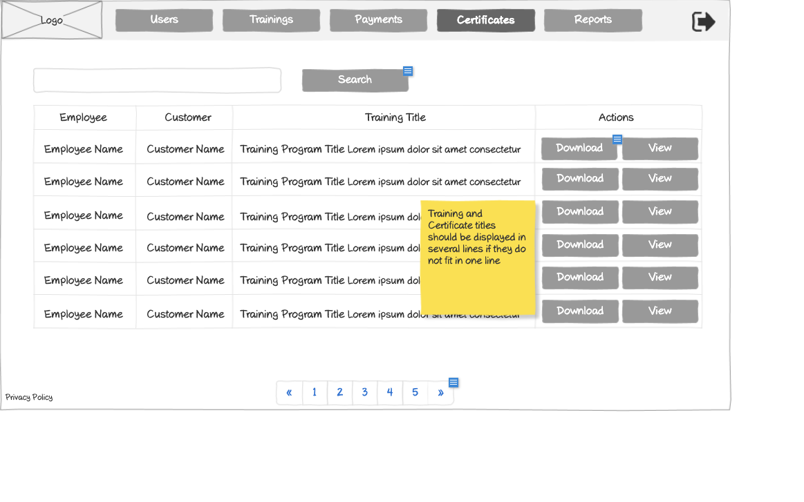

# Training Certificates Management Wireframe



## ASCII Representation

```
+--------------------------------------------------------------------------------------------------------------+
|                                                                                                              |
| +--------+  +--------+  +--------+  +--------+  +--------+  +--------+                    +--------+         |
| |        |  |        |  |        |  |        |  |        |  |        |                    |        |         |
| |  Logo  |  | Users  |  |Trainings|  |Payments|  |Certificates|  | Reports |                    |   →    |         |
| |        |  |        |  |        |  |        |  |        |  |        |                    |        |         |
| +--------+  +--------+  +--------+  +--------+  +--------+  +--------+                    +--------+         |
|                                                                                                              |
| +------------------------------------------------------------------+  +--------+                             |
| |                                                                  |  | Search |                             |
| +------------------------------------------------------------------+  +--------+                             |
|                                                                                                              |
| +---------------+---------------+----------------------------------+---------------+                          |
| |    Employee   |    Customer   |           Training Title         |    Actions    |                          |
| +---------------+---------------+----------------------------------+---------------+                          |
| |               |               |                                  |               |                          |
| | Employee Name | Customer Name | Training Program Title Lorem ipsum dolor sit amet consectetur | Download | View |  |
| |               |               |                                  |               |                          |
| +---------------+---------------+----------------------------------+---------------+                          |
| |               |               |                                  |               |                          |
| | Employee Name | Customer Name | Training Program Title Lorem ipsum dolor sit amet consectetur | Download | View |  |
| |               |               |                                  |               |                          |
| +---------------+---------------+----------------------------------+---------------+                          |
| |               |               |                                  |               |                          |
| | Employee Name | Customer Name | Training Program Title Lorem ipsum dolor sit amet consectetur | Download | View |  |
| |               |               |                                  |               |                          |
| +---------------+---------------+----------------------------------+---------------+                          |
| |               |               |                                  |               |                          |
| | Employee Name | Customer Name | Training Program Title Lorem ipsum dolor sit amet consectetur | Download | View |  |
| |               |               |                                  |               |                          |
| +---------------+---------------+----------------------------------+---------------+                          |
| |               |               |                                  |               |                          |
| | Employee Name | Customer Name | Training Program Title Lorem ipsum dolor sit amet consectetur | Download | View |  |
| |               |               |                                  |               |                          |
| +---------------+---------------+----------------------------------+---------------+                          |
| |               |               |                                  |               |                          |
| | Employee Name | Customer Name | Training Program Title Lorem ipsum dolor sit amet consectetur | Download | View |  |
| |               |               |                                  |               |                          |
| +---------------+---------------+----------------------------------+---------------+                          |
|                                                                                                              |
|                                                                    +---------------+                          |
|                                                                    | Training and  |                          |
|                                                                    | Certificate   |                          |
|                                                                    | titles should |                          |
|                                                                    | be displayed  |                          |
|                                                                    | in several    |                          |
|                                                                    | lines if they |                          |
|                                                                    | do not fit in |                          |
|                                                                    | one line      |                          |
|                                                                    +---------------+                          |
|                                                                                                              |
| Privacy Policy           « | 1 | 2 | 3 | 4 | 5 | »                                                           |
|                                                                                                              |
+--------------------------------------------------------------------------------------------------------------+
```

## Overview

This wireframe displays the Certificates Management interface, which allows administrators to view, manage, and distribute training certificates across the organization. The interface presents a tabular view of all certificates with filtering and pagination capabilities.

## UI Components

### Navigation Header
- **Logo**: Organization or application logo in the top-left corner
- **Main Navigation**: Horizontal menu with options for Users, Trainings, Payments, Certificates (currently selected), and Reports
- **Navigation Arrow**: Button in the top-right corner for additional navigation options or to collapse/expand the menu

### Search and Filter
- **Search Bar**: Full-width search field at the top of the content area
- **Search Button**: Button to execute the search query

### Certificates Table
- **Table Headers**:
  - Employee: Name of the employee who completed the training
  - Customer: Name of the customer organization
  - Training Title: Title of the completed training program
  - Actions: Available operations for each certificate

- **Table Rows**: Multiple entries showing certificate information with the following columns:
  - Employee Name
  - Customer Name
  - Training Program Title (with descriptive text)
  - Action buttons: "Download" and "View" for each certificate

### Pagination Controls
- **Page Navigation**: Controls at the bottom of the table with first («), previous, numbered pages (1-5), next, and last (») buttons
- **Current Page**: Page 1 is currently selected

### Additional Information
- **Privacy Policy**: Link at the bottom-left of the page
- **Note**: Yellow sticky note indicating "Training and Certificate titles should be displayed in several lines if they do not fit in one line"

## Functionality

This interface allows administrators to:

1. **Browse Certificates**: View all training certificates in a paginated table format
2. **Search and Filter**: Find specific certificates using the search functionality
3. **Download Certificates**: Download certificate files for distribution or record-keeping
4. **View Certificates**: Open certificates for detailed viewing
5. **Navigate**: Move between different sections of the application using the top navigation bar

The system appears to organize certificates by employee, customer, and training program, providing a comprehensive view of all training completions across the organization.
