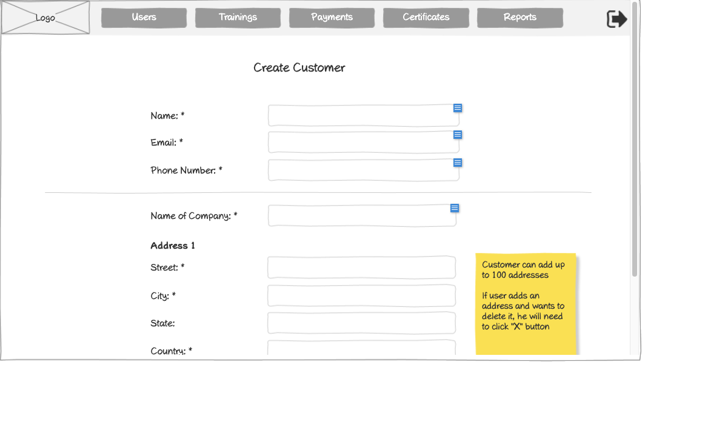

# Create Customer Form Wireframe



## ASCII Representation

```
+--------------------------------------------------------------------------------------------------------------+
|                                                                                                              |
| +--------+  +--------+  +--------+  +--------+  +--------+  +--------+                    +--------+         |
| |        |  |        |  |        |  |        |  |        |  |        |                    |        |         |
| |  Logo  |  | Users  |  |Trainings|  |Payments|  |Certificates|  | Reports |                    |   →    |         |
| |        |  |        |  |        |  |        |  |        |  |        |                    |        |         |
| +--------+  +--------+  +--------+  +--------+  +--------+  +--------+                    +--------+         |
|                                                                                                              |
|                                     Create Customer                                                          |
|                                                                                                              |
|                                                                                                              |
|            Name: *                 +--------------------------------------------------+                      |
|                                    |                                                  |                      |
|                                    +--------------------------------------------------+                      |
|                                                                                                              |
|            Email: *                +--------------------------------------------------+                      |
|                                    |                                                  |                      |
|                                    +--------------------------------------------------+                      |
|                                                                                                              |
|            Phone Number: *         +--------------------------------------------------+                      |
|                                    |                                                  |                      |
|                                    +--------------------------------------------------+                      |
|                                                                                                              |
| ----------------------------------------------------------------------------------------                    |
|                                                                                                              |
|            Name of Company: *      +--------------------------------------------------+                      |
|                                    |                                                  |                      |
|                                    +--------------------------------------------------+                      |
|                                                                                                              |
|            Address 1                                                                                         |
|                                                                                                              |
|            Street: *               +--------------------------------------------------+                      |
|                                    |                                                  |                      |
|                                    +--------------------------------------------------+                      |
|                                                                                       +---------------+      |
|            City: *                 +--------------------------------------------------+| Customer can |      |
|                                    |                                                  || add up to 100|      |
|                                    +--------------------------------------------------+| addresses    |      |
|                                                                                       |               |      |
|            State:                  +--------------------------------------------------+| If user adds|      |
|                                    |                                                  || an address   |      |
|                                    +--------------------------------------------------+| and wants to|      |
|                                                                                       | delete it, he|      |
|            Country: *              +--------------------------------------------------+| will need to|      |
|                                    |                                                  || click "X"    |      |
|                                    +--------------------------------------------------+| button       |      |
|                                                                                       +---------------+      |
|                                                                                                              |
+--------------------------------------------------------------------------------------------------------------+
```

## Overview

This wireframe displays the "Create Customer" form interface, which allows administrators to add new customer accounts to the system. The form collects essential customer information including personal details, company information, and address data.

## UI Components

### Navigation Header
- **Logo**: Organization or application logo in the top-left corner
- **Main Navigation**: Horizontal menu with options for Users, Trainings, Payments, Certificates, and Reports
- **Navigation Arrow**: Button in the top-right corner for additional navigation options or to collapse/expand the menu

### Form Header
- **Title**: "Create Customer" heading centered at the top of the form

### Personal Information Section
- **Name Field**: Required text input (marked with asterisk *)
- **Email Field**: Required text input (marked with asterisk *)
- **Phone Number Field**: Required text input (marked with asterisk *)

### Company Information Section
- **Horizontal Divider**: Separates personal and company information
- **Name of Company Field**: Required text input (marked with asterisk *)

### Address Section
- **Address Label**: "Address 1" indicating this is the primary address
- **Street Field**: Required text input (marked with asterisk *)
- **City Field**: Required text input (marked with asterisk *)
- **State Field**: Optional text input
- **Country Field**: Required text input (marked with asterisk *)

### Informational Note
- **Yellow Sticky Note**: Contains two important pieces of information:
  1. "Customer can add up to 100 addresses"
  2. "If user adds an address and wants to delete it, he will need to click 'X' button"

## Functionality

This interface allows administrators to:

1. **Create New Customers**: Add new customer accounts to the system with all necessary information
2. **Manage Multiple Addresses**: The system supports adding up to 100 addresses per customer
3. **Validate Required Fields**: Required fields are clearly marked with asterisks (*)
4. **Delete Addresses**: Users can remove addresses by clicking an "X" button (not visible in the current view)

The form appears to be the first step in customer onboarding, collecting essential information needed to establish a customer account in the training management system. The ability to add multiple addresses suggests the system supports customers with complex organizational structures or multiple locations.
