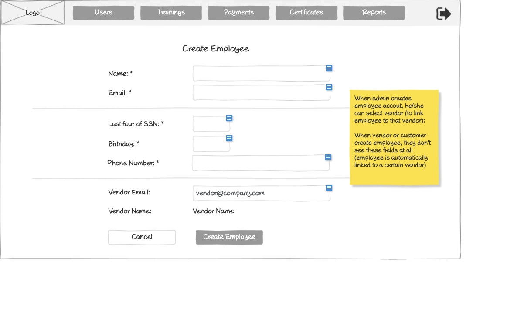

# Create Employee Form Wireframe



## ASCII Representation

```
+--------------------------------------------------------------------------------------------------------------+
|                                                                                                              |
| +--------+  +--------+  +--------+  +--------+  +--------+  +--------+                    +--------+         |
| |        |  |        |  |        |  |        |  |        |  |        |                    |        |         |
| |  Logo  |  | Users  |  |Trainings|  |Payments|  |Certificates|  | Reports |                    |   →    |         |
| |        |  |        |  |        |  |        |  |        |  |        |                    |        |         |
| +--------+  +--------+  +--------+  +--------+  +--------+  +--------+                    +--------+         |
|                                                                                                              |
|                                     Create Employee                                                          |
|                                                                                                              |
|                                                                                                              |
|            Name: *                 +--------------------------------------------------+                      |
|                                    |                                                  |                      |
|                                    +--------------------------------------------------+                      |
|                                                                                                              |
|            Email: *                +--------------------------------------------------+                      |
|                                    |                                                  |                      |
|                                    +--------------------------------------------------+                      |
|                                                                                       +---------------+      |
| ----------------------------------------------------------------------------------------| When admin  |      |
|                                                                                       | creates      |      |
|            Last four of SSN: *     +-------------+                                    | employee     |      |
|                                    |             |                                    | account,     |      |
|                                    +-------------+                                    | he/she can   |      |
|                                                                                       | select vendor|      |
|            Birthday: *             +-------------+                                    | (to link     |      |
|                                    |             |                                    | employee to  |      |
|                                    +-------------+                                    | that vendor);|      |
|                                                                                       |               |      |
|            Phone Number: *         +--------------------------------------------------+| When vendor |      |
|                                    |                                                  || or customer |      |
|                                    +--------------------------------------------------+| create      |      |
|                                                                                       | employee,    |      |
| ----------------------------------------------------------------------------------------| they don't  |      |
|                                                                                       | see these    |      |
|            Vendor Email:           +--------------------------------------------------+| fields at all|      |
|                                    | vendor@company.com                               || (employee is|      |
|                                    +--------------------------------------------------+| automatically|      |
|                                                                                       | linked to a  |      |
|            Vendor Name:            Vendor Name                                        | certain      |      |
|                                                                                       | vendor)      |      |
|                                                                                       +---------------+      |
|                                                                                                              |
|            +---------------+       +------------------+                                                      |
|            |    Cancel     |       |  Create Employee |                                                      |
|            +---------------+       +------------------+                                                      |
|                                                                                                              |
+--------------------------------------------------------------------------------------------------------------+
```

## Overview

This wireframe displays the "Create Employee" form interface, which allows administrators to add new employee accounts to the system. The form collects essential employee information including personal details and vendor association data.

## UI Components

### Navigation Header
- **Logo**: Organization or application logo in the top-left corner
- **Main Navigation**: Horizontal menu with options for Users, Trainings, Payments, Certificates, and Reports
- **Navigation Arrow**: Button in the top-right corner for additional navigation options or to collapse/expand the menu

### Form Header
- **Title**: "Create Employee" heading centered at the top of the form

### Personal Information Section
- **Name Field**: Required text input (marked with asterisk *)
- **Email Field**: Required text input (marked with asterisk *)

### Employee Details Section
- **Horizontal Divider**: Separates basic information from employee-specific details
- **Last four of SSN Field**: Required text input for the last four digits of Social Security Number (marked with asterisk *)
- **Birthday Field**: Required date input (marked with asterisk *)
- **Phone Number Field**: Required text input (marked with asterisk *)

### Vendor Association Section
- **Horizontal Divider**: Separates employee details from vendor association
- **Vendor Email Field**: Pre-populated text input showing "vendor@company.com"
- **Vendor Name Field**: Static text displaying "Vendor Name"

### Action Buttons
- **Cancel Button**: Allows users to cancel the employee creation process
- **Create Employee Button**: Submits the form to create the new employee account

### Informational Note
- **Yellow Sticky Note**: Contains important information about user permissions:
  1. "When admin creates employee account, he/she can select vendor (to link employee to that vendor)"
  2. "When vendor or customer create employee, they don't see these fields at all (employee is automatically linked to a certain vendor)"

## Functionality

This interface allows administrators to:

1. **Create New Employees**: Add new employee accounts with all necessary personal information
2. **Associate Employees with Vendors**: Link employees to specific vendor accounts
3. **Validate Required Fields**: Required fields are clearly marked with asterisks (*)
4. **Cancel Creation Process**: Option to abandon the creation process without saving

The form implements role-based access control, where the fields visible and editable depend on the user's role:
- Administrators can see all fields and select which vendor to associate with the employee
- Vendors and customers have a simplified view where vendor association is automatic

This approach ensures proper organizational hierarchy and data access controls while streamlining the employee onboarding process for different user types.
