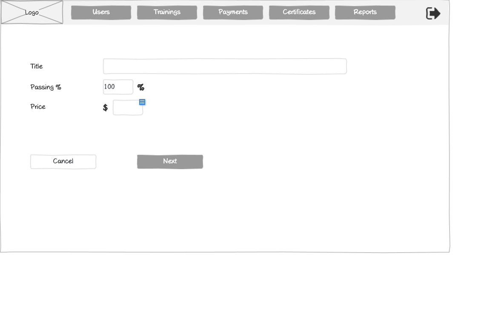

# Create Training Form Wireframe



## ASCII Representation

```
+--------------------------------------------------------------------------------------------------------------+
|                                                                                                              |
| +--------+  +--------+  +--------+  +--------+  +--------+  +--------+                    +--------+         |
| |        |  |        |  |        |  |        |  |        |  |        |                    |        |         |
| |  Logo  |  | Users  |  |Trainings|  |Payments|  |Certificates|  | Reports |                    |   →    |         |
| |        |  |        |  |        |  |        |  |        |  |        |                    |        |         |
| +--------+  +--------+  +--------+  +--------+  +--------+  +--------+                    +--------+         |
|                                                                                                              |
|                                                                                                              |
|                                                                                                              |
|            Title                   +--------------------------------------------------+                      |
|                                    |                                                  |                      |
|                                    +--------------------------------------------------+                      |
|                                                                                                              |
|            Passing %               +--------+ %                                                              |
|                                    |  100   |                                                                |
|                                    +--------+                                                                |
|                                                                                                              |
|            Price                   $ +--------+                                                              |
|                                      |        |                                                              |
|                                      +--------+                                                              |
|                                                                                                              |
|                                                                                                              |
|                                                                                                              |
|                                                                                                              |
|                                                                                                              |
|                                                                                                              |
|                                                                                                              |
|                                                                                                              |
|                                                                                                              |
|                                                                                                              |
|                                                                                                              |
|                                                                                                              |
|                                                                                                              |
|                                                                                                              |
|                                                                                                              |
|                                                                                                              |
|                                                                                                              |
|                                                                                                              |
|                                                                                                              |
|                                                                                                              |
|                                                                                                              |
|            +---------------+       +------------------+                                                      |
|            |    Cancel     |       |       Next       |                                                      |
|            +---------------+       +------------------+                                                      |
|                                                                                                              |
+--------------------------------------------------------------------------------------------------------------+
```

## Overview

This wireframe displays the "Create Training" form interface, which allows administrators to set up new training programs in the system. The form collects basic training information including title, passing score requirements, and pricing.

## UI Components

### Navigation Header
- **Logo**: Organization or application logo in the top-left corner
- **Main Navigation**: Horizontal menu with options for Users, Trainings, Payments, Certificates, and Reports
- **Navigation Arrow**: Button in the top-right corner for additional navigation options or to collapse/expand the menu

### Training Information Form
- **Title Field**: Text input for entering the training program title
- **Passing % Field**: Numeric input with a default value of "100" and a percentage symbol, indicating the minimum score required to pass the training
- **Price Field**: Monetary input with a dollar sign prefix for setting the training program cost

### Action Buttons
- **Cancel Button**: Allows users to cancel the training creation process
- **Next Button**: Proceeds to the next step in the training creation workflow

## Functionality

This interface allows administrators to:

1. **Define Basic Training Parameters**: Set up the fundamental attributes of a new training program
2. **Set Passing Requirements**: Define the minimum score (as a percentage) required for trainees to pass the program
3. **Establish Pricing**: Set the cost for the training program
4. **Multi-step Creation Process**: The "Next" button indicates this is the first step in a multi-stage training creation workflow

The form appears to be the initial step in creating a training program, focusing on the core parameters before moving on to more detailed content creation or configuration in subsequent steps. The simplicity of this first screen suggests a well-structured, step-by-step approach to training program creation that prevents overwhelming users with too many options at once.

## Notes

- The form uses a clean, minimalist design with ample white space
- Required fields are not explicitly marked in this interface
- The "Next" button suggests additional steps will follow for more detailed training configuration
- The "Cancel" button provides a clear way to abandon the creation process
