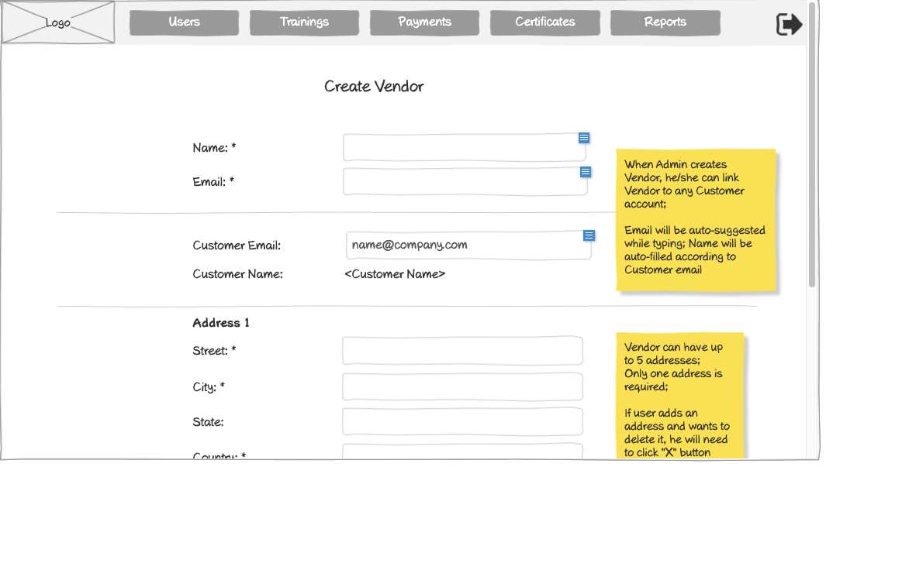

# Create Vendor Form Wireframe



## ASCII Representation

```
+--------------------------------------------------------------------------------------------------------------+
|                                                                                                              |
| +--------+  +--------+  +--------+  +--------+  +--------+  +--------+                    +--------+         |
| |        |  |        |  |        |  |        |  |        |  |        |                    |        |         |
| |  Logo  |  | Users  |  |Trainings|  |Payments|  |Certificates|  | Reports |                    |   →    |         |
| |        |  |        |  |        |  |        |  |        |  |        |                    |        |         |
| +--------+  +--------+  +--------+  +--------+  +--------+  +--------+                    +--------+         |
|                                                                                                              |
|                                     Create Vendor                                                            |
|                                                                                                              |
|                                                                                                              |
|            Name: *                 +--------------------------------------------------+                      |
|                                    |                                                  |                      |
|                                    +--------------------------------------------------+                      |
|                                                                                                              |
|            Email: *                +--------------------------------------------------+                      |
|                                    |                                                  |                      |
|                                    +--------------------------------------------------+                      |
|                                                                                       +---------------+      |
| ----------------------------------------------------------------------------------------| When Admin  |      |
|                                                                                       | creates      |      |
|            Customer Email:         +--------------------------------------------------+| Vendor,     |      |
|                                    | name@company.com                                 || he/she can  |      |
|                                    +--------------------------------------------------+| link Vendor |      |
|                                                                                       | to any       |      |
|            Customer Name:          <Customer Name>                                    | Customer     |      |
|                                                                                       | account;     |      |
|                                                                                       |               |      |
| ----------------------------------------------------------------------------------------| Email will be|      |
|                                                                                       | auto-suggested|      |
|            Address 1                                                                  | while typing; |      |
|                                                                                       | Name will be |      |
|            Street: *               +--------------------------------------------------+| auto-filled  |      |
|                                    |                                                  || according to |      |
|                                    +--------------------------------------------------+| Customer     |      |
|                                                                                       | email        |      |
|            City: *                 +--------------------------------------------------+|              |      |
|                                    |                                                  ||              |      |
|                                    +--------------------------------------------------+|              |      |
|                                                                                       |              |      |
|            State:                  +--------------------------------------------------+|              |      |
|                                    |                                                  ||              |      |
|                                    +--------------------------------------------------+|              |      |
|                                                                                       |              |      |
|            Country: *              +--------------------------------------------------+|              |      |
|                                    |                                                  ||              |      |
|                                    +--------------------------------------------------+|              |      |
|                                                                                       +---------------+      |
|                                                                                                              |
+--------------------------------------------------------------------------------------------------------------+
```

## Overview

This wireframe displays the "Create Vendor" form interface, which allows administrators to add new vendor accounts to the system. The form collects essential vendor information including contact details, customer association, and address information.

## UI Components

### Navigation Header
- **Logo**: Organization or application logo in the top-left corner
- **Main Navigation**: Horizontal menu with options for Users, Trainings, Payments, Certificates, and Reports
- **Navigation Arrow**: Button in the top-right corner for additional navigation options or to collapse/expand the menu

### Form Header
- **Title**: "Create Vendor" heading centered at the top of the form

### Vendor Information Section
- **Name Field**: Required text input (marked with asterisk *)
- **Email Field**: Required text input (marked with asterisk *)

### Customer Association Section
- **Horizontal Divider**: Separates vendor information from customer association
- **Customer Email Field**: Text input pre-populated with "name@company.com"
- **Customer Name Field**: Static text displaying "<Customer Name>"

### Address Section
- **Address Label**: "Address 1" indicating this is the primary address
- **Street Field**: Required text input (marked with asterisk *)
- **City Field**: Required text input (marked with asterisk *)
- **State Field**: Optional text input
- **Country Field**: Required text input (marked with asterisk *)

### Informational Note
- **Yellow Sticky Note**: Contains important information about functionality:
  1. "When Admin creates Vendor, he/she can link Vendor to any Customer account;"
  2. "Email will be auto-suggested while typing; Name will be auto-filled according to Customer email"

## Functionality

This interface allows administrators to:

1. **Create New Vendors**: Add new vendor accounts to the system with all necessary information
2. **Associate Vendors with Customers**: Link vendors to specific customer accounts
3. **Validate Required Fields**: Required fields are clearly marked with asterisks (*)
4. **Auto-completion Support**: Customer email field provides auto-suggestions while typing
5. **Auto-population**: Customer name is automatically filled based on the selected customer email

The form implements intelligent data entry features to streamline the vendor creation process:
- Auto-suggestion for customer emails helps administrators quickly find and select existing customers
- Auto-filling of customer names reduces data entry errors and ensures consistency
- The ability to link vendors to customers establishes the proper business relationships in the system

This interface is specifically designed for administrator use, as indicated by the note about admin privileges for linking vendors to customers. The form structure suggests a hierarchical relationship where vendors are associated with specific customers in the training management system.
