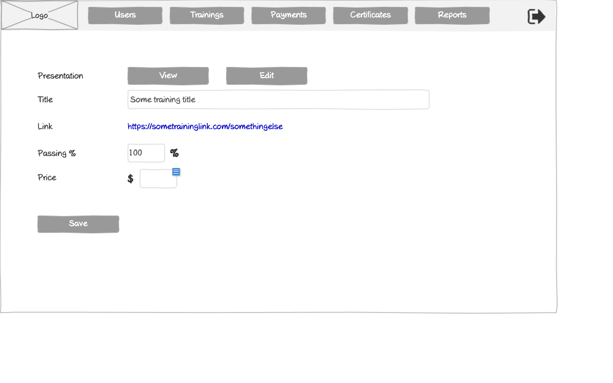

# Edit Training Information Wireframe



## ASCII Representation

```
+--------------------------------------------------------------------------------------------------------------+
|                                                                                                              |
| +--------+  +--------+  +--------+  +--------+  +--------+  +--------+                    +--------+         |
| |        |  |        |  |        |  |        |  |        |  |        |                    |        |         |
| |  Logo  |  | Users  |  |Trainings|  |Payments|  |Certificates|  | Reports |                    |   →    |         |
| |        |  |        |  |        |  |        |  |        |  |        |                    |        |         |
| +--------+  +--------+  +--------+  +--------+  +--------+  +--------+                    +--------+         |
|                                                                                                              |
|                                                                                                              |
|            Presentation            +---------------+  +---------------+                                      |
|                                    |     View      |  |     Edit      |                                      |
|                                    +---------------+  +---------------+                                      |
|                                                                                                              |
|            Title                   +--------------------------------------------------+                      |
|                                    | Some training title                              |                      |
|                                    +--------------------------------------------------+                      |
|                                                                                                              |
|            Link                    https://sometraininglink.com/somethingelse                               |
|                                                                                                              |
|            Passing %               +--------+ %                                                              |
|                                    |  100   |                                                                |
|                                    +--------+                                                                |
|                                                                                                              |
|            Price                   $ +--------+                                                              |
|                                      |        |                                                              |
|                                      +--------+                                                              |
|                                                                                                              |
|                                                                                                              |
|                                                                                                              |
|                                                                                                              |
|                                                                                                              |
|                                                                                                              |
|                                                                                                              |
|                                                                                                              |
|                                                                                                              |
|                                                                                                              |
|                                                                                                              |
|                                                                                                              |
|                                                                                                              |
|                                                                                                              |
|                                                                                                              |
|            +---------------+                                                                                 |
|            |     Save      |                                                                                 |
|            +---------------+                                                                                 |
|                                                                                                              |
+--------------------------------------------------------------------------------------------------------------+
```

## Overview

This wireframe displays the "Edit Training Information" interface, which allows administrators to modify the details of an existing training program. The form presents the current training information for editing, including title, link, passing requirements, and pricing.

## UI Components

### Navigation Header
- **Logo**: Organization or application logo in the top-left corner
- **Main Navigation**: Horizontal menu with options for Users, Trainings, Payments, Certificates, and Reports
- **Navigation Arrow**: Button in the top-right corner for additional navigation options or to collapse/expand the menu

### Presentation Controls
- **Presentation Label**: Text label indicating the presentation section
- **View Button**: Button to view the training presentation
- **Edit Button**: Button to edit the training presentation (currently selected/active)

### Training Information Form
- **Title Field**: Text input showing the current training title ("Some training title")
- **Link Field**: Text or URL display showing the current training link ("https://sometraininglink.com/somethingelse")
- **Passing % Field**: Numeric input with a value of "100" and a percentage symbol, indicating the minimum score required to pass the training
- **Price Field**: Monetary input with a dollar sign prefix for setting the training program cost

### Action Button
- **Save Button**: Submits the form to save the updated training information

## Functionality

This interface allows administrators to:

1. **Update Training Details**: Modify the basic attributes of an existing training program
2. **Navigate to Presentation Content**: Access the presentation content via the "View" and "Edit" buttons
3. **Adjust Passing Requirements**: Change the minimum score (as a percentage) required for trainees to pass the program
4. **Modify Pricing**: Update the cost for the training program
5. **Save Changes**: Commit the modifications to the system

The form provides a comprehensive view of the training program's core parameters, allowing administrators to make necessary adjustments while maintaining access to the associated presentation content. The interface separates the metadata (title, link, passing score, price) from the actual training content, which is managed through the "View" and "Edit" buttons.

## Notes

- The form displays both editable fields (title, passing percentage, price) and potentially read-only information (link)
- The "View" and "Edit" buttons for the presentation suggest that the training content is managed separately from the basic information
- The interface follows a clean, minimalist design consistent with other forms in the system
- The "Save" button is positioned at the bottom-left, providing a clear action point for committing changes
