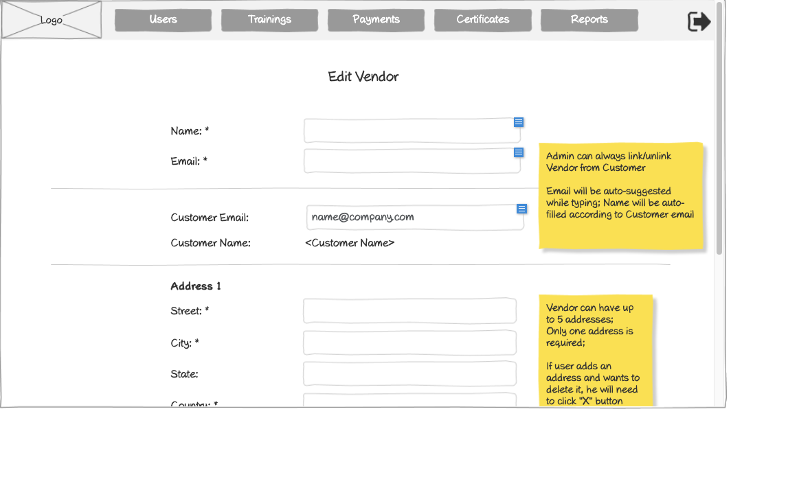

# Edit Vendor Form Wireframe



## ASCII Representation

```
+--------------------------------------------------------------------------------------------------------------+
|                                                                                                              |
| +--------+  +--------+  +--------+  +--------+  +--------+  +--------+                    +--------+         |
| |        |  |        |  |        |  |        |  |        |  |        |                    |        |         |
| |  Logo  |  | Users  |  |Trainings|  |Payments|  |Certificates|  | Reports |                    |   →    |         |
| |        |  |        |  |        |  |        |  |        |  |        |                    |        |         |
| +--------+  +--------+  +--------+  +--------+  +--------+  +--------+                    +--------+         |
|                                                                                                              |
|                                     Edit Vendor                                                              |
|                                                                                                              |
|                                                                                                              |
|            Name: *                 +--------------------------------------------------+                      |
|                                    |                                                  |                      |
|                                    +--------------------------------------------------+                      |
|                                                                                                              |
|            Email: *                +--------------------------------------------------+                      |
|                                    |                                                  |                      |
|                                    +--------------------------------------------------+                      |
|                                                                                       +---------------+      |
| ----------------------------------------------------------------------------------------| Admin can   |      |
|                                                                                       | always       |      |
|            Customer Email:         +--------------------------------------------------+| link/unlink  |      |
|                                    | name@company.com                                 || Vendor from  |      |
|                                    +--------------------------------------------------+| Customer     |      |
|                                                                                       |               |      |
|            Customer Name:          <Customer Name>                                    | Email will be |      |
|                                                                                       | auto-suggested|      |
|                                                                                       | while typing; |      |
| ----------------------------------------------------------------------------------------| Name will be |      |
|                                                                                       | auto-filled   |      |
|            Address 1                                                                  | according to  |      |
|                                                                                       | Customer email|      |
|            Street: *               +--------------------------------------------------+|              |      |
|                                    |                                                  ||              |      |
|                                    +--------------------------------------------------+|              |      |
|                                                                                       |              |      |
|            City: *                 +--------------------------------------------------+|              |      |
|                                    |                                                  ||              |      |
|                                    +--------------------------------------------------+|              |      |
|                                                                                       |              |      |
|            State:                  +--------------------------------------------------+|              |      |
|                                    |                                                  ||              |      |
|                                    +--------------------------------------------------+|              |      |
|                                                                                       |              |      |
|            Country: *              +--------------------------------------------------+|              |      |
|                                    |                                                  ||              |      |
|                                    +--------------------------------------------------+|              |      |
|                                                                                       +---------------+      |
|                                                                                                              |
+--------------------------------------------------------------------------------------------------------------+
```

## Overview

This wireframe displays the "Edit Vendor" form interface, which allows administrators to modify existing vendor accounts in the system. The form presents the current vendor information for editing, including contact details, customer association, and address information.

## UI Components

### Navigation Header
- **Logo**: Organization or application logo in the top-left corner
- **Main Navigation**: Horizontal menu with options for Users, Trainings, Payments, Certificates, and Reports
- **Navigation Arrow**: Button in the top-right corner for additional navigation options or to collapse/expand the menu

### Form Header
- **Title**: "Edit Vendor" heading at the top of the form

### Vendor Information Section
- **Name Field**: Required text input (marked with asterisk *) showing the vendor's current name
- **Email Field**: Required text input (marked with asterisk *) showing the vendor's current email

### Customer Association Section
- **Horizontal Divider**: Separates vendor information from customer association
- **Customer Email Field**: Text input showing "name@company.com"
- **Customer Name Field**: Static text displaying "<Customer Name>"

### Address Section
- **Address Label**: "Address 1" indicating this is the primary address
- **Street Field**: Required text input (marked with asterisk *) showing the current street address
- **City Field**: Required text input (marked with asterisk *) showing the current city
- **State Field**: Optional text input showing the current state
- **Country Field**: Required text input (marked with asterisk *) showing the current country

### Informational Note
- **Yellow Sticky Note**: Contains important information about functionality:
  1. "Admin can always link/unlink Vendor from Customer"
  2. "Email will be auto-suggested while typing; Name will be auto-filled according to Customer email"

## Functionality

This interface allows administrators to:

1. **Update Vendor Information**: Modify any of the vendor's details as needed
2. **Manage Customer Associations**: Link or unlink vendors to customer accounts
3. **Edit Address Information**: Update the vendor's address details
4. **Validate Required Fields**: Required fields are clearly marked with asterisks (*)
5. **Use Auto-completion Features**: Customer email field provides auto-suggestions while typing
6. **Benefit from Auto-population**: Customer name is automatically filled based on the selected customer email

The form layout is nearly identical to the "Create Vendor" form, providing a consistent user experience between creating and editing vendor accounts. The main difference is that the fields are pre-populated with the vendor's existing information.

The interface emphasizes the administrator's ability to manage customer associations, highlighting the hierarchical relationship between vendors and customers in the training management system. This flexibility allows administrators to reassign vendors to different customers as organizational needs change.

## Notes

- The form implements intelligent data entry features to streamline the vendor editing process:
  - Auto-suggestion for customer emails helps administrators quickly find and select existing customers
  - Auto-filling of customer names reduces data entry errors and ensures consistency
- The ability to link/unlink vendors to customers establishes the proper business relationships in the system
- This interface is specifically designed for administrator use, as indicated by the note about admin privileges for linking vendors to customers
