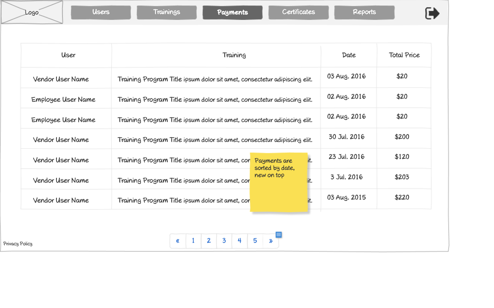

# Payments History Wireframe



## ASCII Representation

```
+--------------------------------------------------------------------------------------------------------------+
|                                                                                                              |
| +--------+  +--------+  +--------+  +--------+  +--------+  +--------+                    +--------+         |
| |        |  |        |  |        |  |        |  |        |  |        |                    |        |         |
| |  Logo  |  | Users  |  |Trainings|  |Payments|  |Certificates|  | Reports |                    |   →    |         |
| |        |  |        |  |        |  |        |  |        |  |        |                    |        |         |
| +--------+  +--------+  +--------+  +--------+  +--------+  +--------+                    +--------+         |
|                                                                                                              |
| +---------------+---------------+----------------------------------+---------------+---------------+         |
| |     User      |    Training   |               Date               |  Total Price  |                         |
| +---------------+---------------+----------------------------------+---------------+---------------+         |
| |               |               |                                  |               |                         |
| | Vendor User   | Training Program Title ipsum dolor sit amet, consectetur adipiscing elit. | 03 Aug. 2016 | $20 |
| | Name          |               |                                  |               |                         |
| +---------------+---------------+----------------------------------+---------------+---------------+         |
| |               |               |                                  |               |                         |
| | Employee User | Training Program Title ipsum dolor sit amet, consectetur adipiscing elit. | 02 Aug. 2016 | $20 |
| | Name          |               |                                  |               |                         |
| +---------------+---------------+----------------------------------+---------------+---------------+         |
| |               |               |                                  |               |                         |
| | Employee User | Training Program Title ipsum dolor sit amet, consectetur adipiscing elit. | 02 Aug. 2016 | $20 |
| | Name          |               |                                  |               |                         |
| +---------------+---------------+----------------------------------+---------------+---------------+         |
| |               |               |                                  |               |                         |
| | Vendor User   | Training Program Title ipsum dolor sit amet, consectetur adipiscing elit. | 30 Jul. 2016 | $200 |
| | Name          |               |                                  |               |                         |
| +---------------+---------------+----------------------------------+---------------+---------------+         |
| |               |               |                                  |               |                         |
| | Vendor User   | Training Program Title ipsum dolor sit amet, consectetur adipiscing elit. | 23 Jul. 2016 | $120 |
| | Name          |               |                                  |               |                         |
| +---------------+---------------+----------------------------------+---------------+---------------+         |
| |               |               |                                  |               |                         |
| | Vendor User   | Training Program Title ipsum dolor sit amet, consectetur adipiscing elit. | 3 Jul. 2016 | $203 |
| | Name          |               |                                  |               |                         |
| +---------------+---------------+----------------------------------+---------------+---------------+         |
| |               |               |                                  |               |                         |
| | Vendor User   | Training Program Title ipsum dolor sit amet, consectetur adipiscing elit. | 03 Aug. 2015 | $220 |
| | Name          |               |                                  |               |                         |
| +---------------+---------------+----------------------------------+---------------+---------------+         |
|                                                                                                              |
|                                                                    +---------------+                         |
|                                                                    | Payments are  |                         |
|                                                                    | sorted by date,|                        |
|                                                                    | new on top    |                         |
|                                                                    +---------------+                         |
|                                                                                                              |
| Privacy Policy           « | 1 | 2 | 3 | 4 | 5 | »                                                           |
|                                                                                                              |
+--------------------------------------------------------------------------------------------------------------+
```

## Overview

This wireframe displays the "Payments History" interface, which shows a comprehensive record of all payments made for training programs within the system. The interface presents a tabular view of payment transactions with pagination capabilities.

## UI Components

### Navigation Header
- **Logo**: Organization or application logo in the top-left corner
- **Main Navigation**: Horizontal menu with options for Users, Trainings, Payments (currently selected), Certificates, and Reports
- **Navigation Arrow**: Button in the top-right corner for additional navigation options or to collapse/expand the menu

### Payments Table
- **Table Headers**:
  - User: Name of the user who made the payment
  - Training: Title of the training program purchased
  - Date: Date when the payment was made
  - Total Price: Amount paid for the training

- **Table Rows**: Multiple entries showing payment information with the following columns:
  - User Name (with type indication - "Vendor User Name" or "Employee User Name")
  - Training Program Title (with descriptive text)
  - Date (formatted as "DD Mon. YYYY")
  - Total Price (formatted with currency symbol)

### Pagination Controls
- **Page Navigation**: Controls at the bottom of the table with first («), previous, numbered pages (1-5), next, and last (») buttons
- **Current Page**: Page 1 is currently selected

### Additional Information
- **Privacy Policy**: Link at the bottom-left of the page
- **Note**: Yellow sticky note indicating "Payments are sorted by date, new on top"

## Functionality

This interface allows administrators to:

1. **Track Payment History**: View all payment transactions in a chronological order
2. **Monitor Revenue**: See the amounts paid for different training programs
3. **Identify User Types**: Distinguish between vendor users and employee users who have made payments
4. **Navigate Payment Records**: Browse through multiple pages of payment history
5. **Analyze Payment Patterns**: Observe payment trends over time with the date-sorted display

## Notes

- The payments are sorted by date in descending order (newest first), as indicated by the sticky note
- The table distinguishes between different types of users (Vendor User vs. Employee User)
- The interface provides a comprehensive financial overview of the training system's operations
- Payment amounts vary significantly (from $20 to $220), suggesting different pricing tiers for various training programs
- The system maintains consistent date formatting (DD Mon. YYYY) for all entries
- The payment history spans multiple years (2015-2016), indicating long-term record-keeping
