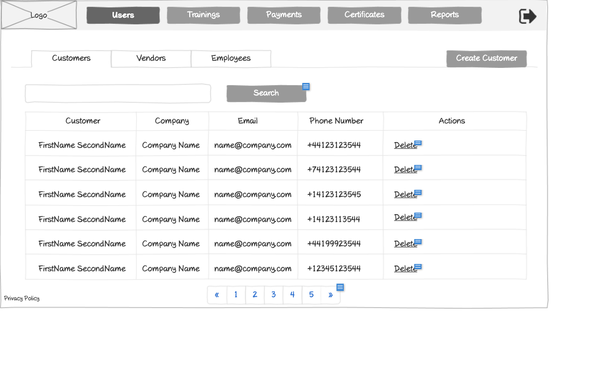

# Users - Customers List Wireframe



## ASCII Representation

```
+--------------------------------------------------------------------------------------------------------------+
|                                                                                                              |
| +--------+  +--------+  +--------+  +--------+  +--------+  +--------+                    +--------+         |
| |        |  |        |  |        |  |        |  |        |  |        |                    |        |         |
| |  Logo  |  | Users  |  |Trainings|  |Payments|  |Certificates|  | Reports |                    |   →    |         |
| |        |  |        |  |        |  |        |  |        |  |        |                    |        |         |
| +--------+  +--------+  +--------+  +--------+  +--------+  +--------+                    +--------+         |
|                                                                                                              |
| +---------------+  +---------------+  +---------------+                                  +---------------+    |
| |   Customers   |  |    Vendors    |  |   Employees   |                                  | Create Customer|    |
| +---------------+  +---------------+  +---------------+                                  +---------------+    |
|                                                                                                              |
| +------------------------------------------------------------------+  +--------+                             |
| |                                                                  |  | Search |                             |
| +------------------------------------------------------------------+  +--------+                             |
|                                                                                                              |
| +------------------+------------------+------------------+------------------+---------------+                |
| |      Customer    |      Company     |       Email      |   Phone Number   |    Actions    |                |
| +------------------+------------------+------------------+------------------+---------------+                |
| |                  |                  |                  |                  |               |                |
| | FirstName        | Company Name     | name@company.com | +44123123544     | Delete        |                |
| | SecondName       |                  |                  |                  |               |                |
| +------------------+------------------+------------------+------------------+---------------+                |
| |                  |                  |                  |                  |               |                |
| | FirstName        | Company Name     | name@company.com | +74123123544     | Delete        |                |
| | SecondName       |                  |                  |                  |               |                |
| +------------------+------------------+------------------+------------------+---------------+                |
| |                  |                  |                  |                  |               |                |
| | FirstName        | Company Name     | name@company.com | +14123123545     | Delete        |                |
| | SecondName       |                  |                  |                  |               |                |
| +------------------+------------------+------------------+------------------+---------------+                |
| |                  |                  |                  |                  |               |                |
| | FirstName        | Company Name     | name@company.com | +14123113544     | Delete        |                |
| | SecondName       |                  |                  |                  |               |                |
| +------------------+------------------+------------------+------------------+---------------+                |
| |                  |                  |                  |                  |               |                |
| | FirstName        | Company Name     | name@company.com | +44199923544     | Delete        |                |
| | SecondName       |                  |                  |                  |               |                |
| +------------------+------------------+------------------+------------------+---------------+                |
| |                  |                  |                  |                  |               |                |
| | FirstName        | Company Name     | name@company.com | +12345123544     | Delete        |                |
| | SecondName       |                  |                  |                  |               |                |
| +------------------+------------------+------------------+------------------+---------------+                |
|                                                                                                              |
| Privacy Policy           « | 1 | 2 | 3 | 4 | 5 | »                                                           |
|                                                                                                              |
+--------------------------------------------------------------------------------------------------------------+
```

## Overview

This wireframe displays the "Users - Customers" interface, which shows a list of all customer accounts in the system. The interface presents a tabular view of customer information with filtering, creation, and deletion capabilities.

## UI Components

### Navigation Header
- **Logo**: Organization or application logo in the top-left corner
- **Main Navigation**: Horizontal menu with options for Users (currently selected), Trainings, Payments, Certificates, and Reports
- **Navigation Arrow**: Button in the top-right corner for additional navigation options or to collapse/expand the menu

### User Type Tabs
- **Customers Tab**: Currently selected tab showing customer accounts
- **Vendors Tab**: Tab to switch to vendor accounts view
- **Employees Tab**: Tab to switch to employee accounts view

### Action Controls
- **Search Bar**: Full-width search field at the top of the content area
- **Search Button**: Button to execute the search query
- **Create Customer Button**: Button to create a new customer account

### Customers Table
- **Table Headers**:
  - Customer: Name of the customer contact person
  - Company: Name of the customer organization
  - Email: Email address of the customer
  - Phone Number: Contact phone number
  - Actions: Available operations for each customer account

- **Table Rows**: Multiple entries showing customer information with the following columns:
  - Customer Name (formatted as FirstName SecondName)
  - Company Name
  - Email Address (formatted as name@company.com)
  - Phone Number (with international format, e.g., +44123123544)
  - Action button: "Delete" for removing the customer account

### Pagination Controls
- **Page Navigation**: Controls at the bottom of the table with first («), previous, numbered pages (1-5), next, and last (») buttons
- **Current Page**: Page 1 is currently selected

### Additional Information
- **Privacy Policy**: Link at the bottom-left of the page

## Functionality

This interface allows administrators to:

1. **Browse Customer Accounts**: View all customer accounts in a paginated table format
2. **Search for Customers**: Find specific customers using the search functionality
3. **Create New Customers**: Add new customer accounts via the "Create Customer" button
4. **Delete Customers**: Remove customer accounts that are no longer needed
5. **Navigate Between User Types**: Switch between different user categories (Customers, Vendors, Employees)
6. **Paginate Results**: Move between different pages of customer accounts

## Notes

- The interface uses a tab-based navigation to separate different user types (Customers, Vendors, Employees)
- Customer names are displayed in a "FirstName SecondName" format
- Phone numbers are shown with international dialing codes, suggesting a global user base
- The "Delete" action suggests that administrators have the authority to remove customer accounts
- The "Create Customer" button indicates that new customer accounts can be added directly from this interface
- The system maintains a consistent layout with other list views in the application, providing a familiar user experience
- The table appears to show all essential customer information at a glance, facilitating quick identification and management
