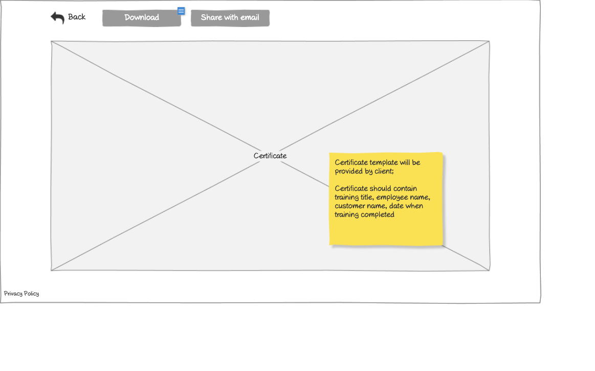

# Users - Vendors List Wireframe


## ASCII Representation

```
+--------------------------------------------------------------------------------------------------------------+
|                                                                                                              |
| +--------+  +--------+  +--------+  +--------+  +--------+  +--------+                    +--------+         |
| |        |  |        |  |        |  |        |  |        |  |        |                    |        |         |
| |  Logo  |  | Users  |  |Trainings|  |Payments|  |Certificates|  | Reports |                    |   →    |         |
| |        |  |        |  |        |  |        |  |        |  |        |                    |        |         |
| +--------+  +--------+  +--------+  +--------+  +--------+  +--------+                    +--------+         |
|                                                                                                              |
| +---------------+  +---------------+  +---------------+                                  +---------------+    |
| |   Customers   |  |    Vendors    |  |   Employees   |                                  | Create Vendor  |    |
| +---------------+  +---------------+  +---------------+                                  +---------------+    |
|                                                                                                              |
| +------------------------------------------------------------------+  +--------+                             |
| |                                                                  |  | Search |                             |
| +------------------------------------------------------------------+  +--------+                             |
|                                                                                                              |
| +------------------+------------------+------------------+------------------+---------------+                |
| |      Vendor      |     Customer     |       Email      |   Phone Number   |    Actions    |                |
| +------------------+------------------+------------------+------------------+---------------+                |
| |                  |                  |                  |                  |               |                |
| | FirstName        | Company Name     | name@company.com | +44123123544     | Delete        |                |
| | SecondName       |                  |                  |                  |               |                |
| +------------------+------------------+------------------+------------------+---------------+                |
| |                  |                  |                  |                  |               |                |
| | FirstName        |                  | name@company.com | +74123123544     | Delete        |                |
| | SecondName       |                  |                  |                  |               |                |
| +------------------+------------------+------------------+------------------+---------------+                |
| |                  |                  |                  |                  |               |                |
| | FirstName        | Company Name     | name@company.com | +14123123545     | Delete        |                |
| | SecondName       |                  |                  |                  |               |                |
| +------------------+------------------+------------------+------------------+---------------+                |
| |                  |                  |                  |                  |               |                |
| | FirstName        |                  | name@company.com | +14123113544     | Delete        |                |
| | SecondName       |                  |                  |                  |               |                |
| +------------------+------------------+------------------+------------------+---------------+                |
| |                  |                  |                  |                  |               |                |
| | FirstName        | Company Name     | name@company.com | +44199923544     | Delete        |                |
| | SecondName       |                  |                  |                  |               |                |
| +------------------+------------------+------------------+------------------+---------------+                |
| |                  |                  |                  |                  |               |                |
| | FirstName        | Company Name     | name@company.com | +12345123544     | Delete        |                |
| | SecondName       |                  |                  |                  |               |                |
| +------------------+------------------+------------------+------------------+---------------+                |
|                                                                                                              |
|                                                                    +---------------+                         |
|                                                                    | Admin sees all|                         |
|                                                                    | vendors -     |                         |
|                                                                    | created by    |                         |
|                                                                    | all customers |                         |
|                                                                    | and           |                         |
|                                                                    | registered in |                         |
|                                                                    | the system    |                         |
|                                                                    +---------------+                         |
|                                                                                                              |
| Privacy Policy           « | 1 | 2 | 3 | 4 | 5 | »                                                           |
|                                                                                                              |
+--------------------------------------------------------------------------------------------------------------+
```

## Overview

This wireframe displays the "Users - Vendors" interface, which shows a list of all vendor accounts in the system. The interface presents a tabular view of vendor information with filtering, creation, and deletion capabilities.

## UI Components

### Navigation Header
- **Logo**: Organization or application logo in the top-left corner
- **Main Navigation**: Horizontal menu with options for Users (currently selected), Trainings, Payments, Certificates, and Reports
- **Navigation Arrow**: Button in the top-right corner for additional navigation options or to collapse/expand the menu

### User Type Tabs
- **Customers Tab**: Tab to switch to customer accounts view
- **Vendors Tab**: Currently selected tab showing vendor accounts
- **Employees Tab**: Tab to switch to employee accounts view

### Action Controls
- **Search Bar**: Full-width search field at the top of the content area
- **Search Button**: Button to execute the search query
- **Create Vendor Button**: Button to create a new vendor account

### Vendors Table
- **Table Headers**:
  - Vendor: Name of the vendor contact person
  - Customer: Name of the customer organization associated with the vendor
  - Email: Email address of the vendor
  - Phone Number: Contact phone number
  - Actions: Available operations for each vendor account

- **Table Rows**: Multiple entries showing vendor information with the following columns:
  - Vendor Name (formatted as FirstName SecondName)
  - Customer Name (may be empty for some vendors)
  - Email Address (formatted as name@company.com)
  - Phone Number (with international format, e.g., +44123123544)
  - Action button: "Delete" for removing the vendor account

### Pagination Controls
- **Page Navigation**: Controls at the bottom of the table with first («), previous, numbered pages (1-5), next, and last (») buttons
- **Current Page**: Page 1 is currently selected

### Additional Information
- **Privacy Policy**: Link at the bottom-left of the page
- **Note**: Yellow sticky note indicating "Admin sees all vendors - created by all customers and registered in the system"

## Functionality

This interface allows administrators to:

1. **Browse Vendor Accounts**: View all vendor accounts in a paginated table format
2. **Search for Vendors**: Find specific vendors using the search functionality
3. **Create New Vendors**: Add new vendor accounts via the "Create Vendor" button
4. **Delete Vendors**: Remove vendor accounts that are no longer needed
5. **Navigate Between User Types**: Switch between different user categories (Customers, Vendors, Employees)
6. **Paginate Results**: Move between different pages of vendor accounts
7. **View Customer Associations**: See which customer each vendor is associated with

## Notes

- The interface uses a tab-based navigation to separate different user types (Customers, Vendors, Employees)
- Vendor names are displayed in a "FirstName SecondName" format
- Some vendors do not have an associated customer (empty customer field)
- Phone numbers are shown with international dialing codes, suggesting a global user base
- The "Delete" action suggests that administrators have the authority to remove vendor accounts
- The "Create Vendor" button indicates that new vendor accounts can be added directly from this interface
- The sticky note emphasizes that administrators have a comprehensive view of all vendors in the system, regardless of which customer created them
- The system maintains a consistent layout with other list views in the application, providing a familiar user experience
# View Certificate Wireframe



## ASCII Representation

```
+--------------------------------------------------------------------------------------------------------------+
|                                                                                                              |
| +--------+  +--------+  +---------------+                                                                    |
| |        |  |        |  |               |                                                                    |
| |  Back  |  |Download|  |Share with email|                                                                   |
| |        |  |        |  |               |                                                                    |
| +--------+  +--------+  +---------------+                                                                    |
|                                                                                                              |
| +------------------------------------------------------------------------------------------------------+     |
| |                                                                                                      |     |
| |                                                                                                      |     |
| |                                                                                                      |     |
| |                                                                                                      |     |
| |                                                                                                      |     |
| |                                                                                                      |     |
| |                                                                                                      |     |
| |                                                                                                      |     |
| |                                                                                                      |     |
| |                                                                                                      |     |
| |                                                                                                      |     |
| |                                                                                                      |     |
| |                                                                                                      |     |
| |                                                                                                      |     |
| |                                                                                                      |     |
| |                                                                                                      |     |
| |                                                                                                      |     |
| |                                                                                                      |     |
| |                                                                                                      |     |
| |                                                                                                      |     |
| |                                                                                                      |     |
| |                                                                                                      |     |
| |                                                                                                      |     |
| |                                                                                                      |     |
| |                                                                                                      |     |
| |                                                                                                      |     |
| |                                                                                                      |     |
| |                                                                                                      |     |
| |                                                                                                      |     |
| |                                                                                                      |     |
| |                                                                                                      |     |
| |                                                                                                      |     |
| |                                                                                                      |     |
| |                                                                                                      |     |
| |                                                                                                      |     |
| |                                                                                                      |     |
| |                                                                                                      |     |
| |                                                                                                      |     |
| |                                                                                                      |     |
| |                                                                                                      |     |
| |                                                                                                      |     |
| |                                                                                                      |     |
| |                                                                                                      |     |
| |                                                                                                      |     |
| |                                                                                                      |     |
| |                                                                                                      |     |
| |                                                                                                      |     |
| |                                                                                                      |     |
| |                                                                                                      |     |
| |                                                                                                      |     |
| |                                                                                                      |     |
| |                                                                                                      |     |
| |                                                                                                      |     |
| |                                                                                                      |     |
| |                                                                                                      |     |
| |                                                                                                      |     |
| |                                                                                                      |     |
| |                                                                                                      |     |
| |                                                                                                      |     |
| |                                                                                                      |     |
| |                                                                                                      |     |
| |                                                                                                      |     |
| |                                                                                                      |     |
| |                                                                                                      |     |
| |                                                                                                      |     |
| |                                                                                                      |     |
| |                                                                                                      |     |
| |                                                                                                      |     |
| |                                                                                                      |     |
| |                                                                                                      |     |
| |                                                                                                      |     |
| |                                                                                                      |     |
| |                                                                                                      |     |
| |                                                                                                      |     |
| |                                                                                                      |     |
| |                                                                                                      |     |
| |                                                                                                      |     |
| |                                                                                                      |     |
| |                                                                                                      |     |
| |                                                                                                      |     |
| |                                                                                                      |     |
| |                                                                                                      |     |
| |                                                                                                      |     |
| |                                                                                                      |     |
| |                                                                                                      |     |
| |                                                                                                      |     |
| |                                                                                                      |     |
| |                                                                                                      |     |
| |                                                                                                      |     |
| |                                                                                                      |     |
| |                                                                                                      |     |
| |                                                                                                      |     |
| |                                                                                                      |     |
| |                                                                                                      |     |
| |                                                                                                      |     |
| |                                                                                                      |     |
| |                                                                                                      |     |
| |                                                                                                      |     |
| |                                                                                                      |     |
| |                                                                                                      |     |
| |                                                                                                      |     |
| |                                                                                                      |     |
| |                                                                                                      |     |
| |                                                                                                      |     |
| |                                                                                                      |     |
| |                                                                                                      |     |
| |                                                                                                      |     |
| |                                                                                                      |     |
| |                                                                                                      |     |
| |                                                                                                      |     |
| |                                                                                                      |     |
| |                                                                                                      |     |
| |                                                                                                      |     |
| |                                                                                                      |     |
| |                                                                                                      |     |
| |                                                                                                      |     |
| |                                                                                                      |     |
| |                                                                                                      |     |
| |                                                                                                      |     |
| |                                                                                                      |     |
| |                                                                                                      |     |
| |                                                                                                      |     |
| |                                                                                                      |     |
| |                                                                                                      |     |
| |                                                                                                      |     |
| |                                                                                                      |     |
| |                                                                                                      |     |
| |                                                                                                      |     |
| |                                                                                                      |     |
| |                                                                                                      |     |
| |                                                                                                      |     |
| |                                                                                                      |     |
| |                                                                                                      |     |
| |                                                                                                      |     |
| |                                                                                                      |     |
| |                                                                                                      |     |
| |                                                                                                      |     |
| |                                                                                                      |     |
| |                                                                                                      |     |
| |                                                                                                      |     |
| |                                                                                                      |     |
| |                                                                                                      |     |
| |                                                                                                      |     |
| |                                                                                                      |     |
| |                                                                                                      |     |
| |                                                                                                      |     |
| |                                                                                                      |     |
| |                                                                                                      |     |
| |                                                                                                      |     |
| |                                                                                                      |     |
| |                                                                                                      |     |
| |                                                                                                      |     |
| |                                                                                                      |     |
| |                                                                                                      |     |
| |                                                                                                      |     |
| |                                                                                                      |     |
| |                                                                                                      |     |
| |                                                                                                      |     |
| |                                                                                                      |     |
| |                                                                                                      |     |
| |                                                                                                      |     |
| |                                                                                                      |     |
| |                                                                                                      |     |
| |                                                                                                      |     |
| |                                                                                                      |     |
| |                                                                                                      |     |
| |                                                                                                      |     |
| |                                                                                                      |     |
| |                                                                                                      |     |
| |                                                                                                      |     |
| |                                                                                                      |     |
| |                                                                                                      |     |
| |                                                                                                      |     |
| |                                                                                                      |     |
| |                                                                                                      |     |
| |                                                                                                      |     |
| |                                                                                                      |     |
| |                                                                                                      |     |
| |                                                                                                      |     |
| |                                                                                                      |     |
| |                                                                                                      |     |
