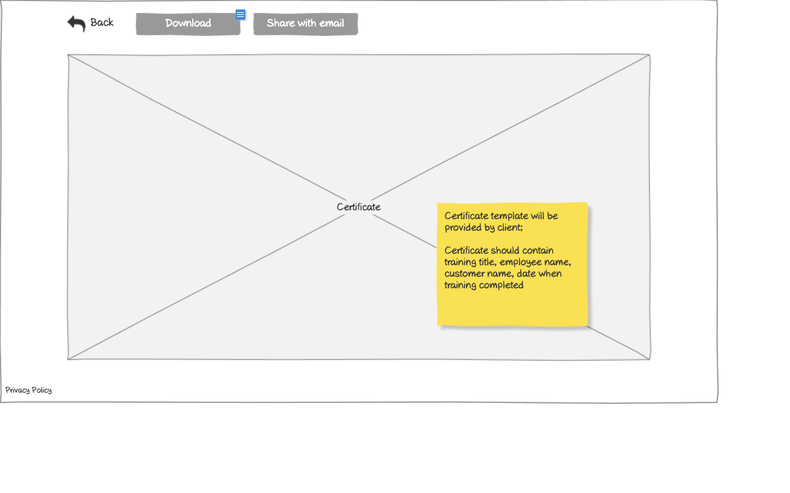

# View Certificate Wireframe

## Overview

This wireframe displays the "View Certificate" interface, which shows a training certificate that has been issued to an employee. The interface provides a visual representation of the certificate with options for navigation, downloading, and sharing.

## UI Components

### Action Controls
- **Back Button**: Button in the top-left corner to return to the previous screen
- **Download Button**: Button to download the certificate as a file (likely PDF)
- **Share with email Button**: Button to share the certificate via email

### Certificate Display
- **Certificate Content**: Large central area displaying the actual certificate with its formal design
- **Certificate Information**: The certificate likely contains:
  - Training title
  - Employee name
  - Customer name
  - Date of completion
  - Any official branding or logos

## Functionality

This interface allows users to:

1. **View Certificate Details**: See the full certificate with all relevant information
2. **Download Certificate**: Save a copy of the certificate for record-keeping
3. **Share Certificate**: Send the certificate to others via email
4. **Navigate Back**: Return to the previous screen (likely the certificates list)

## Notes

- The certificate appears to be displayed in a large, central viewing area that dominates the screen
- The interface follows a minimalist design with focus on the certificate itself
- The action buttons are positioned at the top of the screen for easy access
- The certificate likely follows a standardized template as mentioned in the sticky note from other screens: "Certificate template will be provided by client; Certificate should contain training title, employee name, customer name, date when training completed"
- This view is accessible from various parts of the application where certificates are listed, such as the main Certificates screen or the Employee Certificates screen
