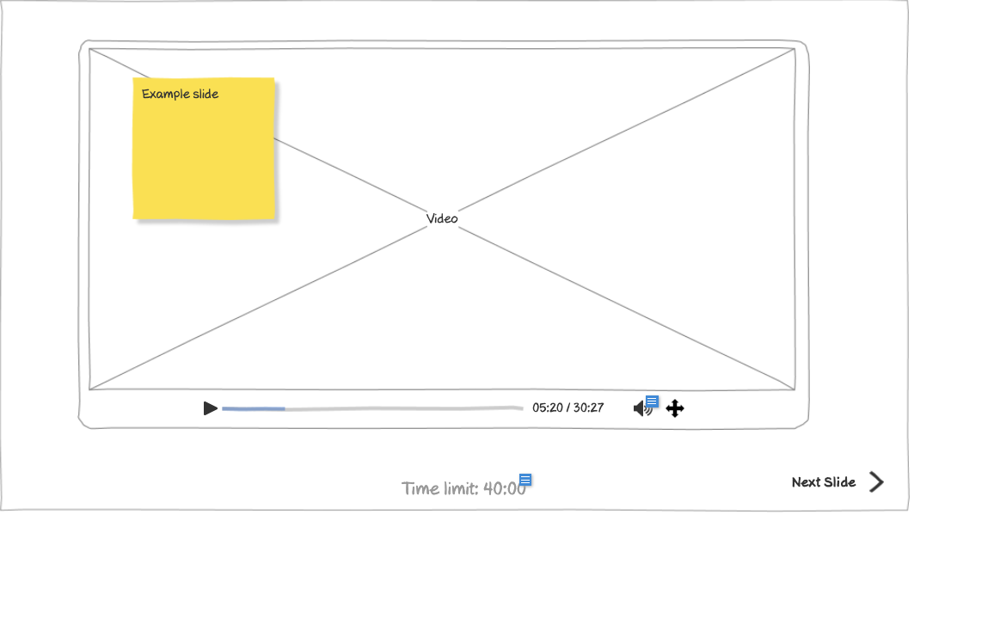

# View Presentation (Slide 1) Wireframe

## Overview

This wireframe displays the "View Presentation" interface showing the first slide of a training presentation. The interface provides a video player-like experience for viewing training content with navigation controls and time tracking.

## UI Components

### Presentation Display
- **Main Content Area**: Large central area displaying the current slide content
- **Example Slide Note**: Yellow sticky note in the top-left corner labeled "Example slide"
- **Video Placeholder**: Central area with "Video" text indicating where video content would be displayed
- **Slide Frame**: Outlined border around the presentation content

### Playback Controls
- **Play/Pause Button**: Control at the bottom-left to start or pause the presentation
- **Progress Bar**: Horizontal bar showing the current position in the presentation
- **Time Display**: Shows current time and total duration (05:20 / 30:27)
- **Volume Control**: Button to adjust audio volume
- **Fullscreen Toggle**: Button to expand the presentation to fullscreen mode

### Navigation Controls
- **Time Limit Display**: Shows the total time limit for the presentation (40:00)
- **Next Slide Button**: Arrow button at the bottom-right to advance to the next slide

## Functionality

This interface allows users to:

1. **View Training Content**: See the presentation slides with embedded video content
2. **Control Playback**: Start, pause, and navigate through the presentation
3. **Track Progress**: Monitor how much of the presentation has been completed
4. **Adjust Volume**: Control the audio level of the presentation
5. **Navigate Between Slides**: Move to the next slide when ready
6. **Monitor Time Limits**: See how much time is allocated for the presentation

## Notes

- The interface resembles a video player but is specifically designed for interactive training presentations
- The current slide appears to be showing a video element
- The progress bar indicates that the user is approximately 17% through the presentation (5:20 out of 30:27)
- The time limit (40:00) suggests that users have a maximum amount of time to complete the training
- The "Example slide" sticky note suggests this is a template or demonstration of how slides would appear
- This view is likely accessed from the training program listing or certificate screens
- The presentation appears to be designed for self-paced learning with user-controlled navigation
