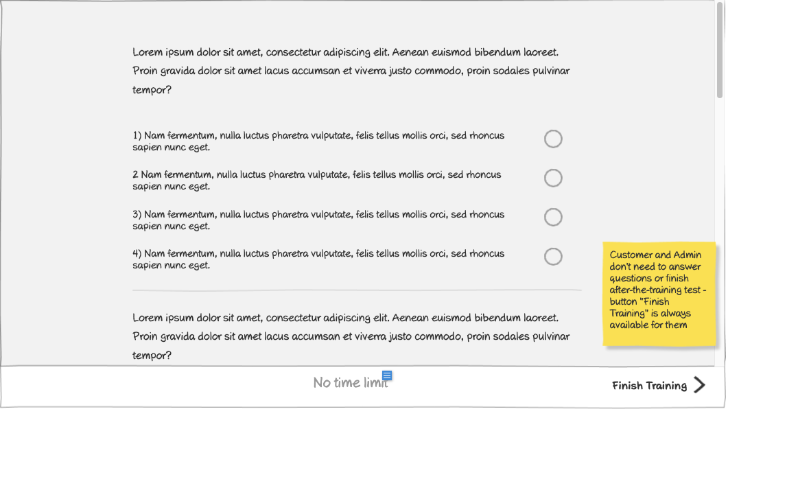

# View Presentation (Slide 3) Wireframe

## Overview

This wireframe displays the "View Presentation" interface showing the third slide of a training presentation. This slide appears to present the results or feedback after the user has completed the training assessment.

## UI Components

### Results Display
- **Results Header**: Title indicating this is the results or summary slide
- **Performance Metrics**: Information about the user's performance on the assessment
- **Pass/Fail Status**: Indication of whether the user successfully passed the training
- **Score Details**: Breakdown of correct and incorrect answers

### Action Controls
- **Finish/Complete Button**: Button to finalize the training session
- **Retry/Review Options**: Possible options to retake the assessment or review content

### Additional Information
- **Training Information**: Details about the completed training program
- **Certification Status**: Information about any certificates earned

## Functionality

This interface allows users to:

1. **View Assessment Results**: See how they performed on the training questions
2. **Understand Pass/Fail Status**: Clearly identify if they successfully completed the training
3. **Review Performance Details**: See which questions they answered correctly or incorrectly
4. **Complete the Training**: Finalize the training session and record completion
5. **Access Remedial Options**: If failed, possibly retry the assessment or review specific content

## Notes

- This slide represents the conclusion of the interactive training experience
- The results screen likely adapts its content based on the user's performance (pass vs. fail)
- For passed assessments, this may include information about the certificate that will be issued
- For failed assessments, this may include guidance on which sections to review
- The system records the completion status for reporting and certification purposes
- This final slide provides closure to the training experience and clear next steps for the user
- The design maintains consistency with the overall presentation viewing interface while adapting to the results format
- This screen is crucial for the training management system as it determines certificate issuance and completion status
