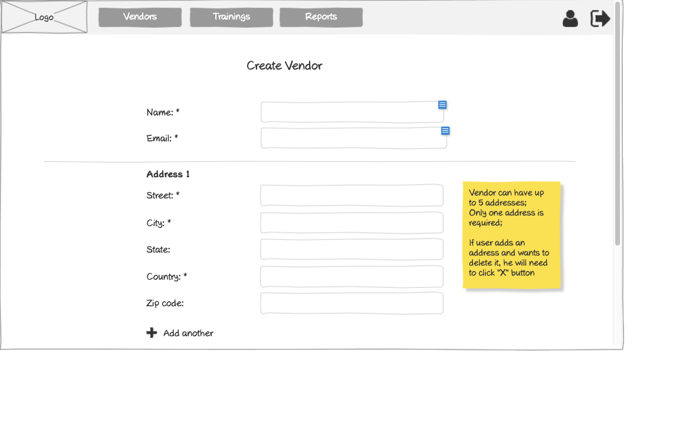

# Customer - Create Vendor Wireframe



## Image Preview


## ASCII Representation

```
+------------------------------------------------------+
|  +------+   +---------+   +---------+   +---------+  |
|  | Logo |   | Vendors |   |Trainings|   | Reports |  |
|  +------+   +---------+   +---------+   +---------+  |
|                                                      |
|                    Create Vendor                     |
|                                                      |
|  Name: *         +----------------------------+      |
|                  |                            |      |
|                  +----------------------------+      |
|                                                      |
|  Email: *        +----------------------------+      |
|                  |                            |      |
|                  +----------------------------+      |
|                                                      |
|  Phone Number: * +----------------------------+      |
|                  |                            |      |
|                  +----------------------------+      |
|  ------------------------------------------------    |
|                                                      |
|  Address 1                                           |
|                                                      |
|  Street: *       +----------------------------+      |
|                  |                            |      |
|                  +----------------------------+      |
|                                                      |
|  City: *         +----------------------------+      |
|                  |                            |      |
|                  +----------------------------+      |
|                                                      |
|  State:          +----------------------------+      |
|                  |                            |      |
|                  +----------------------------+      |
|                                                      |
|  Country: *      +----------------------------+      |
|                  |                            |      |
|                  +----------------------------+      |
|                                                      |
|  Zip code:       +----------------------------+      |
|                  |                            |      |
|                  +----------------------------+      |
|                                                      |
|  + Add another                                       |
|                                                      |
|                  +--------+                          |
|                  | Create |                          |
|                  +--------+                          |
|                                                      |
+------------------------------------------------------+
```

## Overview

This wireframe displays the "Create Vendor" interface from the customer perspective. It allows customers to add a new vendor to the system by providing contact information and address details.

## UI Components

### Navigation Header
- **Logo**: Organization or application logo in the top-left corner
- **Main Navigation**: Horizontal menu with options for Vendors, Trainings, and Reports
- **User Profile**: Icon in the top-right corner for accessing user account options
- **Navigation Arrow**: Button in the top-right corner for additional navigation options

### Form Header
- **Title**: "Create Vendor" heading centered at the top of the form

### Vendor Information Section
- **Name Field**: Required text input (marked with asterisk *) for the vendor's name
- **Email Field**: Required text input (marked with asterisk *) for the vendor's email address
- **Phone Number Field**: Required text input (marked with asterisk *) for the vendor's phone number

### Address Section
- **Address Label**: "Address 1" indicating this is the primary address
- **Street Field**: Required text input (marked with asterisk *) for street address
- **City Field**: Required text input (marked with asterisk *) for city
- **State Field**: Optional text input for state
- **Country Field**: Required text input (marked with asterisk *) for country
- **Zip code Field**: Optional text input for postal/zip code
- **Add another Button**: Button with plus icon to add additional address entries

### Form Controls
- **Create Button**: Button at the bottom to submit the form and create the vendor

## Functionality

This interface allows customers to:

1. **Enter Vendor Details**: Input the vendor's name, email, and phone number
2. **Provide Address Information**: Add one or more addresses for the vendor
3. **Add Multiple Addresses**: Create additional address entries if needed
4. **Submit the Form**: Create the vendor record in the system
5. **Validate Required Fields**: Ensure all required fields (marked with *) are completed

## Notes

- The interface provides a straightforward way for customers to add new vendors to the system
- Required fields are clearly marked with asterisks (*)
- The address management functionality is flexible, allowing for multiple addresses
- The "Add another" button with plus icon makes it clear how to add additional addresses
- This screen is likely accessed from the vendors list page via a "Create Vendor" button
- The form follows a clean, minimalist design consistent with other parts of the application
- The vendor creation process is an important part of the customer workflow, as vendors need to be in the system before they can be assigned trainings
- The simple layout ensures that all required information is collected efficiently
- After successful creation, the user is likely redirected to the vendors list or the newly created vendor's details page
