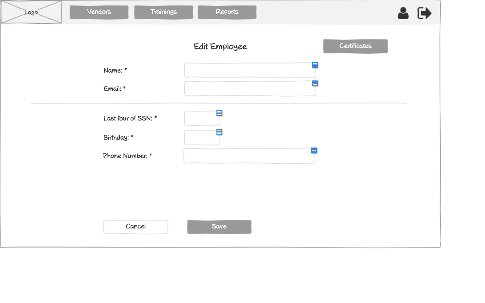

# Customer - Edit Employee Wireframe

## Overview

This wireframe displays the "Edit Employee" interface from the customer perspective. It allows customers to modify existing employee accounts within their organization in the training management system.

## UI Components

### Navigation Header
- **Logo**: Organization or application logo in the top-left corner
- **Main Navigation**: Horizontal menu with options for Employees and Training requests
- **User Profile**: Icon in the top-right corner for accessing user account options
- **Navigation Arrow**: Button in the top-right corner for additional navigation options

### Form Header and Controls
- **Title**: "Edit Employee" heading centered at the top of the form
- **Open Certificates Button**: Button in the top-right of the form area that navigates to the employee's certificates page

### Personal Information Section
- **Name Field**: Required text input (marked with asterisk *) showing the employee's current name
- **Email Field**: Required text input (marked with asterisk *) showing the employee's current email

### Employee Details Section
- **Horizontal Divider**: Separates basic information from employee-specific details
- **Last four of SSN Field**: Required text input for the last four digits of Social Security Number (marked with asterisk *)
- **Birthday Field**: Required date input (marked with asterisk *)
- **Phone Number Field**: Required text input (marked with asterisk *) showing the employee's current phone number

### Action Buttons
- **Cancel Button**: Allows users to cancel the editing process without saving changes
- **Save Button**: Submits the form to save the updated employee information

## Functionality

This interface allows customers to:

1. **Update Employee Information**: Modify any of the employee's personal details as needed
2. **View Employee Certificates**: Access the employee's training certificates via the "Open Certificates" button
3. **Validate Required Fields**: Required fields are clearly marked with asterisks (*)
4. **Cancel Editing Process**: Option to abandon the editing process without saving changes

## Notes

- The interface is simpler than the administrator version, focusing only on essential employee information
- Unlike the admin version, there is no vendor association section since employees are automatically associated with the customer
- There is no "Delete user" button, suggesting that customers may not have the authority to remove employee accounts
- The "Open Certificates" button provides quick access to view the employee's training records
- The form follows a clean, minimalist design with clear section separation
- The required fields (marked with *) ensure that all necessary information is maintained
- This view is accessed from the customer's employees management section
- The form structure is optimized for efficient employee information management by customers
