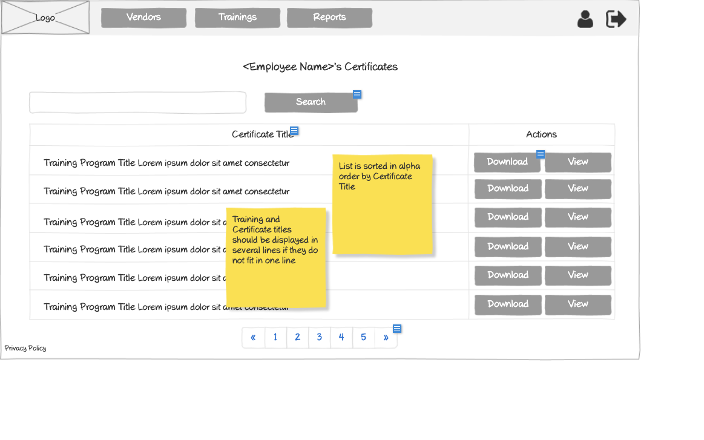

# Customer - Employee Certificates Wireframe



## Image Preview


## ASCII Representation

```
+------------------------------------------------------+
|  +------+   +-----------+   +----------------+   +-+ |
|  | Logo |   | Employees |   | Training req.  |   |U| |
|  +------+   +-----------+   +----------------+   +-+ |
|                                                      |
|  <Employee Name>'s Certificates                      |
|                                                      |
|  +------------------------------------------+  +-+   |
|  |                Search                    |  |S|   |
|  +------------------------------------------+  +-+   |
|                                                      |
|  +----------+----------------+----------------+      |
|  | Customer | Certificate    |    Actions     |      |
|  |          | Title          |                |      |
|  +----------+----------------+----------------+      |
|  | Customer | Training       | +--------+ +-+ |      |
|  | Name     | Program Title  | |Download| |V| |      |
|  |          | Lorem ipsum... | +--------+ +-+ |      |
|  +----------+----------------+----------------+      |
|  | Customer | Training       | +--------+ +-+ |      |
|  | Name     | Program Title  | |Download| |V| |      |
|  |          | Lorem ipsum... | +--------+ +-+ |      |
|  +----------+----------------+----------------+      |
|  | Customer | Training       | +--------+ +-+ |      |
|  | Name     | Program Title  | |Download| |V| |      |
|  |          | Lorem ipsum... | +--------+ +-+ |      |
|  +----------+----------------+----------------+      |
|                                                      |
|  « | 1 | 2 | 3 | 4 | 5 | »                           |
|                                                      |
| Privacy Policy                                       |
+------------------------------------------------------+
```

## Overview

This wireframe displays the "Employee Certificates" interface from the customer perspective. It shows all training certificates earned by a specific employee within the customer's organization, allowing for management and access to these certificates.

## UI Components

### Navigation Header
- **Logo**: Organization or application logo in the top-left corner
- **Main Navigation**: Horizontal menu with options for Employees and Training requests
- **User Profile**: Icon in the top-right corner for accessing user account options
- **Navigation Arrow**: Button in the top-right corner for additional navigation options

### Page Header
- **Title**: "<Employee Name>'s Certificates" heading at the top of the content area, displaying the specific employee's name

### Search and Filter
- **Search Bar**: Full-width search field at the top of the content area
- **Search Button**: Button to execute the search query

### Certificates Table
- **Table Headers**:
  - Customer: Name of the customer organization
  - Certificate Title: Title of the completed training program
  - Actions: Available operations for each certificate

- **Table Rows**: Multiple entries showing certificate information with the following columns:
  - Customer Name
  - Training Program Title (with descriptive text)
  - Action buttons: "Download" and "View" for each certificate

### Pagination Controls
- **Page Navigation**: Controls at the bottom of the table with first («), previous, numbered pages (1-5), next, and last (») buttons
- **Current Page**: Page 1 is currently selected

### Additional Information
- **Privacy Policy**: Link at the bottom-left of the page
- **Notes**: Two yellow sticky notes with important information:
  1. "Training and Certificate titles should be displayed in several lines if they do not fit in one line"
  2. "List is sorted in alpha order by Customer"

## Functionality

This interface allows customers to:

1. **Browse Employee Certificates**: View all training certificates earned by the specific employee in a paginated table format
2. **Search for Certificates**: Find specific certificates using the search functionality
3. **Download Certificates**: Download certificate files for distribution or record-keeping
4. **View Certificates**: Open certificates for detailed viewing
5. **Navigate**: Move between different pages of certificates if the employee has earned many certificates

## Notes

- This view is focused on a single employee's certificates, as indicated by the "<Employee Name>'s Certificates" title
- The customer can see which of their employees have completed which training programs
- The table does not include an "Employee" column since all certificates belong to the same employee
- The system maintains a consistent design pattern with other certificate views in the application
- The sticky notes provide important information about display formatting and sorting order
- The certificates are sorted alphabetically by customer name for easy reference
- This screen is likely accessed from the employee list or employee details page
- The interface provides a comprehensive view of an employee's training accomplishments
