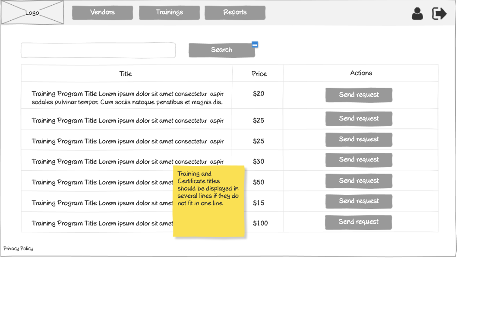

# Customer - Training List Wireframe



## Image Preview


## ASCII Representation

```
+------------------------------------------------------+
|  +------+   +---------+   +---------+   +---------+  |
|  | Logo |   | Vendors |   |Trainings|   | Reports |  |
|  +------+   +---------+   +---------+   +---------+  |
|                                                      |
|  +------------------------------------------+  +-+   |
|  |                Search                    |  |S|   |
|  +------------------------------------------+  +-+   |
|                                                      |
|  +----------+----------------+----------------+      |
|  | Title    | Price          | Actions        |      |
|  +----------+----------------+----------------+      |
|  | Training | $20            | +-----------+  |      |
|  | Program  |                | |Send request|  |      |
|  | Title... |                | +-----------+  |      |
|  +----------+----------------+----------------+      |
|  | Training | $25            | +-----------+  |      |
|  | Program  |                | |Send request|  |      |
|  | Title... |                | +-----------+  |      |
|  +----------+----------------+----------------+      |
|  | Training | $25            | +-----------+  |      |
|  | Program  |                | |Send request|  |      |
|  | Title... |                | +-----------+  |      |
|  +----------+----------------+----------------+      |
|  | Training | $30            | +-----------+  |      |
|  | Program  |                | |Send request|  |      |
|  | Title... |                | +-----------+  |      |
|  +----------+----------------+----------------+      |
|                                                      |
|  « | 1 | 2 | 3 | 4 | 5 | »                           |
|                                                      |
| Privacy Policy                                       |
+------------------------------------------------------+
```

## Overview

This wireframe displays the "Training List" interface from the customer perspective. It shows a list of available training programs with their pricing and request options, allowing customers to browse and request access to training content for their employees.

## UI Components

### Navigation Header
- **Logo**: Organization or application logo in the top-left corner
- **Main Navigation**: Horizontal menu with options for Vendors, Trainings (currently selected), and Reports
- **User Profile**: Icon in the top-right corner for accessing user account options
- **Navigation Arrow**: Button in the top-right corner for additional navigation options

### Search and Filter
- **Search Bar**: Full-width search field at the top of the content area
- **Search Button**: Button to execute the search query

### Training Programs Table
- **Table Headers**:
  - Title: Name of the training program
  - Price: Cost of the training
  - Actions: Available operations for each training

- **Table Rows**: Multiple entries showing training information with the following columns:
  - Training Program Title (with descriptive text)
  - Price (formatted with currency symbol)
  - Action button: "Send request" for requesting access to the training

### Pagination Controls
- **Page Navigation**: Controls at the bottom of the table with first («), previous, numbered pages (1-5), next, and last (») buttons
- **Current Page**: Page 1 is currently selected

### Informational Note
- **Yellow Sticky Note**: Contains important information about title display: "Training and Certificate titles should be displayed in several lines if they do not fit in one line"

### Additional Information
- **Privacy Policy**: Link at the bottom-left of the page

## Functionality

This interface allows customers to:

1. **Browse Available Trainings**: View all training programs available for their employees
2. **Search for Trainings**: Find specific training programs using the search functionality
3. **View Pricing**: See the cost associated with each training program
4. **Request Access**: Send requests for access to specific training programs for their employees
5. **Navigate**: Move between different pages of training programs if many are available

## Notes

- The interface provides a comprehensive view of all training programs available to the customer
- Training programs have different price points ($15 to $100), suggesting different levels or types of training
- The "Send request" button suggests that customers need to request access to trainings before they can be assigned to employees
- The sticky note provides important information about display formatting for long titles
- Pricing is clearly displayed to help customers make informed decisions about which trainings to request
- This screen serves as the main hub for customers to discover and access training content for their employees
- The search functionality allows customers to quickly find relevant trainings in a potentially large catalog
- The consistent layout with other list views in the application makes navigation intuitive for users
