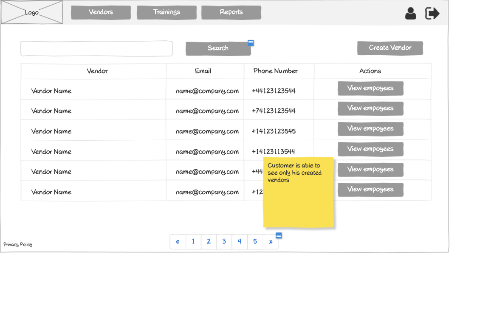

# Customer - Vendors List Wireframe



## Image Preview


## ASCII Representation

```
+------------------------------------------------------+
|  +------+   +---------+   +---------+   +---------+  |
|  | Logo |   | Vendors |   |Trainings|   | Reports |  |
|  +------+   +---------+   +---------+   +---------+  |
|                                                      |
|  +------------------------------------------+  +-+   |
|  |                Search                    |  |S|   |
|  +------------------------------------------+  +-+   |
|                                                      |
|  +----------+----------------+----------------+      |
|  | Vendor   | Email          | Phone Number   |      |
|  +----------+----------------+----------------+      |
|  | Vendor   | name@company   | +44123123544   |      |
|  | Name     | .com           |                |      |
|  +----------+----------------+----------------+      |
|  | Vendor   | name@company   | +74123123544   |      |
|  | Name     | .com           |                |      |
|  +----------+----------------+----------------+      |
|  | Vendor   | name@company   | +14123123545   |      |
|  | Name     | .com           |                |      |
|  +----------+----------------+----------------+      |
|  | Vendor   | name@company   | +14123113544   |      |
|  | Name     | .com           |                |      |
|  +----------+----------------+----------------+      |
|                                                      |
|  « | 1 | 2 | 3 | 4 | 5 | »                           |
|                                                      |
| Privacy Policy                                       |
+------------------------------------------------------+
```

## Overview

This wireframe displays the "Vendors List" interface from the customer perspective. It shows a list of all vendors associated with the customer's organization, allowing for management and access to vendor information and their employees.

## UI Components

### Navigation Header
- **Logo**: Organization or application logo in the top-left corner
- **Main Navigation**: Horizontal menu with options for Vendors (currently selected), Trainings, and Reports
- **User Profile**: Icon in the top-right corner for accessing user account options
- **Navigation Arrow**: Button in the top-right corner for additional navigation options

### Action Controls
- **Search Bar**: Full-width search field at the top of the content area
- **Search Button**: Button to execute the search query
- **Create Vendor Button**: Button in the top-right to add a new vendor to the organization

### Vendors Table
- **Table Headers**:
  - Vendor: Name of the vendor
  - Email: Email address of the vendor
  - Phone Number: Contact phone number
  - Actions: Available operations for each vendor

- **Table Rows**: Multiple entries showing vendor information with the following columns:
  - Vendor Name
  - Email Address (formatted as name@company.com)
  - Phone Number (with international format, e.g., +44123123544)
  - Action button: "View employees" button to access the vendor's employees

### Pagination Controls
- **Page Navigation**: Controls at the bottom of the table with first («), previous, numbered pages (1-5), next, and last (») buttons
- **Current Page**: Page 1 is currently selected

### Informational Note
- **Yellow Sticky Note**: Contains important information: "Customer is able to see only his created vendors"

### Additional Information
- **Privacy Policy**: Link at the bottom-left of the page

## Functionality

This interface allows customers to:

1. **Browse Vendors**: View all vendors in their organization in a paginated table format
2. **Search for Vendors**: Find specific vendors using the search functionality
3. **Create New Vendors**: Add new vendor accounts via the "Create Vendor" button
4. **Access Vendor Employees**: View employees associated with each vendor via the "View employees" button
5. **Navigate**: Move between different pages of vendors if the organization has many vendors

## Notes

- The interface provides a comprehensive view of all vendors within the customer's organization
- The sticky note indicates an important security/visibility constraint: customers can only see vendors they have created
- Phone numbers are shown with international dialing codes, suggesting a global user base
- The "Create Vendor" button indicates that customers can add new vendors directly from this interface
- The "View employees" button provides quick access to each vendor's employee list, facilitating efficient navigation between related data
- The system maintains a consistent layout with other list views in the application
- This screen serves as a central hub for managing vendors and accessing their associated employees
- The search functionality allows customers to quickly find specific vendors within a potentially large list
- This view is likely the starting point for many vendor-related workflows, such as adding new vendors, managing existing vendors, or accessing vendor employees
