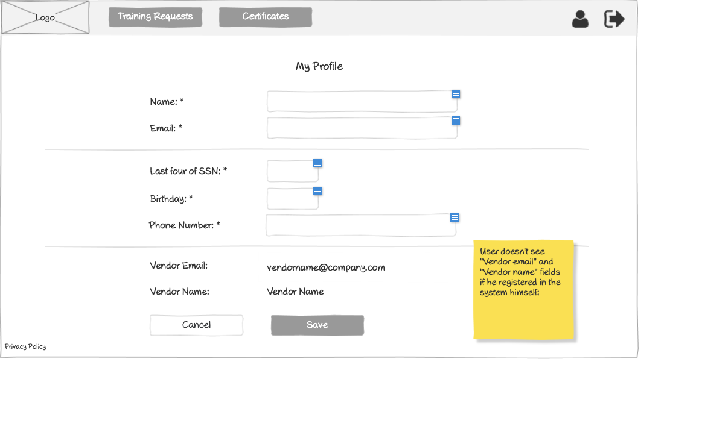

# Employee - Profile Wireframe



## Image Preview


## ASCII Representation

```
+------------------------------------------------------+
|  +------+   +-----------+   +----------------+   +-+ |
|  | Logo |   | Employees |   | Training req.  |   |U| |
|  +------+   +-----------+   +----------------+   +-+ |
|                                                      |
|                    My Profile                        |
|                                                      |
|  Name: *         +----------------------------+      |
|                  |                            |      |
|                  +----------------------------+      |
|                                                      |
|  Email: *        +----------------------------+      |
|                  |                            |      |
|                  +----------------------------+      |
|  ------------------------------------------------    |
|                                                      |
|  Address 1                                           |
|                                                      |
|  Street: *       +----------------------------+      |
|                  |                            |      |
|                  +----------------------------+      |
|                                                      |
|  City: *         +----------------------------+      |
|                  |                            |      |
|                  +----------------------------+      |
|                                                      |
|  State:          +----------------------------+      |
|                  |                            |      |
|                  +----------------------------+      |
|                                                      |
|  Country: *      +----------------------------+      |
|                  |                            |      |
|                  +----------------------------+      |
|                                                      |
|  Zip code:       +----------------------------+      |
|                  |                            |      |
|                  +----------------------------+      |
|                                                      |
|  + Add another                                       |
|                                                      |
+------------------------------------------------------+
```

## Overview

This wireframe displays the "My Profile" interface from the employee perspective. It allows employees to view and edit their personal information and manage their address details within the training management system.

## UI Components

### Navigation Header
- **Logo**: Organization or application logo in the top-left corner
- **Main Navigation**: Horizontal menu with options for Employees and Training requests
- **User Profile**: Icon in the top-right corner for accessing user account options
- **Navigation Arrow**: Button in the top-right corner for additional navigation options

### Form Header
- **Title**: "My Profile" heading centered at the top of the form

### Personal Information Section
- **Name Field**: Required text input (marked with asterisk *) showing the employee's current name
- **Email Field**: Required text input (marked with asterisk *) showing the employee's current email

### Address Section
- **Address Label**: "Address 1" indicating this is the primary address
- **Street Field**: Required text input (marked with asterisk *) for street address
- **City Field**: Required text input (marked with asterisk *) for city
- **State Field**: Optional text input for state
- **Country Field**: Required text input (marked with asterisk *) for country
- **Zip code Field**: Optional text input for postal/zip code
- **Add another Button**: Button with plus icon to add additional address entries

### Informational Note
- **Yellow Sticky Note**: Contains important information about address management:
  1. "Vendor can have up to 5 addresses;"
  2. "Only one address is required;"
  3. "If user adds an address and wants to delete it, he will need to click 'X' button"

## Functionality

This interface allows employees to:

1. **View Personal Information**: See their current profile details
2. **Edit Personal Information**: Update their name and email if needed
3. **Manage Addresses**: Add, edit, or remove address information
4. **Add Multiple Addresses**: Create up to 5 different address entries
5. **Validate Required Fields**: Ensure all required fields (marked with *) are completed

## Notes

- The interface provides a simple, user-friendly way for employees to manage their profile information
- The form appears to be in view/edit mode, allowing employees to see their current information and make changes
- Required fields are clearly marked with asterisks (*)
- The address management functionality is flexible, allowing for multiple addresses while requiring only one
- The sticky note provides important guidance on address management capabilities and limitations
- The "Add another" button with plus icon makes it clear how to add additional addresses
- This screen is likely accessed from the user profile icon in the navigation header
- The interface follows a clean, minimalist design consistent with other parts of the application
