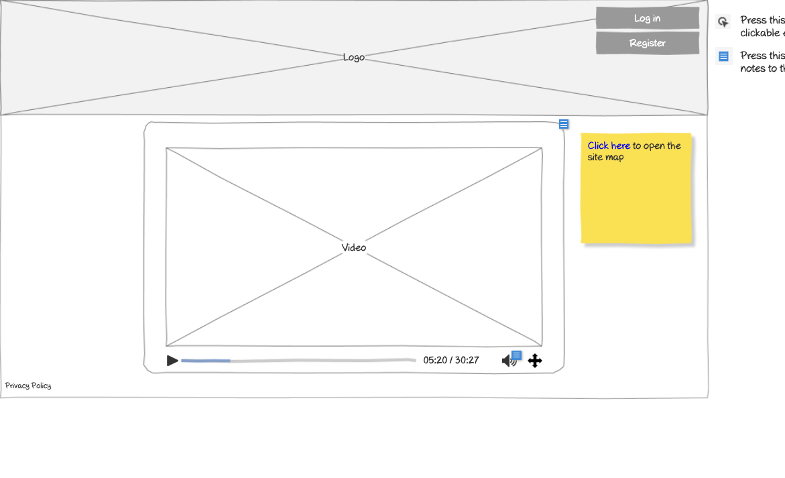

# Home Page (Guest) Wireframe



## Image Preview


## ASCII Representation

```
+------------------------------------------------------+
|                                                      |
|  +------+                                      +-+   |
|  | Logo |                                      |L|   |
|  +------+                                      +-+   |
|                                                      |
|                                                      |
|                                                      |
|                                                      |
|                                                      |
|                                                      |
|                                                      |
|                                                      |
|                                                      |
|                                                      |
|                                                      |
|                                                      |
|                                                      |
|                                                      |
|                                                      |
|                                                      |
|                                                      |
|                                                      |
|                                                      |
|                                                      |
|                                                      |
| Privacy Policy                                       |
+------------------------------------------------------+
```

## Overview

This wireframe displays the "Home Page" interface for guest users (not logged in). It shows a minimal landing page with basic branding and login access.

## UI Components

### Header
- **Logo**: Organization or application logo in the top-left corner
- **Login Button**: Button in the top-right corner for accessing the login page

### Footer
- **Privacy Policy**: Link at the bottom-left of the page

## Functionality

This interface allows guest users to:

1. **View Branding**: See the organization's logo and basic branding
2. **Access Login**: Navigate to the login page to authenticate
3. **View Privacy Policy**: Access the privacy policy information

## Notes

- The interface provides a simple, minimalist landing page for unauthenticated users
- The primary purpose of this page is to direct users to the login functionality
- The page contains minimal content, focusing on the essential elements needed for a guest user
- This screen is likely the first page users see when accessing the application without authentication
- The login button is prominently placed in the top-right corner, following standard web conventions
- The privacy policy link is included in the footer, providing access to important legal information
- The simplicity of the design suggests that the application's functionality is only available to authenticated users
- This page may be expanded in future iterations to include marketing information, feature highlights, or registration options
- The clean layout ensures that users can quickly identify how to proceed (by logging in)
- This view serves as the entry point to the application for new or returning users who are not currently authenticated
