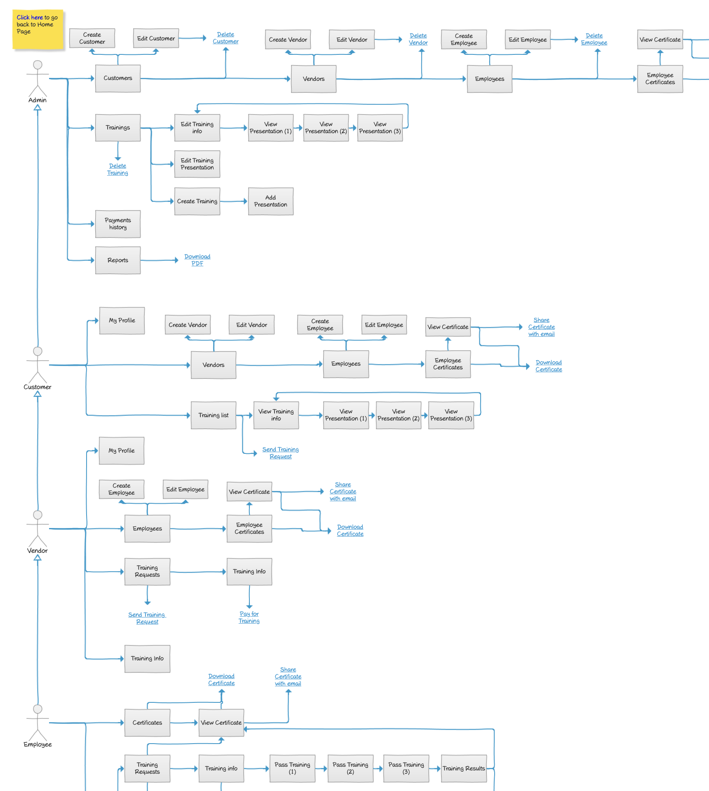

# Site Map Wireframe



## Image Preview


## ASCII Representation

```
+------------------------------------------------------+
|                                                      |
|                      Site Map                        |
|                                                      |
|  +----------+       +----------+       +----------+  |
|  |  Guest   |       |  Admin   |       | Customer |  |
|  +----------+       +----------+       +----------+  |
|       |                  |                  |        |
|       v                  v                  v        |
|  +----------+       +----------+       +----------+  |
|  |  Login   |       |Dashboard |       |Dashboard |  |
|  +----------+       +----------+       +----------+  |
|       |                  |                  |        |
|       v                  |                  |        |
|  +----------+            |                  |        |
|  |Registration|          |                  |        |
|  +----------+            |                  |        |
|       |                  |                  |        |
|       v                  v                  v        |
|  +----------+       +----------+       +----------+  |
|  | Employee |       | Vendors  |       | Vendors  |  |
|  +----------+       +----------+       +----------+  |
|       |                  |                  |        |
|       v                  v                  v        |
|  +----------+       +----------+       +----------+  |
|  |  Vendor  |       |Employees |       |Trainings |  |
|  +----------+       +----------+       +----------+  |
|                          |                  |        |
|                          v                  v        |
|                     +----------+       +----------+  |
|                     |Trainings |       | Reports  |  |
|                     +----------+       +----------+  |
|                          |                           |
|                          v                           |
|                     +----------+                     |
|                     | Reports  |                     |
|                     +----------+                     |
|                                                      |
+------------------------------------------------------+
```

## Overview

This wireframe displays the "Site Map" for the application, showing the overall navigation structure and user flows for different user roles (Guest, Admin, Customer, Employee, and Vendor).

## UI Components

### Title
- **Site Map Header**: Title at the top of the diagram

### User Roles and Navigation Paths
- **Guest Path**: Shows the navigation flow for unauthenticated users
  - Login
  - Registration (with Employee and Vendor options)

- **Admin Path**: Shows the navigation flow for administrators
  - Dashboard
  - Vendors
  - Employees
  - Trainings
  - Reports

- **Customer Path**: Shows the navigation flow for customers
  - Dashboard
  - Vendors
  - Trainings
  - Reports

### Connections
- **Arrows**: Directional arrows showing the navigation flow between pages
- **Hierarchical Structure**: Visual representation of the parent-child relationships between pages

## Functionality

This site map illustrates:

1. **User Role Separation**: Different navigation paths based on user roles
2. **Navigation Structure**: The hierarchical organization of pages within the application
3. **User Flows**: The typical paths users might take through the application
4. **Access Control**: Which sections are available to which user roles

## Notes

- The site map provides a high-level overview of the application's structure
- The guest path focuses on authentication and registration options
- The admin path shows the comprehensive access to all sections of the application
- The customer path shows access to vendor management, trainings, and reports
- The hierarchical structure indicates that some sections are accessible only after navigating through parent sections
- This diagram serves as a reference for understanding the overall architecture of the application
- The site map helps stakeholders visualize how different user roles interact with the system
- This view is likely used for planning and documentation purposes rather than as an actual interface in the application
- The simple box-and-arrow format makes it easy to understand the relationships between different sections
- This diagram may be expanded or refined as the application evolves with new features or user roles
