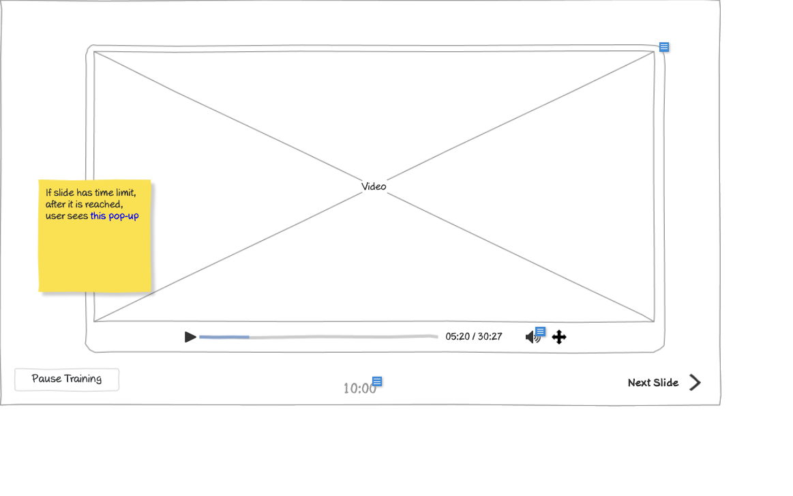

# Pass Training (Quiz Slide 1) Wireframe



## Image Preview


## ASCII Representation

```
+------------------------------------------------------+
|                                                      |
|  Lorem ipsum dolor sit amet, consectetur adipiscing  |
|  elit. Aenean euismod bibendum laoreet. Proin gravida|
|  dolor sit amet lacus accumsan et viverra justo      |
|  commodo, proin sodales pulvinar tempor?             |
|                                                      |
|                                                      |
|  1) Nam fermentum, nulla luctus pharetra vulputate,  |
|  felis tellus mollis orci, sed rhoncus sapien nunc   |  ○
|  eget.                                               |
|                                                      |
|  2 Nam fermentum, nulla luctus pharetra vulputate,   |
|  felis tellus mollis orci, sed rhoncus sapien nunc   |  ○
|  eget.                                               |
|                                                      |
|  3) Nam fermentum, nulla luctus pharetra vulputate,  |
|  felis tellus mollis orci, sed rhoncus sapien nunc   |  ○
|  eget.                                               |
|                                                      |
|  4) Nam fermentum, nulla luctus pharetra vulputate,  |
|  felis tellus mollis orci, sed rhoncus sapien nunc   |  ○
|  eget.                                               |
|                                                      |
|                                                      |
|         Time limit: 04:00                 Next Slide →|
|                                                      |
+------------------------------------------------------+
```

## Overview

This wireframe displays the "Pass Training (Quiz Slide 1)" interface, showing a multiple-choice quiz question as part of a training assessment. It allows users to select an answer and navigate through the quiz.

## UI Components

### Question Section
- **Question Text**: Paragraph at the top displaying the question text (Lorem ipsum placeholder text)

### Answer Options
- **Multiple Choice Options**: Four answer options labeled 1-4, each with descriptive text
- **Radio Buttons**: Circular selection buttons to the right of each answer option

### Navigation Controls
- **Time Limit Display**: Text showing the time limit for the question (04:00)
- **Next Slide Button**: Button in the bottom-right to advance to the next slide

### Informational Note
- **Yellow Sticky Note**: Contains important information: "Customer and Admin don't need to answer questions or finish after-the-training test - button 'Finish Training' is always available for them"

## Functionality

This interface allows users to:

1. **Read Question**: View the question text at the top of the screen
2. **Select Answer**: Choose one of the four multiple-choice options
3. **Track Time**: Monitor the time remaining to answer the question
4. **Navigate Quiz**: Move to the next question after selecting an answer
5. **Skip Questions**: For Customer and Admin users, bypass the quiz entirely

## Notes

- The interface provides a clean, focused environment for quiz-taking
- The question and answer options use placeholder text (Lorem ipsum)
- The time limit (04:00) indicates that users have 4 minutes to answer this question
- The radio button format ensures users can select only one answer
- The sticky note indicates special privileges for Customer and Admin users, who can skip the quiz
- This screen is part of a multi-slide quiz that likely follows training content
- The numbering of options is inconsistent (1), 2, 3), 4)) in the wireframe, which should be standardized in the final implementation
- The simple layout ensures that the question and answer options are clearly presented
- This view is likely accessed after viewing training content and before receiving a certificate
