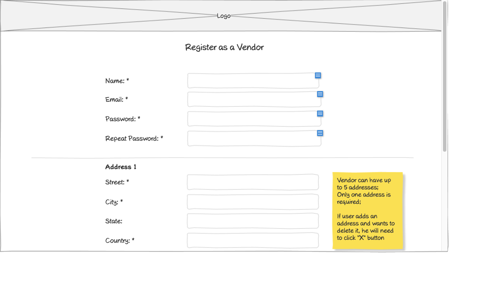

# Register as Vendor Wireframe

## Overview

This wireframe displays the "Register as a Vendor" interface, which allows new vendors to create an account in the training management system. The form collects essential personal and business information needed to establish a vendor account.

## UI Components

### Header
- **Logo**: Organization or application logo centered at the top of the page

### Form Header
- **Title**: "Register as a Vendor" heading centered below the logo

### Personal Information Section
- **Name Field**: Required text input (marked with asterisk *)
- **Email Field**: Required text input (marked with asterisk *)
- **Password Field**: Required password input (marked with asterisk *)
- **Repeat Password Field**: Required password confirmation input (marked with asterisk *)

### Address Section
- **Horizontal Divider**: Separates basic account information from address details
- **Address Label**: "Address 1" indicating this is the primary address
- **Street Field**: Required text input (marked with asterisk *)
- **City Field**: Required text input (marked with asterisk *)
- **State Field**: Optional text input
- **Country Field**: Required text input (marked with asterisk *)

### Informational Note
- **Yellow Sticky Note**: Contains important information about address management:
  1. "Vendor can have up to 5 addresses;"
  2. "Only one address is required;"
  3. "If user adds an address and wants to delete it, he will need to click 'X' button"

## Functionality

This interface allows new vendors to:

1. **Create an Account**: Register as a vendor in the system
2. **Set Login Credentials**: Establish email and password for future logins
3. **Provide Business Address**: Submit required address information
4. **Understand Address Management**: Learn about the ability to add multiple addresses

## Notes

- The interface provides a clean, straightforward registration form for vendors
- Required fields are clearly marked with asterisks (*)
- The password field includes a confirmation field to prevent typing errors
- The form collects essential business information, focusing on address details
- The sticky note provides important guidance on address management capabilities and limitations
- This screen is likely accessed from the registration options page where users select their role
- The form follows a logical flow, grouping related information together
- The design maintains a simple, focused approach to minimize registration friction
- Unlike the employee registration, this form emphasizes business location information
