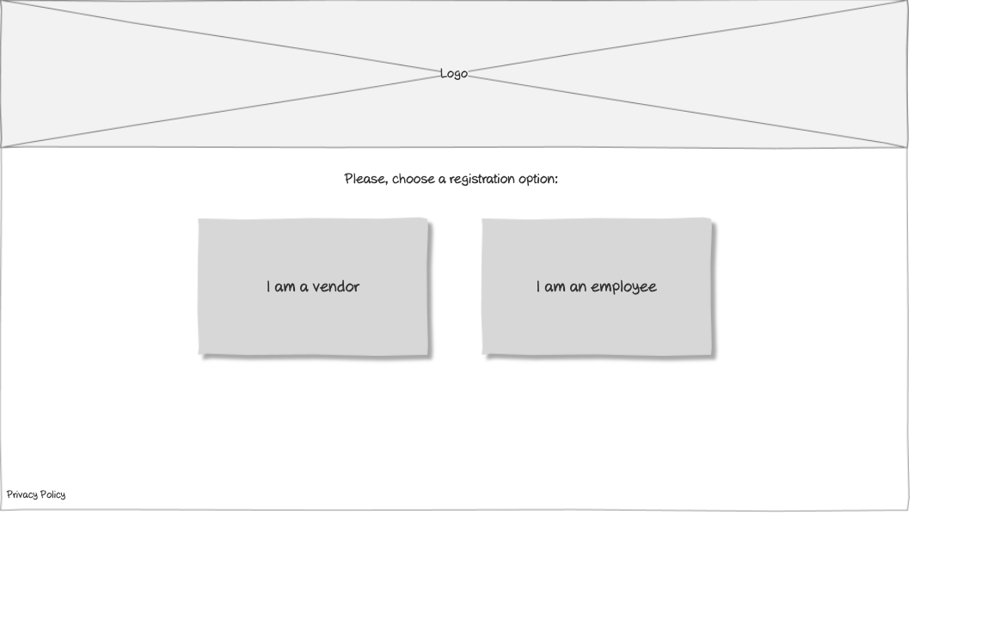

# Registration Options Wireframe

## Overview

This wireframe displays the "Registration Options" interface, which serves as the entry point for new users to select their role in the training management system. Users can choose between registering as a vendor or as an employee.

## UI Components

### Header
- **Logo**: Organization or application logo centered at the top of the page

### Instructions
- **Prompt Text**: "Please, choose a registration option:" centered below the logo

### Registration Options
- **Vendor Option**: Large button or card with text "I am a vendor"
- **Employee Option**: Large button or card with text "I am an employee"

### Additional Information
- **Privacy Policy**: Link at the bottom-left of the page

## Functionality

This interface allows new users to:

1. **Select User Role**: Choose between registering as a vendor or an employee
2. **Access Privacy Policy**: View the system's privacy policy before proceeding
3. **Begin Registration Process**: Initiate the appropriate registration flow based on selection

## Notes

- The interface presents a simple, clear choice between two user roles
- The options are presented as equal, prominent buttons/cards to facilitate easy selection
- The design uses visual depth (shadows) to make the options appear as clickable elements
- This screen serves as the gateway to the role-specific registration forms
- The minimalist design focuses user attention on the critical decision of role selection
- The privacy policy link is accessible but doesn't distract from the main purpose of the page
- This is likely the first screen users see after deciding to register for the system
- The clear separation of roles helps ensure users follow the correct registration path
