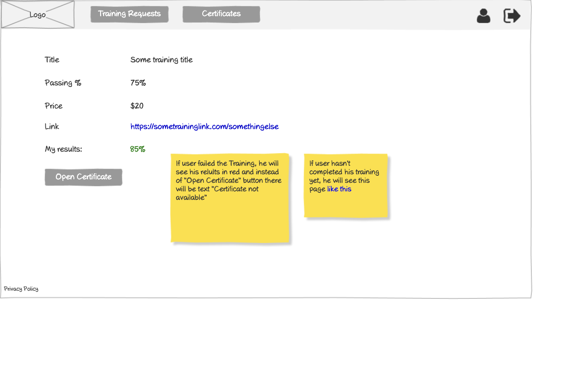

# Training Info (Version 2) Wireframe



## Image Preview


## ASCII Representation

```
+------------------------------------------------------+
|  +------+   +---------+   +---------+   +---------+  |
|  | Logo |   | Vendors |   |Trainings|   | Reports |  |
|  +------+   +---------+   +---------+   +---------+  |
|                                                      |
|                                                      |
|  Title           Some training title                 |
|                                                      |
|  Passing %       75%                                 |
|                                                      |
|  Price           $20                                 |
|                                                      |
|  Link            https://sometraininglink.com/...    |
|                                                      |
|  Training        +--------+                          |
|                  | Open   |                          |
|                  +--------+                          |
|                                                      |
|                                                      |
|                                                      |
|                                                      |
|                                                      |
|                                                      |
|                                                      |
|                                                      |
|                                                      |
| Privacy Policy                                       |
+------------------------------------------------------+
```

## Overview

This wireframe displays the "Training Info (Version 2)" interface, showing detailed information about a specific training program, including its title, passing requirements, price, and access options. This appears to be an alternative version or iteration of the training information view.

## UI Components

### Navigation Header
- **Logo**: Organization or application logo in the top-left corner
- **Main Navigation**: Horizontal menu with options for Vendors, Trainings, and Reports
- **User Profile**: Icon in the top-right corner for accessing user account options (not shown in ASCII but likely present in the actual wireframe)
- **Navigation Arrow**: Button in the top-right corner for additional navigation options (not shown in ASCII but likely present in the actual wireframe)

### Training Information
- **Title Field**: Label and value showing the training program title ("Some training title")
- **Passing % Field**: Label and value showing the required passing percentage (75%)
- **Price Field**: Label and value showing the cost of the training ($20)
- **Link Field**: Label and value showing the URL to access the training
- **Training Access**: Label and "Open" button to launch the training content

### Additional Information
- **Privacy Policy**: Link at the bottom-left of the page

## Functionality

This interface allows users to:

1. **View Training Details**: See comprehensive information about the selected training program
2. **Access Training Content**: Launch the training by clicking the "Open" button
3. **Copy Training Link**: Access the direct URL to the training content
4. **Understand Requirements**: View the passing percentage required to complete the training
5. **See Pricing**: View the cost associated with the training program

## Notes

- The interface provides a clean, focused view of essential training information
- The passing percentage (75%) indicates the minimum score required to successfully complete the training
- The price ($20) is clearly displayed, helping users understand the cost of the training
- The direct link to the training is provided, which could be used for sharing or direct access
- The "Open" button provides immediate access to the training content
- This screen is likely accessed from the training list or training requests page
- The simple layout ensures that all important information is clearly presented
- This view serves as both an informational page and a gateway to accessing the actual training content
- The training link is displayed as a clickable URL, suggesting it may be an external resource or a deep link within the application
- This version appears to be functionally identical to the other training info view, suggesting it may be an alternative design or a view for a different user role
