# Updated Udora System Mermaid Diagrams

This document contains comprehensive mermaid diagrams that visualize the structure, flow, and UI components of the Udora system based on the wireframe specifications.

## 1. Site Map Overview

```mermaid
graph TD
    %% Main user roles
    Guest([Guest])
    Admin([Admin])
    Customer([Customer])
    Vendor([Vendor])
    Employee([Employee])
    
    %% Guest flow
    Guest --> Login
    Login --> Registration
    Registration --> RegistrationOptions[Registration Options]
    RegistrationOptions --> EmployeeReg[Employee Registration]
    RegistrationOptions --> VendorReg[Vendor Registration]
    
    %% Admin flow
    Admin --> AdminDashboard[Dashboard]
    AdminDashboard --> AdminCustomers[Customers]
    AdminDashboard --> AdminVendors[Vendors]
    AdminDashboard --> AdminEmployees[Employees]
    AdminDashboard --> AdminTrainings[Trainings]
    AdminDashboard --> AdminPayments[Payments History]
    AdminDashboard --> AdminReports[Reports]
    AdminDashboard --> AdminCertificates[Certificates]
    
    %% Customer flow
    Customer --> CustomerDashboard[Dashboard]
    CustomerDashboard --> CustomerProfile[My Profile]
    CustomerDashboard --> CustomerVendors[Vendors]
    CustomerDashboard --> CustomerEmployees[Employees]
    CustomerDashboard --> CustomerTrainings[Training List]
    CustomerDashboard --> CustomerReports[Reports]
    
    %% Vendor flow
    Vendor --> VendorDashboard[Dashboard]
    VendorDashboard --> VendorProfile[My Profile]
    VendorDashboard --> VendorEmployees[Employees]
    VendorDashboard --> VendorTrainingRequests[Training Requests]
    VendorDashboard --> VendorTrainingInfo[Training Info]
    VendorDashboard --> VendorCertificates[Certificates]
    
    %% Employee flow
    Employee --> EmployeeDashboard[Dashboard]
    EmployeeDashboard --> EmployeeProfile[My Profile]
    EmployeeDashboard --> EmployeeCertificates[Certificates]
    EmployeeDashboard --> EmployeeTrainingRequests[Training Requests]
    EmployeeDashboard --> EmployeeTrainingInfo[Training Info]
    
    %% Style definitions
    classDef userRole fill:#f9f,stroke:#333,stroke-width:2px;
    classDef dashboard fill:#bbf,stroke:#333,stroke-width:1px;
    
    %% Apply styles
    class Guest,Admin,Customer,Vendor,Employee userRole;
    class AdminDashboard,CustomerDashboard,VendorDashboard,EmployeeDashboard dashboard;
```

## 2. Admin User Journey with UI Components

```mermaid
graph TD
    Admin([Admin]) --> AdminDashboard[Dashboard]
    
    %% Customers management
    AdminDashboard --> Customers[Customers]
    Customers --> CreateCustomer[Create Customer]
    CreateCustomer --> CustomerForm[Customer Form<br>- Name*<br>- Email*<br>- Phone*<br>- Company*<br>- Address*]
    Customers --> EditCustomer[Edit Customer]
    Customers --> DeleteCustomer[Delete Customer]
    
    %% Vendors management
    AdminDashboard --> Vendors[Vendors]
    Vendors --> CreateVendor[Create Vendor]
    CreateVendor --> VendorForm[Vendor Form<br>- Name*<br>- Email*<br>- Phone*<br>- Company*<br>- Address*]
    Vendors --> EditVendor[Edit Vendor]
    Vendors --> DeleteVendor[Delete Vendor]
    
    %% Employees management
    AdminDashboard --> Employees[Employees]
    Employees --> CreateEmployee[Create Employee]
    CreateEmployee --> EmployeeForm[Employee Form<br>- Name*<br>- Email*<br>- Phone*<br>- Position*]
    Employees --> EditEmployee[Edit Employee]
    Employees --> DeleteEmployee[Delete Employee]
    Employees --> EmployeeCertificates[Employee Certificates]
    EmployeeCertificates --> ViewCertificate[View Certificate]
    
    %% Trainings management
    AdminDashboard --> Trainings[Trainings]
    Trainings --> EditTrainingInfo[Edit Training Info]
    EditTrainingInfo --> TrainingInfoForm[Training Info Form<br>- Title*<br>- Description*<br>- Price*]
    Trainings --> EditTrainingPresentation[Edit Training Presentation]
    EditTrainingPresentation --> PresentationEditor[Presentation Editor<br>- Slides<br>- Content<br>- Media]
    Trainings --> CreateTraining[Create Training]
    CreateTraining --> NewTrainingForm[New Training Form<br>- Title*<br>- Description*<br>- Price*]
    Trainings --> DeleteTraining[Delete Training]
    Trainings --> ViewPresentation1[View Presentation 1]
    Trainings --> ViewPresentation2[View Presentation 2]
    Trainings --> ViewPresentation3[View Presentation 3]
    CreateTraining --> AddPresentation[Add Presentation]
    AddPresentation --> UploadPresentation[Upload Presentation<br>- File Upload<br>- Title*<br>- Description]
    
    %% Payments and Reports
    AdminDashboard --> PaymentsHistory[Payments History]
    PaymentsHistory --> PaymentsTable[Payments Table<br>- Date<br>- Vendor<br>- Amount<br>- Status]
    AdminDashboard --> Reports[Reports]
    Reports --> ReportsInterface[Reports Interface<br>- Date Range<br>- Report Type<br>- Filters]
    Reports --> DownloadPDF[Download PDF]
    
    %% Certificates
    AdminDashboard --> Certificates[Certificates]
    Certificates --> CertificatesTable[Certificates Table<br>- Employee<br>- Training<br>- Date<br>- Status]
    
    %% Home navigation
    AdminDashboard --> HomePage[Home Page]
    
    %% Style definitions
    classDef userRole fill:#f9f,stroke:#333,stroke-width:2px;
    classDef dashboard fill:#bbf,stroke:#333,stroke-width:1px;
    classDef action fill:#dfd,stroke:#333,stroke-width:1px;
    classDef form fill:#ffd,stroke:#333,stroke-width:1px;
    classDef table fill:#eff,stroke:#333,stroke-width:1px;
    
    %% Apply styles
    class Admin userRole;
    class AdminDashboard dashboard;
    class CreateCustomer,EditCustomer,DeleteCustomer,CreateVendor,EditVendor,DeleteVendor,CreateEmployee,EditEmployee,DeleteEmployee,EditTrainingInfo,EditTrainingPresentation,CreateTraining,DeleteTraining,AddPresentation,DownloadPDF action;
    class CustomerForm,VendorForm,EmployeeForm,TrainingInfoForm,NewTrainingForm,PresentationEditor,UploadPresentation form;
    class PaymentsTable,ReportsInterface,CertificatesTable table;
```

## 3. Customer User Journey with UI Components

```mermaid
graph TD
    Customer([Customer]) --> CustomerDashboard[Dashboard]
    
    %% Profile
    CustomerDashboard --> CustomerProfile[My Profile]
    CustomerProfile --> ProfileForm[Profile Form<br>- Name<br>- Email<br>- Phone<br>- Company<br>- Address]
    
    %% Vendors management
    CustomerDashboard --> CustomerVendors[Vendors]
    CustomerVendors --> VendorsTable[Vendors Table<br>- Name<br>- Email<br>- Phone<br>- Actions]
    CustomerVendors --> CustomerCreateVendor[Create Vendor]
    CustomerCreateVendor --> VendorForm[Vendor Form<br>- Name*<br>- Email*<br>- Phone*<br>- Company*<br>- Address*]
    CustomerVendors --> CustomerEditVendor[Edit Vendor]
    
    %% Employees management
    CustomerDashboard --> CustomerEmployees[Employees]
    CustomerEmployees --> EmployeesTable[Employees Table<br>- Name<br>- Email<br>- Position<br>- Actions]
    CustomerEmployees --> CustomerCreateEmployee[Create Employee]
    CustomerCreateEmployee --> EmployeeForm[Employee Form<br>- Name*<br>- Email*<br>- Phone*<br>- Position*]
    CustomerEmployees --> CustomerEditEmployee[Edit Employee]
    CustomerEmployees --> CustomerEmployeeCertificates[Employee Certificates]
    CustomerEmployeeCertificates --> CertificatesTable[Certificates Table<br>- Training<br>- Date<br>- Status<br>- Actions]
    CustomerEmployeeCertificates --> CustomerViewCertificate[View Certificate]
    CustomerViewCertificate --> CertificateView[Certificate View<br>- Employee Name<br>- Training<br>- Date<br>- Certificate ID]
    CustomerViewCertificate --> ShareCertificate[Share Certificate with email]
    CustomerViewCertificate --> DownloadCertificate[Download Certificate]
    
    %% Training management
    CustomerDashboard --> CustomerTrainingList[Training List]
    CustomerTrainingList --> TrainingsTable[Trainings Table<br>- Title<br>- Description<br>- Status<br>- Actions]
    CustomerTrainingList --> ViewTrainingInfo[View Training Info]
    ViewTrainingInfo --> TrainingDetails[Training Details<br>- Title<br>- Description<br>- Price<br>- Status]
    CustomerTrainingList --> ViewPresentation1[View Presentation 1]
    CustomerTrainingList --> ViewPresentation2[View Presentation 2]
    CustomerTrainingList --> ViewPresentation3[View Presentation 3]
    CustomerTrainingList --> SendTrainingRequest[Send Training Request]
    SendTrainingRequest --> RequestForm[Request Form<br>- Training<br>- Employees<br>- Notes]
    
    %% Reports
    CustomerDashboard --> CustomerReports[Reports]
    CustomerReports --> ReportsInterface[Reports Interface<br>- Date Range<br>- Report Type<br>- Filters]
    CustomerReports --> DownloadReport[Download Report]
    
    %% Style definitions
    classDef userRole fill:#f9f,stroke:#333,stroke-width:2px;
    classDef dashboard fill:#bbf,stroke:#333,stroke-width:1px;
    classDef action fill:#dfd,stroke:#333,stroke-width:1px;
    classDef form fill:#ffd,stroke:#333,stroke-width:1px;
    classDef table fill:#eff,stroke:#333,stroke-width:1px;
    classDef view fill:#fee,stroke:#333,stroke-width:1px;
    
    %% Apply styles
    class Customer userRole;
    class CustomerDashboard dashboard;
    class CustomerCreateVendor,CustomerEditVendor,CustomerCreateEmployee,CustomerEditEmployee,ShareCertificate,DownloadCertificate,SendTrainingRequest,DownloadReport action;
    class ProfileForm,VendorForm,EmployeeForm,RequestForm form;
    class VendorsTable,EmployeesTable,CertificatesTable,TrainingsTable table;
    class CertificateView,TrainingDetails view;
```

## 4. Vendor User Journey with UI Components

```mermaid
graph TD
    Vendor([Vendor]) --> VendorDashboard[Dashboard]
    
    %% Profile
    VendorDashboard --> VendorProfile[My Profile]
    VendorProfile --> ProfileForm[Profile Form<br>- Name<br>- Email<br>- Phone<br>- Company<br>- Address]
    
    %% Employees management
    VendorDashboard --> VendorEmployees[Employees]
    VendorEmployees --> EmployeesTable[Employees Table<br>- Name<br>- Email<br>- Position<br>- Actions]
    VendorEmployees --> VendorCreateEmployee[Create Employee]
    VendorCreateEmployee --> EmployeeForm[Employee Form<br>- Name*<br>- Email*<br>- Phone*<br>- Position*]
    VendorEmployees --> VendorEditEmployee[Edit Employee]
    VendorEmployees --> VendorEmployeeCertificates[Employee Certificates]
    VendorEmployeeCertificates --> CertificatesTable[Certificates Table<br>- Training<br>- Date<br>- Status<br>- Actions]
    VendorEmployeeCertificates --> VendorViewCertificate[View Certificate]
    VendorViewCertificate --> CertificateView[Certificate View<br>- Employee Name<br>- Training<br>- Date<br>- Certificate ID]
    VendorViewCertificate --> VendorShareCertificate[Share Certificate with email]
    VendorViewCertificate --> VendorDownloadCertificate[Download Certificate]
    
    %% Training management
    VendorDashboard --> VendorTrainingRequests[Training Requests]
    VendorTrainingRequests --> RequestsTable[Requests Table<br>- Title<br>- Customer<br>- Actions]
    VendorTrainingRequests --> VendorTrainingInfo[Training Info]
    VendorTrainingInfo --> TrainingDetails[Training Details<br>- Title<br>- Description<br>- Price<br>- Status]
    VendorTrainingRequests --> VendorSendTrainingRequest[Send Training Request]
    VendorSendTrainingRequest --> RequestForm[Request Form<br>- Training<br>- Employees<br>- Notes]
    VendorTrainingInfo --> PayForTraining[Pay for Training]
    PayForTraining --> PaymentForm[Payment Form<br>- Amount<br>- Payment Method<br>- Billing Info]
    
    %% Certificates
    VendorDashboard --> VendorCertificates[Certificates]
    VendorCertificates --> VendorCertificatesTable[Certificates Table<br>- Training<br>- Date<br>- Status<br>- Actions]
    VendorCertificates --> VendorViewCertificateMain[View Certificate]
    VendorViewCertificateMain --> VendorCertificateView[Certificate View<br>- Vendor Name<br>- Training<br>- Date<br>- Certificate ID]
    VendorViewCertificateMain --> VendorShareCertificateMain[Share Certificate with email]
    VendorViewCertificateMain --> VendorDownloadCertificateMain[Download Certificate]
    
    %% Style definitions
    classDef userRole fill:#f9f,stroke:#333,stroke-width:2px;
    classDef dashboard fill:#bbf,stroke:#333,stroke-width:1px;
    classDef action fill:#dfd,stroke:#333,stroke-width:1px;
    classDef form fill:#ffd,stroke:#333,stroke-width:1px;
    classDef table fill:#eff,stroke:#333,stroke-width:1px;
    classDef view fill:#fee,stroke:#333,stroke-width:1px;
    
    %% Apply styles
    class Vendor userRole;
    class VendorDashboard dashboard;
    class VendorCreateEmployee,VendorEditEmployee,VendorShareCertificate,VendorDownloadCertificate,VendorSendTrainingRequest,PayForTraining,VendorShareCertificateMain,VendorDownloadCertificateMain action;
    class ProfileForm,EmployeeForm,RequestForm,PaymentForm form;
    class EmployeesTable,CertificatesTable,RequestsTable,VendorCertificatesTable table;
    class CertificateView,TrainingDetails,VendorCertificateView view;
```

## 5. Employee User Journey with UI Components

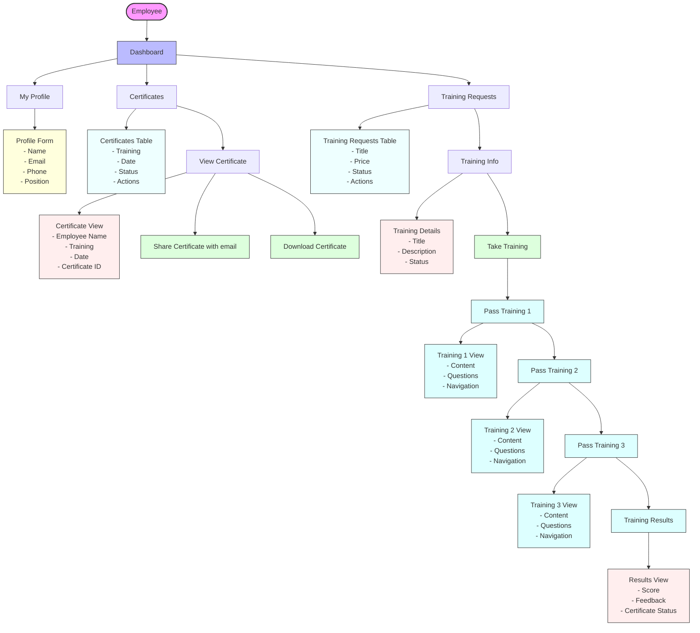

## 6. Authentication Workflow with UI Components

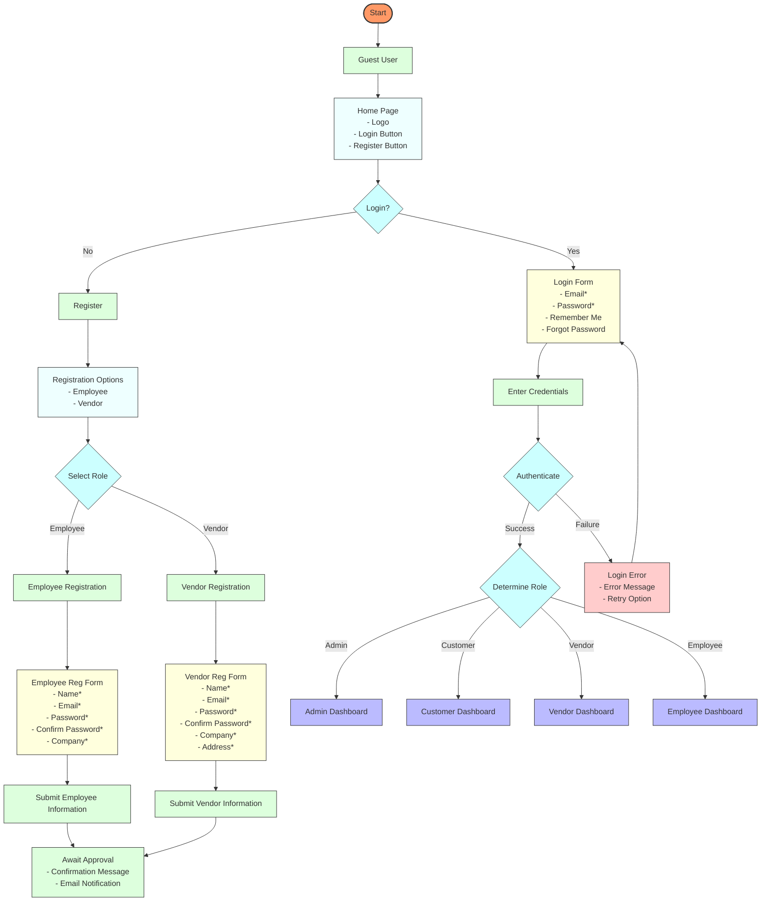

## 7. Training Management Workflow with UI Components

```mermaid
graph TD
    %% Admin Training Management
    Admin([Admin]) --> AdminTrainings[Trainings]
    AdminTrainings --> TrainingsTable[Trainings Table<br>- Title<br>- Description<br>- Status<br>- Actions]
    AdminTrainings --> CreateTraining[Create Training]
    CreateTraining --> NewTrainingForm[New Training Form<br>- Title*<br>- Description*<br>- Price*]
    CreateTraining --> AddPresentation[Add Presentation]
    AddPresentation --> UploadPresentation[Upload Presentation<br>- File Upload<br>- Title*<br>- Description]
    AdminTrainings --> EditTrainingInfo[Edit Training Info]
    EditTrainingInfo --> TrainingInfoForm[Training Info Form<br>- Title*<br>- Description*<br>- Price*]
    AdminTrainings --> EditTrainingPresentation[Edit Training Presentation]
    EditTrainingPresentation --> PresentationEditor[Presentation Editor<br>- Slides<br>- Content<br>- Media]
    AdminTrainings --> ViewTrainingPresentation[View Presentation]
    ViewTrainingPresentation --> PresentationView[Presentation View<br>- Slides<br>- Navigation<br>- Controls]
    AdminTrainings --> DeleteTraining[Delete Training]
    DeleteTraining --> ConfirmDelete[Confirm Delete<br>- Warning Message<br>- Confirm/Cancel]
    
    %% Customer Training Flow
    Customer([Customer]) --> CustomerTrainingList[Training List]
    CustomerTrainingList --> CustomerTrainingsTable[Trainings Table<br>- Title<br>- Description<br>- Status<br>- Actions]
    CustomerTrainingList --> ViewTrainingInfo[View Training Info]
    ViewTrainingInfo --> TrainingDetails[Training Details<br>- Title<br>- Description<br>- Price<br>- Status]
    CustomerTrainingList --> ViewPresentation[View Presentation]
    ViewPresentation --> CustomerPresentationView[Presentation View<br>- Slides<br>- Navigation<br>- Controls]
    CustomerTrainingList --> SendTrainingRequest[Send Training Request]
    SendTrainingRequest --> RequestForm[Request Form<br>- Training<br>- Employees<br>- Notes]
    
    %% Vendor Training Flow
    Vendor([Vendor]) --> VendorTrainingRequests[Training Requests]
    VendorTrainingRequests --> VendorRequestsTable[Requests Table<br>- Title<br>- Customer<br>- Actions]
    VendorTrainingRequests --> VendorTrainingInfo[Training Info]
    VendorTrainingInfo --> VendorTrainingDetails[Training Details<br>- Title<br>- Description<br>- Price<br>- Status]
    VendorTrainingInfo --> PayForTraining[Pay for Training]
    PayForTraining --> PaymentForm[Payment Form<br>- Amount<br>- Payment Method<br>- Billing Info]
    VendorTrainingRequests --> SendTrainingRequestToEmployee[Send Training Request]
    SendTrainingRequestToEmployee --> EmployeeRequestForm[Employee Request Form<br>- Training<br>- Employee<br>- Notes]
    
    %% Employee Training Flow
    Employee([Employee]) --> EmployeeTrainingRequests[Training Requests]
    EmployeeTrainingRequests --> EmployeeRequestsTable[Requests Table<br>- Title<br>- Price<br>- Status<br>- Actions]
    EmployeeTrainingRequests --> EmployeeTrainingInfo[Training Info]
    EmployeeTrainingInfo --> EmployeeTrainingDetails[Training Details<br>- Title<br>- Description<br>- Status]
    EmployeeTrainingInfo --> TakeTraining[Take Training]
    TakeTraining --> PassTraining1[Pass Training 1]
    PassTraining1 --> Training1View[Training 1 View<br>- Content<br>- Questions<br>- Navigation]
    PassTraining1 --> PassTraining2[Pass Training 2]
    PassTraining2 --> Training2View[Training 2 View<br>- Content<br>- Questions<br>- Navigation]
    PassTraining2 --> PassTraining3[Pass Training 3]
    PassTraining3 --> Training3View[Training 3 View<br>- Content<br>- Questions<br>- Navigation]
    PassTraining3 --> TrainingResults[Training Results]
    TrainingResults --> ResultsView[Results View<br>- Score<br>- Feedback<br>- Certificate Status]
    TrainingResults --> GenerateCertificate[Generate Certificate]
    GenerateCertificate --> NewCertificate[New Certificate<br>- Employee Name<br>- Training<br>- Date<br>- Certificate ID]
    
    %% Style definitions
    classDef userRole fill:#f9f,stroke:#333,stroke-width:2px;
    classDef training fill:#ffd,stroke:#333,stroke-width:1px;
    classDef action fill:#dfd,stroke:#333,stroke-width:1px;
    classDef form fill:#eff,stroke:#333,stroke-width:1px;
    classDef view fill:#fee,stroke:#333,stroke-width:1px;
    classDef table fill:#dff,stroke:#333,stroke-width:1px;
    
    %% Apply styles
    class Admin,Customer,Vendor,Employee userRole;
    class AdminTrainings,CustomerTrainingList,VendorTrainingRequests,EmployeeTrainingRequests,EmployeeTrainingInfo,VendorTrainingInfo training;
    class CreateTraining,AddPresentation,EditTrainingInfo,EditTrainingPresentation,DeleteTraining,SendTrainingRequest,PayForTraining,SendTrainingRequestToEmployee,TakeTraining,PassTraining1,PassTraining2,PassTraining3,GenerateCertificate action;
    class NewTrainingForm,TrainingInfoForm,PresentationEditor,RequestForm,PaymentForm,EmployeeRequestForm form;
    class PresentationView,CustomerPresentationView,TrainingDetails,VendorTrainingDetails,EmployeeTrainingDetails,Training1View,Training2View,Training3View,ResultsView,NewCertificate view;
    class TrainingsTable,CustomerTrainingsTable,VendorRequestsTable,EmployeeRequestsTable table;
```

## 8. Certificate Management Workflow with UI Components

```mermaid
graph TD
    %% Certificate Generation
    TrainingCompletion[Training Completion] --> GenerateCertificate[Generate Certificate]
    GenerateCertificate --> CertificateGeneration[Certificate Generation<br>- Employee Data<br>- Training Data<br>- Date<br>- Unique ID]
    CertificateGeneration --> StoreCertificate[Store Certificate]
    
    %% Certificate Access by Role
    StoreCertificate --> AccessByRole{Access By Role}
    
    %% Admin Certificate Access
    AccessByRole --> AdminAccess[Admin Access]
    AdminAccess --> AdminEmployees[Employees]
    AdminEmployees --> AdminEmployeesTable[Employees Table<br>- Name<br>- Email<br>- Position<br>- Actions]
    AdminEmployees --> EmployeeCertificates[Employee Certificates]
    EmployeeCertificates --> AdminCertificatesTable[Certificates Table<br>- Employee<br>- Training<br>- Date<br>- Actions]
    EmployeeCertificates --> ViewCertificate[View Certificate]
    ViewCertificate --> CertificateView[Certificate View<br>- Employee Name<br>- Training<br>- Date<br>- Certificate ID]
    
    %% Customer Certificate Access
    AccessByRole --> CustomerAccess[Customer Access]
    CustomerAccess --> CustomerEmployees[Employees]
    CustomerEmployees --> CustomerEmployeesTable[Employees Table<br>- Name<br>- Email<br>- Position<br>- Actions]
    CustomerEmployees --> CustomerEmployeeCertificates[Employee Certificates]
    CustomerEmployeeCertificates --> CustomerCertificatesTable[Certificates Table<br>- Employee<br>- Training<br>- Date<br>- Actions]
    CustomerEmployeeCertificates --> CustomerViewCertificate[View Certificate]
    CustomerViewCertificate --> CustomerCertificateView[Certificate View<br>- Employee Name<br>- Training<br>- Date<br>- Certificate ID]
    CustomerViewCertificate --> ShareCertificate[Share Certificate with email]
    ShareCertificate --> ShareForm[Share Form<br>- Email*<br>- Message<br>- Send Copy to Me]
    CustomerViewCertificate --> DownloadCertificate[Download Certificate]
    DownloadCertificate --> DownloadOptions[Download Options<br>- PDF<br>- Image<br>- Print]
    
    %% Vendor Certificate Access
    AccessByRole --> VendorAccess[Vendor Access]
    VendorAccess --> VendorEmployees[Employees]
    VendorEmployees --> VendorEmployeesTable[Employees Table<br>- Name<br>- Email<br>- Position<br>- Actions]
    VendorEmployees --> VendorEmployeeCertificates[Employee Certificates]
    VendorEmployeeCertificates --> VendorCertificatesTable[Certificates Table<br>- Employee<br>- Training<br>- Date<br>- Actions]
    VendorEmployeeCertificates --> VendorViewCertificate[View Certificate]
    VendorViewCertificate --> VendorCertificateView[Certificate View<br>- Employee Name<br>- Training<br>- Date<br>- Certificate ID]
    VendorViewCertificate --> VendorShareCertificate[Share Certificate with email]
    VendorShareCertificate --> VendorShareForm[Share Form<br>- Email*<br>- Message<br>- Send Copy to Me]
    VendorViewCertificate --> VendorDownloadCertificate[Download Certificate]
    VendorDownloadCertificate --> VendorDownloadOptions[Download Options<br>- PDF<br>- Image<br>- Print]
    
    VendorAccess --> VendorCertificates[Vendor Certificates]
    VendorCertificates --> VendorOwnCertificatesTable[Certificates Table<br>- Training<br>- Date<br>- Status<br>- Actions]
    VendorCertificates --> VendorViewOwnCertificate[View Certificate]
    VendorViewOwnCertificate --> VendorOwnCertificateView[Certificate View<br>- Vendor Name<br>- Training<br>- Date<br>- Certificate ID]
    VendorViewOwnCertificate --> VendorShareOwnCertificate[Share Certificate with email]
    VendorShareOwnCertificate --> VendorShareOwnForm[Share Form<br>- Email*<br>- Message<br>- Send Copy to Me]
    VendorViewOwnCertificate --> VendorDownloadOwnCertificate[Download Certificate]
    VendorDownloadOwnCertificate --> VendorDownloadOwnOptions[Download Options<br>- PDF<br>- Image<br>- Print]
    
    %% Employee Certificate Access
    AccessByRole --> EmployeeAccess[Employee Access]
    EmployeeAccess --> EmployeeCertificatesView[Certificates]
    EmployeeCertificatesView --> EmployeeCertificatesTable[Certificates Table<br>- Training<br>- Date<br>- Status<br>- Actions]
    EmployeeCertificatesView --> EmployeeViewCertificate[View Certificate]
    EmployeeViewCertificate --> EmployeeCertificateView[Certificate View<br>- Employee Name<br>- Training<br>- Date<br>- Certificate ID]
    EmployeeViewCertificate --> EmployeeShareCertificate[Share Certificate with email]
    EmployeeShareCertificate --> EmployeeShareForm[Share Form<br>- Email*<br>- Message<br>- Send Copy to Me]
    EmployeeViewCertificate --> EmployeeDownloadCertificate[Download Certificate]
    EmployeeDownloadCertificate --> EmployeeDownloadOptions[Download Options<br>- PDF<br>- Image<br>- Print]
    
    %% Style definitions
    classDef process fill:#dfd,stroke:#333,stroke-width:1px;
    classDef decision fill:#cff,stroke:#333,stroke-width:1px;
    classDef access fill:#bbf,stroke:#333,stroke-width:1px;
    classDef action fill:#ffd,stroke:#333,stroke-width:1px;
    classDef table fill:#eff,stroke:#333,stroke-width:1px;
    classDef view fill:#fee,stroke:#333,stroke-width:1px;
    classDef form fill:#dff,stroke:#333,stroke-width:1px;
    
    %% Apply styles
    class TrainingCompletion,GenerateCertificate,StoreCertificate,CertificateGeneration process;
    class AccessByRole decision;
    class AdminAccess,CustomerAccess,VendorAccess,EmployeeAccess access;
    class ShareCertificate,DownloadCertificate,VendorShareCertificate,VendorDownloadCertificate,VendorShareOwnCertificate,VendorDownloadOwnCertificate,EmployeeShareCertificate,EmployeeDownloadCertificate action;
    class AdminEmployeesTable,AdminCertificatesTable,CustomerEmployeesTable,CustomerCertificatesTable,VendorEmployeesTable,VendorCertificatesTable,VendorOwnCertificatesTable,EmployeeCertificatesTable table;
    class CertificateView,CustomerCertificateView,VendorCertificateView,VendorOwnCertificateView,EmployeeCertificateView view;
    class ShareForm,DownloadOptions,VendorShareForm,VendorDownloadOptions,VendorShareOwnForm,VendorDownloadOwnOptions,EmployeeShareForm,EmployeeDownloadOptions form;
```

## 9. UI Components Diagram

```mermaid
graph TD
    %% Main UI Components
    UI[UI Components] --> Header[Header Components]
    UI --> Content[Content Components]
    UI --> Footer[Footer Components]
    
    %% Header Components
    Header --> Logo[Logo<br>- Company Logo<br>- Links to Home]
    Header --> MainNav[Main Navigation<br>- Role-based Menu<br>- Current Section Highlight]
    Header --> UserMenu[User Menu<br>- Profile Picture<br>- Dropdown Options<br>- Logout]
    Header --> Notifications[Notifications<br>- Alert Count<br>- Dropdown List]
    
    %% Content Components
    Content --> PageTitle[Page Title<br>- Section Name<br>- Breadcrumbs]
    Content --> ActionBar[Action Bar<br>- Primary Actions<br>- Search<br>- Filters]
    Content --> DataDisplay[Data Display<br>- Tables<br>- Cards<br>- Lists]
    Content --> Forms[Forms<br>- Input Fields<br>- Validation<br>- Submit Buttons]
    Content --> Modals[Modals<br>- Confirmations<br>- Quick Forms<br>- Alerts]
    
    %% Data Display Components
    DataDisplay --> Tables[Tables<br>- Sortable Headers<br>- Pagination<br>- Row Actions]
    DataDisplay --> Cards[Cards<br>- Title<br>- Content<br>- Actions]
    DataDisplay --> DetailViews[Detail Views<br>- Sections<br>- Related Data<br>- Actions]
    
    %% Form Components
    Forms --> TextInputs[Text Inputs<br>- Single Line<br>- Multi-line<br>- Rich Text]
    Forms --> SelectInputs[Select Inputs<br>- Dropdowns<br>- Multi-select<br>- Autocomplete]
    Forms --> FileUploads[File Uploads<br>- Drag & Drop<br>- Progress<br>- Preview]
    Forms --> Buttons[Buttons<br>- Primary<br>- Secondary<br>- Danger]
    
    %% Footer Components
    Footer --> Copyright[Copyright<br>- Year<br>- Company]
    Footer --> Links[Footer Links<br>- Privacy Policy<br>- Terms<br>- Support]
    Footer --> SocialMedia[Social Media<br>- Icons<br>- Links]
    
    %% Style definitions
    classDef main fill:#f9f,stroke:#333,stroke-width:2px;
    classDef section fill:#bbf,stroke:#333,stroke-width:1px;
    classDef component fill:#dfd,stroke:#333,stroke-width:1px;
    classDef subcomponent fill:#eff,stroke:#333,stroke-width:1px;
    
    %% Apply styles
    class UI main;
    class Header,Content,Footer section;
    class Logo,MainNav,UserMenu,Notifications,PageTitle,ActionBar,DataDisplay,Forms,Modals,Copyright,Links,SocialMedia component;
    class Tables,Cards,DetailViews,TextInputs,SelectInputs,FileUploads,Buttons subcomponent;
```

## 10. Data Flow Diagram

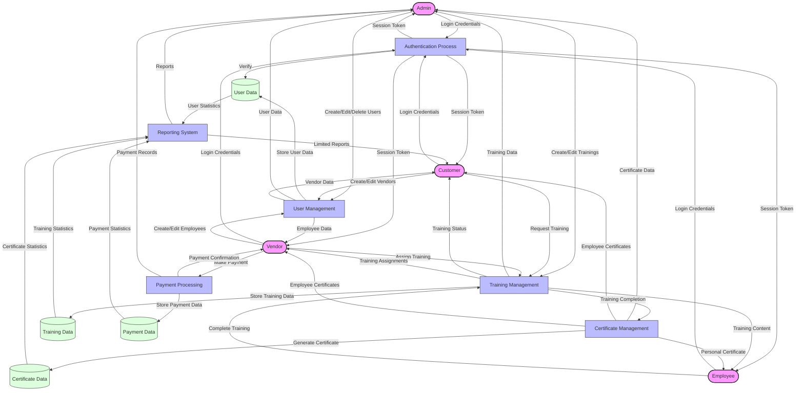

## 11. Entity Relationship Diagram

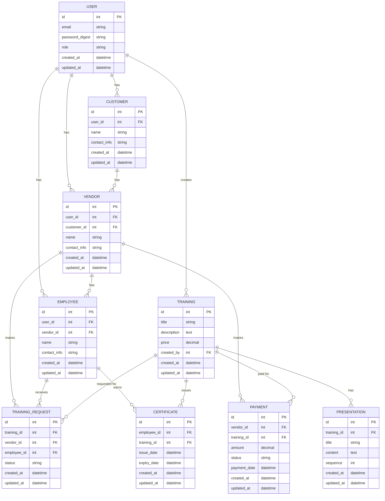
