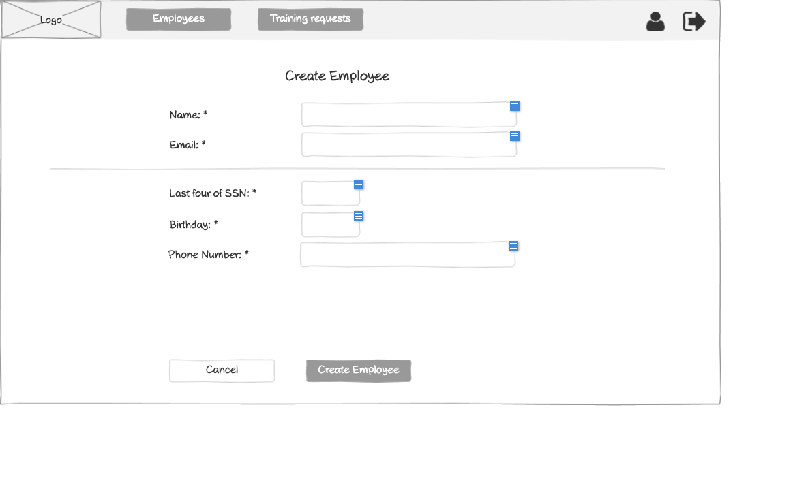

# Vendor - Create Employee Wireframe



## Image Preview


## ASCII Representation

```
+------------------------------------------------------+
|  +------+   +----------------+   +------------+   +-+ |
|  | Logo |   |Training Requests|   |Certificates|   |U| |
|  +------+   +----------------+   +------------+   +-+ |
|                                                      |
|                    Create Employee                   |
|                                                      |
|  Name: *         +----------------------------+      |
|                  |                            |      |
|                  +----------------------------+      |
|                                                      |
|  Email: *        +----------------------------+      |
|                  |                            |      |
|                  +----------------------------+      |
|                                                      |
|  Phone Number: * +----------------------------+      |
|                  |                            |      |
|                  +----------------------------+      |
|                                                      |
|                  +--------+                          |
|                  | Create |                          |
|                  +--------+                          |
|                                                      |
|                                                      |
|                                                      |
|                                                      |
|                                                      |
| Privacy Policy                                       |
+------------------------------------------------------+
```

## Overview

This wireframe displays the "Create Employee" interface from the vendor perspective. It allows vendors to add a new employee to the system by providing basic contact information.

## UI Components

### Navigation Header
- **Logo**: Organization or application logo in the top-left corner
- **Main Navigation**: Horizontal menu with options for Training Requests and Certificates
- **User Profile**: Icon in the top-right corner for accessing user account options
- **Navigation Arrow**: Button in the top-right corner for additional navigation options

### Form Header
- **Title**: "Create Employee" heading centered at the top of the form

### Employee Information Form
- **Name Field**: Required text input (marked with asterisk *) for the employee's name
- **Email Field**: Required text input (marked with asterisk *) for the employee's email address
- **Phone Number Field**: Required text input (marked with asterisk *) for the employee's phone number

### Form Controls
- **Create Button**: Button at the bottom to submit the form and create the employee

### Additional Information
- **Privacy Policy**: Link at the bottom-left of the page

## Functionality

This interface allows vendors to:

1. **Enter Employee Details**: Input the employee's name, email, and phone number
2. **Submit the Form**: Create the employee record in the system
3. **Validate Required Fields**: Ensure all required fields (marked with *) are completed

## Notes

- The interface provides a straightforward way for vendors to add new employees to the system
- Required fields are clearly marked with asterisks (*)
- The form is intentionally simple, collecting only the essential information needed to create an employee account
- Unlike the customer's create employee form, this version does not include address information, suggesting that vendors have a simplified employee creation process
- This screen is likely accessed from an employees list page via a "Create Employee" button
- The form follows a clean, minimalist design consistent with other parts of the application
- The employee creation process is an important part of the vendor workflow, as employees need to be in the system before they can be assigned trainings
- The simple layout ensures that all required information is collected efficiently
- After successful creation, the user is likely redirected to the employees list or the newly created employee's details page
- This form represents the first step in onboarding a new employee into the training system
