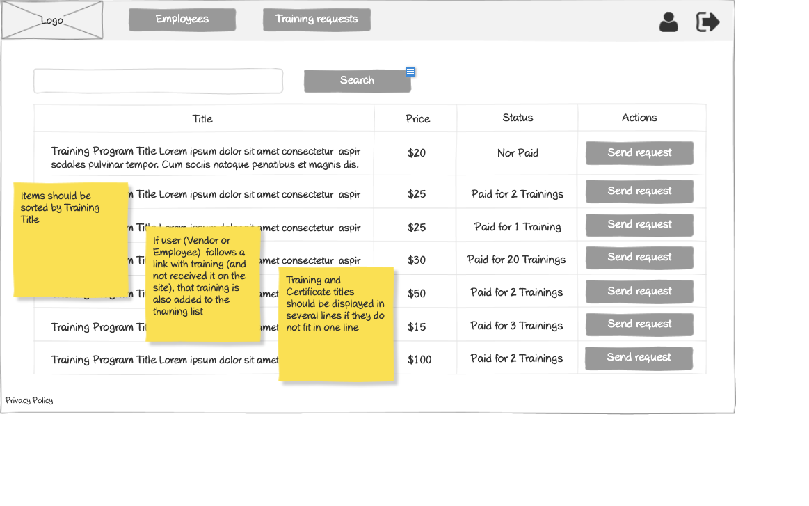

# Vendor - Training Requests Wireframe



## Image Preview


## ASCII Representation

```plaintext
+------------------------------------------------------+
|  +------+   +----------------+   +------------+   +-+ |
|  | Logo |   |Training Requests|   |Certificates|   |U| |
|  +------+   +----------------+   +------------+   +-+ |
|                                                      |
|  +------------------------------------------+  +-+   |
|  |                Search                    |  |S|   |
|  +------------------------------------------+  +-+   |
|                                                      |
|  +----------+----------------+----------------+      |
|  | Title    | Customer       | Actions        |      |
|  +----------+----------------+----------------+      |
|  | Training | Customer       | +--------+     |      |
|  | Program  | Name           | |  Start |     |      |
|  | Title... |                | +--------+     |      |
|  +----------+----------------+----------------+      |
|  | Training | Customer       | +--------+     |      |
|  | Program  | Name           | |  Start |     |      |
|  | Title... |                | +--------+     |      |
|  +----------+----------------+----------------+      |
|  | Training | Customer       | +--------+     |      |
|  | Program  | Name           | |  Start |     |      |
|  | Title... |                | +--------+     |      |
|  +----------+----------------+----------------+      |
|  | Training | Customer       | +--------+     |      |
|  | Program  | Name           | |  Start |     |      |
|  | Title... |                | +--------+     |      |
|  +----------+----------------+----------------+      |
|                                                      |
|  « | 1 | 2 | 3 | 4 | 5 | »                           |
|                                                      |
| Privacy Policy                                       |
+------------------------------------------------------+
```

## Overview

This wireframe displays the "Training Requests" interface from the vendor perspective. It shows a list of training programs that have been requested by customers, allowing vendors to start the training process.

## UI Components

### Navigation Header

- **Logo**: Organization or application logo in the top-left corner
- **Main Navigation**: Horizontal menu with options for Training Requests (currently selected) and Certificates
- **User Profile**: Icon in the top-right corner for accessing user account options
- **Navigation Arrow**: Button in the top-right corner for additional navigation options

### Search and Filter

- **Search Bar**: Full-width search field at the top of the content area
- **Search Button**: Button to execute the search query

### Training Requests Table

- **Table Headers**:
  - Title: Name of the training program
  - Customer: Name of the customer who requested the training
  - Actions: Available operations for each training request

- **Table Rows**: Multiple entries showing training request information with the following columns:
  - Training Program Title (with descriptive text)
  - Customer Name
  - Action button: "Start" for initiating the training

### Pagination Controls

- **Page Navigation**: Controls at the bottom of the table with first («), previous, numbered pages (1-5), next, and last (») buttons
- **Current Page**: Page 1 is currently selected

### Additional Information

- **Privacy Policy**: Link at the bottom-left of the page

## Functionality

This interface allows vendors to:

1. **Browse Training Requests**: View all training programs requested by customers
2. **Search for Requests**: Find specific training requests using the search functionality
3. **Start Training**: Initiate the training process for a specific request
4. **Navigate**: Move between different pages of training requests if many are available

## Notes

- The interface provides a comprehensive view of all training requests from customers
- The "Start" button suggests that vendors need to actively initiate the training process after a customer request
- This screen is likely accessed from the main navigation menu
- The system maintains a consistent layout with other list views in the application
- This view serves as a central hub for managing training requests from customers
- The search functionality allows vendors to quickly find specific requests within a potentially large list
- The pagination controls suggest that vendors may have many training requests to manage
- This interface is crucial for the vendor workflow, as it represents the starting point for delivering training content to customers
- The simple layout ensures that all important information is clearly presented
- The organization by training title and customer name makes it easy to identify specific requests
