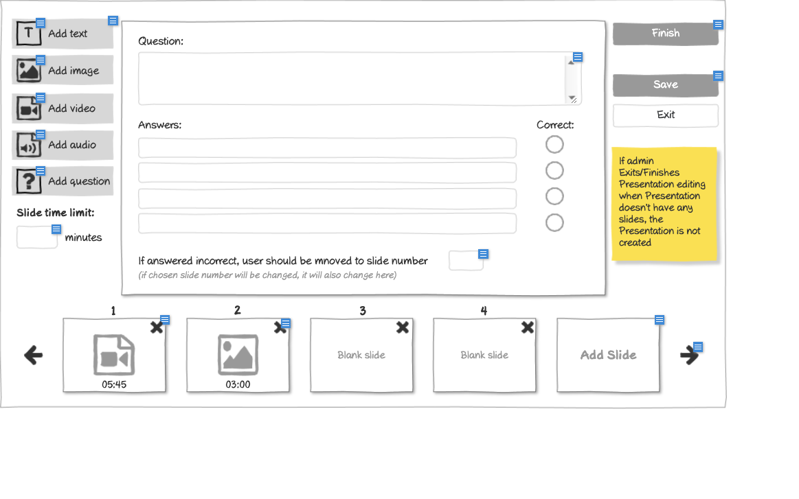

# Add Presentation Question Wireframe



## ASCII Representation

```
+--------------------------------------------------------------------------------------------------------------+
|                                                                                                              |
| +--------+  +--------+                                                                      +--------+       |
| |   T    |  |        |  Question:                                                           | Finish |       |
| | Add text|  |        |  +------------------------------------------------------------------+        |       |
| +--------+  |        |  |                                                                  ||        |       |
|             |        |  |                                                                  ||        |       |
| +--------+  |        |  +------------------------------------------------------------------+        |       |
| |   IMG   | |        |                                                                      +--------+       |
| | Add image|          Answers:                                                 Correct:                      |
| +--------+             +------------------------------------------------------------------+  O               |
|                        |                                                                  |                  |
| +--------+             +------------------------------------------------------------------+  O               |
| |  VID   |             |                                                                  |                  |
| | Add video|            +------------------------------------------------------------------+  O               |
| +--------+             |                                                                  |                  |
|                        +------------------------------------------------------------------+  O               |
| +--------+                                                                                                   |
| |  SND   |             If answered incorrect, user should be moved to slide number        +--------+         |
| | Add audio|            (if chosen slide number will be changed, it will also change here)| [input] |         |
| +--------+                                                                                +--------+         |
|                                                                                                              |
| +--------+                                                                                                   |
| |   ?    |                                                                                                   |
| | Add    |                                                                                                   |
| | question|                                                                                                   |
| +--------+                                                                                                   |
|                                                                                           +---------------+  |
| Slide time limit:                                                                         | If admin      |  |
| +--------+                                                                                | Exits/Finishes|  |
| | [input] | minutes                                                                        | Presentation  |  |
| +--------+                                                                                | editing when  |  |
|                                                                                           | Presentation  |  |
|                                                                                           | doesn't have  |  |
|                                                                                           | any slides,   |  |
|                                                                                           | the           |  |
|                                                                                           | Presentation  |  |
|                                                                                           | is not created|  |
|                                                                                           +---------------+  |
|                                                                                                              |
| +---+  +---+  +---+  +---+  +---+                                                                            |
| | 1 |  | 2 |  | 3 |  | 4 |  |Add|                                                                            |
| |[X]|  |[X]|  |   |  |   |  |Slide|                                                                          |
| |05:45| |03:00| |Blank| |Blank|                                                                              |
| +---+  +---+  +---+  +---+  +---+                                                                            |
|                                                                                                              |
+--------------------------------------------------------------------------------------------------------------+
```

## Overview

This wireframe displays the interface for adding a question to a presentation slide. It's part of a presentation editor system that allows administrators to create interactive training content.

## UI Components

### Left Sidebar - Content Addition Tools
- **Add text** button: Allows adding text content to the slide
- **Add image** button: Enables uploading and inserting images
- **Add video** button: Provides functionality to embed videos
- **Add audio** button: Allows adding audio elements
- **Add question** button: Currently selected, showing the question creation interface
- **Slide time limit** field: Input for setting a time limit in minutes for the current slide

### Main Content Area - Question Editor
- **Question** field: Large text input area for entering the question text
- **Answers** section: Four text input fields for possible answers
- **Correct** selection: Radio buttons to mark which answer is correct
- **Incorrect answer redirection**: Input field to specify which slide to show if answered incorrectly

### Right Sidebar - Control Buttons
- **Finish** button: Completes the presentation editing process
- **Save** button (visible but not highlighted)
- **Exit** button: Exits the presentation editor

### Bottom Navigation - Slide Management
- **Slide thumbnails**: Shows existing slides (1-4) with their time limits
- **Add Slide** button: Allows adding a new slide to the presentation
- **Navigation arrows**: For moving between slides

### Notes
- Yellow sticky note warning: "If admin Exits/Finishes Presentation editing when Presentation doesn't have any slides, the Presentation is not created"
- The interface shows that slides 1 and 2 have content (with X marks) and time limits (05:45 and 03:00), while slides 3 and 4 are blank

## Functionality

This interface allows trainers or administrators to:
1. Create interactive quiz questions with multiple-choice answers
2. Set correct answers and define navigation logic based on user responses
3. Organize content across multiple slides with time limits
4. Build complete training presentations with various media types (text, images, video, audio)

The system appears to support conditional navigation, where incorrect answers can redirect users to specific slides for remedial content.
