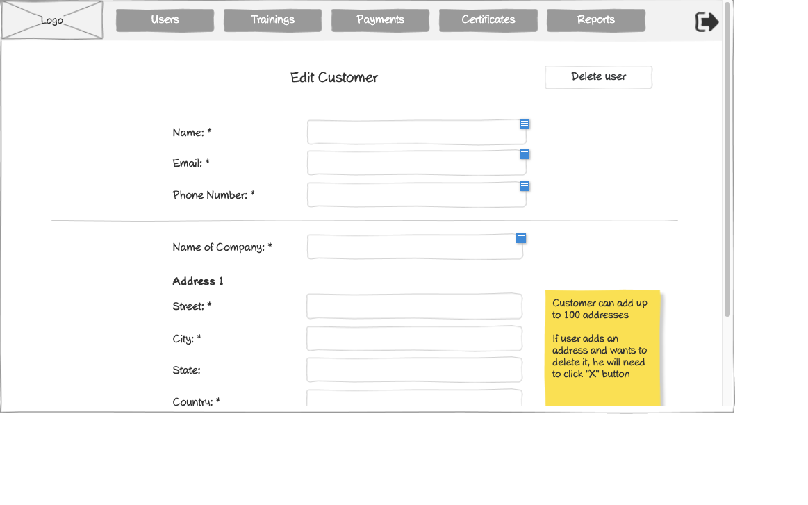

# Edit Customer Form Wireframe



## ASCII Representation

```
+--------------------------------------------------------------------------------------------------------------+
|                                                                                                              |
| +--------+  +--------+  +--------+  +--------+  +--------+  +--------+                    +--------+         |
| |        |  |        |  |        |  |        |  |        |  |        |                    |        |         |
| |  Logo  |  | Users  |  |Trainings|  |Payments|  |Certificates|  | Reports |                    |   →    |         |
| |        |  |        |  |        |  |        |  |        |  |        |                    |        |         |
| +--------+  +--------+  +--------+  +--------+  +--------+  +--------+                    +--------+         |
|                                                                                                              |
|                                     Edit Customer                                         +---------------+   |
|                                                                                           | Delete user  |   |
|                                                                                           +---------------+   |
|            Name: *                 +--------------------------------------------------+                      |
|                                    |                                                  |                      |
|                                    +--------------------------------------------------+                      |
|                                                                                                              |
|            Email: *                +--------------------------------------------------+                      |
|                                    |                                                  |                      |
|                                    +--------------------------------------------------+                      |
|                                                                                                              |
|            Phone Number: *         +--------------------------------------------------+                      |
|                                    |                                                  |                      |
|                                    +--------------------------------------------------+                      |
|                                                                                                              |
| ----------------------------------------------------------------------------------------                    |
|                                                                                                              |
|            Name of Company: *      +--------------------------------------------------+                      |
|                                    |                                                  |                      |
|                                    +--------------------------------------------------+                      |
|                                                                                                              |
|            Address 1                                                                                         |
|                                                                                                              |
|            Street: *               +--------------------------------------------------+                      |
|                                    |                                                  |                      |
|                                    +--------------------------------------------------+                      |
|                                                                                       +---------------+      |
|            City: *                 +--------------------------------------------------+| Customer can |      |
|                                    |                                                  || add up to 100|      |
|                                    +--------------------------------------------------+| addresses    |      |
|                                                                                       |               |      |
|            State:                  +--------------------------------------------------+| If user adds|      |
|                                    |                                                  || an address   |      |
|                                    +--------------------------------------------------+| and wants to|      |
|                                                                                       | delete it, he|      |
|            Country: *              +--------------------------------------------------+| will need to|      |
|                                    |                                                  || click "X"    |      |
|                                    +--------------------------------------------------+| button       |      |
|                                                                                       +---------------+      |
|                                                                                                              |
+--------------------------------------------------------------------------------------------------------------+
```

## Overview

This wireframe displays the "Edit Customer" form interface, which allows administrators to modify existing customer accounts in the system. The form presents the current customer information for editing, including personal details, company information, and address data.

## UI Components

### Navigation Header
- **Logo**: Organization or application logo in the top-left corner
- **Main Navigation**: Horizontal menu with options for Users, Trainings, Payments, Certificates, and Reports
- **Navigation Arrow**: Button in the top-right corner for additional navigation options or to collapse/expand the menu

### Form Header and Controls
- **Title**: "Edit Customer" heading at the top of the form
- **Delete User Button**: Button in the top-right of the form area that allows administrators to delete the customer account

### Personal Information Section
- **Name Field**: Required text input (marked with asterisk *) showing the customer's current name
- **Email Field**: Required text input (marked with asterisk *) showing the customer's current email
- **Phone Number Field**: Required text input (marked with asterisk *) showing the customer's current phone number

### Company Information Section
- **Horizontal Divider**: Separates personal and company information
- **Name of Company Field**: Required text input (marked with asterisk *) showing the customer's current company name

### Address Section
- **Address Label**: "Address 1" indicating this is the primary address
- **Street Field**: Required text input (marked with asterisk *) showing the current street address
- **City Field**: Required text input (marked with asterisk *) showing the current city
- **State Field**: Optional text input showing the current state
- **Country Field**: Required text input (marked with asterisk *) showing the current country

### Informational Note
- **Yellow Sticky Note**: Contains two important pieces of information:
  1. "Customer can add up to 100 addresses"
  2. "If user adds an address and wants to delete it, he will need to click 'X' button"

## Functionality

This interface allows administrators to:

1. **Update Customer Information**: Modify any of the customer's details as needed
2. **Delete Customer Accounts**: Remove customers from the system using the "Delete user" button
3. **Manage Multiple Addresses**: The system supports editing and adding up to 100 addresses per customer
4. **Validate Required Fields**: Required fields are clearly marked with asterisks (*)
5. **Delete Addresses**: Users can remove addresses by clicking an "X" button (not visible in the current view)

The form layout is nearly identical to the "Create Customer" form, providing a consistent user experience between creating and editing customer accounts. The main differences are the pre-populated fields with existing customer data and the addition of the "Delete user" button, which allows for complete removal of the customer account from the system.

The interface maintains the same address management capabilities as the creation form, allowing administrators to add, edit, or remove multiple addresses associated with the customer.
