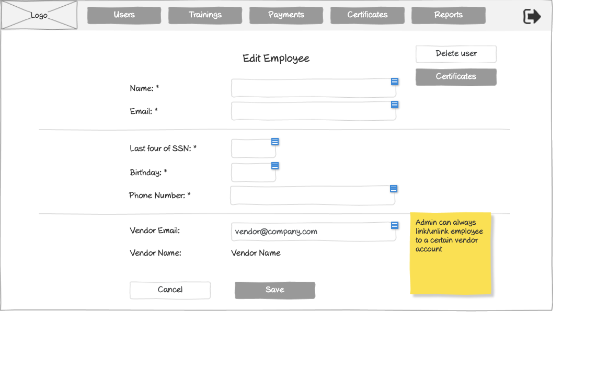

# Edit Employee Form Wireframe



## ASCII Representation

```
+--------------------------------------------------------------------------------------------------------------+
|                                                                                                              |
| +--------+  +--------+  +--------+  +--------+  +--------+  +--------+                    +--------+         |
| |        |  |        |  |        |  |        |  |        |  |        |                    |        |         |
| |  Logo  |  | Users  |  |Trainings|  |Payments|  |Certificates|  | Reports |                    |   →    |         |
| |        |  |        |  |        |  |        |  |        |  |        |                    |        |         |
| +--------+  +--------+  +--------+  +--------+  +--------+  +--------+                    +--------+         |
|                                                                                                              |
|                                     Edit Employee                                         +---------------+   |
|                                                                                           | Delete user  |   |
|                                                                                           +---------------+   |
|            Name: *                 +--------------------------------------------------+   +---------------+   |
|                                    |                                                  |   | Certificates  |   |
|                                    +--------------------------------------------------+   +---------------+   |
|                                                                                                              |
|            Email: *                +--------------------------------------------------+                      |
|                                    |                                                  |                      |
|                                    +--------------------------------------------------+                      |
|                                                                                                              |
| ----------------------------------------------------------------------------------------                    |
|                                                                                                              |
|            Last four of SSN: *     +-------------+                                                           |
|                                    |             |                                                           |
|                                    +-------------+                                                           |
|                                                                                                              |
|            Birthday: *             +-------------+                                                           |
|                                    |             |                                                           |
|                                    +-------------+                                                           |
|                                                                                                              |
|            Phone Number: *         +--------------------------------------------------+                      |
|                                    |                                                  |                      |
|                                    +--------------------------------------------------+                      |
|                                                                                       +---------------+      |
| ----------------------------------------------------------------------------------------| Admin can   |      |
|                                                                                       | always       |      |
|            Vendor Email:           +--------------------------------------------------+| link/unlink  |      |
|                                    | vendor@company.com                               || employee to  |      |
|                                    +--------------------------------------------------+| a certain    |      |
|                                                                                       | vendor        |      |
|            Vendor Name:            Vendor Name                                        | account       |      |
|                                                                                       +---------------+      |
|                                                                                                              |
|            +---------------+       +------------------+                                                      |
|            |    Cancel     |       |       Save       |                                                      |
|            +---------------+       +------------------+                                                      |
|                                                                                                              |
+--------------------------------------------------------------------------------------------------------------+
```

## Overview

This wireframe displays the "Edit Employee" form interface, which allows administrators to modify existing employee accounts in the system. The form presents the current employee information for editing, including personal details and vendor association data.

## UI Components

### Navigation Header
- **Logo**: Organization or application logo in the top-left corner
- **Main Navigation**: Horizontal menu with options for Users, Trainings, Payments, Certificates, and Reports
- **Navigation Arrow**: Button in the top-right corner for additional navigation options or to collapse/expand the menu

### Form Header and Controls
- **Title**: "Edit Employee" heading at the top of the form
- **Delete User Button**: Button in the top-right of the form area that allows administrators to delete the employee account
- **Certificates Button**: Button that navigates to the employee's certificates page

### Personal Information Section
- **Name Field**: Required text input (marked with asterisk *) showing the employee's current name
- **Email Field**: Required text input (marked with asterisk *) showing the employee's current email

### Employee Details Section
- **Horizontal Divider**: Separates basic information from employee-specific details
- **Last four of SSN Field**: Required text input for the last four digits of Social Security Number (marked with asterisk *)
- **Birthday Field**: Required date input (marked with asterisk *)
- **Phone Number Field**: Required text input (marked with asterisk *) showing the employee's current phone number

### Vendor Association Section
- **Horizontal Divider**: Separates employee details from vendor association
- **Vendor Email Field**: Text input showing "vendor@company.com"
- **Vendor Name Field**: Static text displaying "Vendor Name"

### Action Buttons
- **Cancel Button**: Allows users to cancel the editing process without saving changes
- **Save Button**: Submits the form to save the updated employee information

### Informational Note
- **Yellow Sticky Note**: Contains information about administrator privileges: "Admin can always link/unlink employee to a certain vendor account"

## Functionality

This interface allows administrators to:

1. **Update Employee Information**: Modify any of the employee's personal details as needed
2. **Delete Employee Accounts**: Remove employees from the system using the "Delete user" button
3. **View Employee Certificates**: Access the employee's training certificates via the "Certificates" button
4. **Manage Vendor Associations**: Link or unlink employees to vendor accounts
5. **Validate Required Fields**: Required fields are clearly marked with asterisks (*)
6. **Cancel Editing Process**: Option to abandon the editing process without saving changes

The form layout is similar to the "Create Employee" form, providing a consistent user experience between creating and editing employee accounts. The main differences are:

1. The pre-populated fields with existing employee data
2. The addition of the "Delete user" button for account removal
3. The "Certificates" button for quick access to the employee's training records
4. The "Save" button (instead of "Create Employee") for updating existing information

The interface emphasizes the administrator's ability to manage vendor associations, highlighting the hierarchical relationship between employees and vendors in the training management system. This flexibility allows administrators to reassign employees to different vendors as organizational needs change.
