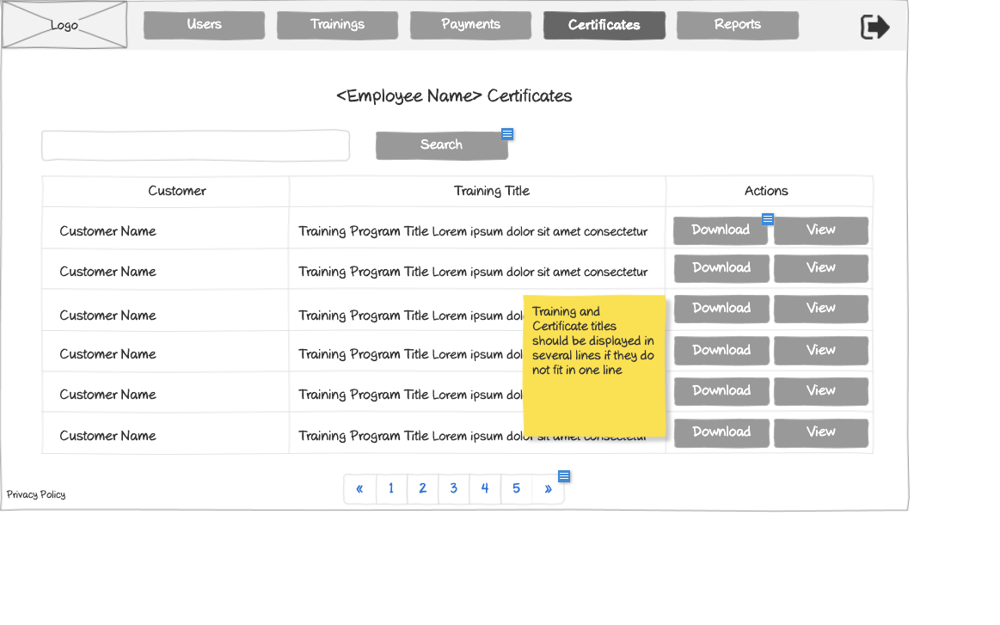

# Employee Certificates Wireframe



## ASCII Representation

```
+--------------------------------------------------------------------------------------------------------------+
|                                                                                                              |
| +--------+  +--------+  +--------+  +--------+  +--------+  +--------+                    +--------+         |
| |        |  |        |  |        |  |        |  |        |  |        |                    |        |         |
| |  Logo  |  | Users  |  |Trainings|  |Payments|  |Certificates|  | Reports |                    |   →    |         |
| |        |  |        |  |        |  |        |  |        |  |        |                    |        |         |
| +--------+  +--------+  +--------+  +--------+  +--------+  +--------+                    +--------+         |
|                                                                                                              |
|                                <Employee Name> Certificates                                                  |
|                                                                                                              |
| +------------------------------------------------------------------+  +--------+                             |
| |                                                                  |  | Search |                             |
| +------------------------------------------------------------------+  +--------+                             |
|                                                                                                              |
| +---------------+----------------------------------+---------------+                                         |
| |    Customer   |           Training Title         |    Actions    |                                         |
| +---------------+----------------------------------+---------------+                                         |
| |               |                                  |               |                                         |
| | Customer Name | Training Program Title Lorem ipsum dolor sit amet consectetur | Download | View |          |
| |               |                                  |               |                                         |
| +---------------+----------------------------------+---------------+                                         |
| |               |                                  |               |                                         |
| | Customer Name | Training Program Title Lorem ipsum dolor sit amet consectetur | Download | View |          |
| |               |                                  |               |                                         |
| +---------------+----------------------------------+---------------+                                         |
| |               |                                  |               |                                         |
| | Customer Name | Training Program Title Lorem ipsum dolor sit amet consectetur | Download | View |          |
| |               |                                  |               |                                         |
| +---------------+----------------------------------+---------------+                                         |
| |               |                                  |               |                                         |
| | Customer Name | Training Program Title Lorem ipsum dolor sit amet consectetur | Download | View |          |
| |               |                                  |               |                                         |
| +---------------+----------------------------------+---------------+                                         |
| |               |                                  |               |                                         |
| | Customer Name | Training Program Title Lorem ipsum dolor sit amet consectetur | Download | View |          |
| |               |                                  |               |                                         |
| +---------------+----------------------------------+---------------+                                         |
| |               |                                  |               |                                         |
| | Customer Name | Training Program Title Lorem ipsum dolor sit amet consectetur | Download | View |          |
| |               |                                  |               |                                         |
| +---------------+----------------------------------+---------------+                                         |
|                                                                                                              |
|                                                                    +---------------+                         |
|                                                                    | Training and  |                         |
|                                                                    | Certificate   |                         |
|                                                                    | titles should |                         |
|                                                                    | be displayed  |                         |
|                                                                    | in several    |                         |
|                                                                    | lines if they |                         |
|                                                                    | do not fit in |                         |
|                                                                    | one line      |                         |
|                                                                    +---------------+                         |
|                                                                                                              |
| Privacy Policy           « | 1 | 2 | 3 | 4 | 5 | »                                                           |
|                                                                                                              |
+--------------------------------------------------------------------------------------------------------------+
```

## Overview

This wireframe displays the "Employee Certificates" interface, which shows all training certificates earned by a specific employee. The interface presents a tabular view of certificates with filtering and pagination capabilities.

## UI Components

### Navigation Header
- **Logo**: Organization or application logo in the top-left corner
- **Main Navigation**: Horizontal menu with options for Users, Trainings, Payments, Certificates, and Reports
- **Navigation Arrow**: Button in the top-right corner for additional navigation options or to collapse/expand the menu

### Page Header
- **Title**: "<Employee Name> Certificates" heading at the top of the content area, displaying the specific employee's name

### Search and Filter
- **Search Bar**: Full-width search field at the top of the content area
- **Search Button**: Button to execute the search query

### Certificates Table
- **Table Headers**:
  - Customer: Name of the customer organization
  - Training Title: Title of the completed training program
  - Actions: Available operations for each certificate

- **Table Rows**: Multiple entries showing certificate information with the following columns:
  - Customer Name
  - Training Program Title (with descriptive text)
  - Action buttons: "Download" and "View" for each certificate

### Pagination Controls
- **Page Navigation**: Controls at the bottom of the table with first («), previous, numbered pages (1-5), next, and last (») buttons
- **Current Page**: Page 1 is currently selected

### Additional Information
- **Privacy Policy**: Link at the bottom-left of the page
- **Note**: Yellow sticky note indicating "Training and Certificate titles should be displayed in several lines if they do not fit in one line"

## Functionality

This interface allows administrators and potentially the employee to:

1. **Browse Certificates**: View all training certificates earned by the specific employee in a paginated table format
2. **Search and Filter**: Find specific certificates using the search functionality
3. **Download Certificates**: Download certificate files for distribution or record-keeping
4. **View Certificates**: Open certificates for detailed viewing
5. **Navigate**: Move between different pages of certificates if the employee has earned many certificates

## Notes

- This view is focused on a single employee's certificates, as indicated by the "<Employee Name> Certificates" title
- The interface is similar to the general Certificates Management screen but with a narrower focus on just one employee
- The table does not include an "Employee" column since all certificates belong to the same employee
- The system maintains the same design patterns and functionality as the main certificates view, providing a consistent user experience
- The sticky note about multi-line titles suggests that some training program names may be quite long and need proper display handling
