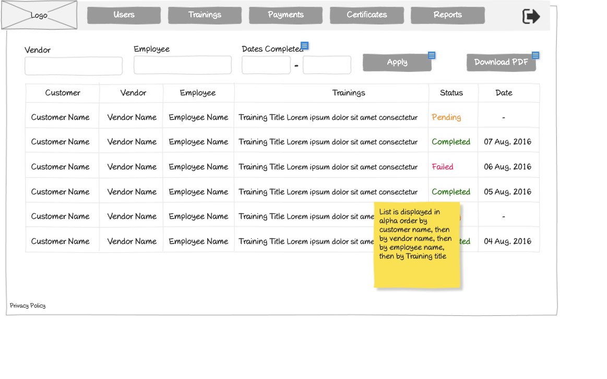

# Reports Wireframe



## ASCII Representation

```
+--------------------------------------------------------------------------------------------------------------+
|                                                                                                              |
| +--------+  +--------+  +--------+  +--------+  +--------+  +--------+                    +--------+         |
| |        |  |        |  |        |  |        |  |        |  |        |                    |        |         |
| |  Logo  |  | Users  |  |Trainings|  |Payments|  |Certificates|  | Reports |                    |   →    |         |
| |        |  |        |  |        |  |        |  |        |  |        |                    |        |         |
| +--------+  +--------+  +--------+  +--------+  +--------+  +--------+                    +--------+         |
|                                                                                                              |
| +---------------+  +---------------+  +---------------+                                                      |
| |    Vendor     |  |    Employee   |  | Dates Completed|                                                     |
| +---------------+  +---------------+  +---------------+                                                      |
| |               |  |               |  |       -       |  +--------+  +---------------+                      |
| |               |  |               |  |               |  | Apply  |  | Download PDF  |                      |
| +---------------+  +---------------+  +---------------+  +--------+  +---------------+                      |
|                                                                                                              |
| +---------------+---------------+---------------+----------------------------------+---------------+----------+
| |    Customer   |    Vendor     |   Employee    |            Trainings            |     Status    |   Date   |
| +---------------+---------------+---------------+----------------------------------+---------------+----------+
| |               |               |               |                                  |               |          |
| | Customer Name | Vendor Name   | Employee Name | Training Title Lorem ipsum dolor sit amet consectetur | Pending | - |
| |               |               |               |                                  |               |          |
| +---------------+---------------+---------------+----------------------------------+---------------+----------+
| |               |               |               |                                  |               |          |
| | Customer Name | Vendor Name   | Employee Name | Training Title Lorem ipsum dolor sit amet consectetur | Completed | 07 Aug. 2016 |
| |               |               |               |                                  |               |          |
| +---------------+---------------+---------------+----------------------------------+---------------+----------+
| |               |               |               |                                  |               |          |
| | Customer Name | Vendor Name   | Employee Name | Training Title Lorem ipsum dolor sit amet consectetur | Failed | 06 Aug. 2016 |
| |               |               |               |                                  |               |          |
| +---------------+---------------+---------------+----------------------------------+---------------+----------+
| |               |               |               |                                  |               |          |
| | Customer Name | Vendor Name   | Employee Name | Training Title Lorem ipsum dolor sit amet consectetur | Completed | 05 Aug. 2016 |
| |               |               |               |                                  |               |          |
| +---------------+---------------+---------------+----------------------------------+---------------+----------+
| |               |               |               |                                  |               |          |
| | Customer Name | Vendor Name   | Employee Name | Training Title Lorem ipsum dolor sit amet consectetur | Pending | - |
| |               |               |               |                                  |               |          |
| +---------------+---------------+---------------+----------------------------------+---------------+----------+
| |               |               |               |                                  |               |          |
| | Customer Name | Vendor Name   | Employee Name | Training Title Lorem ipsum dolor sit amet consectetur | Completed | 04 Aug. 2016 |
| |               |               |               |                                  |               |          |
| +---------------+---------------+---------------+----------------------------------+---------------+----------+
|                                                                                                              |
|                                                                    +---------------+                         |
|                                                                    | List is       |                         |
|                                                                    | displayed in  |                         |
|                                                                    | alpha order by|                         |
|                                                                    | customer name,|                         |
|                                                                    | then by vendor|                         |
|                                                                    | name, then by |                         |
|                                                                    | employee name,|                         |
|                                                                    | then by       |                         |
|                                                                    | Training title|                         |
|                                                                    +---------------+                         |
|                                                                                                              |
| Privacy Policy           « | 1 | 2 | 3 | 4 | 5 | »                                                           |
|                                                                                                              |
+--------------------------------------------------------------------------------------------------------------+
```

## Overview

This wireframe displays the "Reports" interface, which provides administrators with a comprehensive view of training activities across the organization. The interface includes filtering options and a detailed table of training records with their current status.

## UI Components

### Navigation Header
- **Logo**: Organization or application logo in the top-left corner
- **Main Navigation**: Horizontal menu with options for Users, Trainings, Payments, Certificates, and Reports (currently selected)
- **Navigation Arrow**: Button in the top-right corner for additional navigation options or to collapse/expand the menu

### Filter Controls
- **Vendor Filter**: Dropdown or input field to filter by vendor
- **Employee Filter**: Dropdown or input field to filter by employee
- **Dates Completed Filter**: Date range selector with a dash separator
- **Apply Button**: Button to apply the selected filters
- **Download PDF Button**: Button to generate and download a PDF report of the filtered data

### Reports Table
- **Table Headers**:
  - Customer: Name of the customer organization
  - Vendor: Name of the vendor
  - Employee: Name of the employee
  - Trainings: Title of the training program
  - Status: Current status of the training (Pending, Completed, Failed)
  - Date: Completion date of the training

- **Table Rows**: Multiple entries showing training information with the following columns:
  - Customer Name
  - Vendor Name
  - Employee Name
  - Training Title (with descriptive text)
  - Status (color-coded: green for "Completed", red for "Failed", possibly orange/yellow for "Pending")
  - Date (formatted as "DD Mon. YYYY" for completed trainings, "-" for pending ones)

### Pagination Controls
- **Page Navigation**: Controls at the bottom of the table with first («), previous, numbered pages (1-5), next, and last (») buttons
- **Current Page**: Page 1 is currently selected

### Additional Information
- **Privacy Policy**: Link at the bottom-left of the page
- **Note**: Yellow sticky note indicating "List is displayed in alpha order by customer name, then by vendor name, then by employee name, then by Training title"

## Functionality

This interface allows administrators to:

1. **Generate Custom Reports**: Filter training data by vendor, employee, and date range
2. **Export Reports**: Download filtered data as PDF documents
3. **Monitor Training Status**: View the current status of all training activities
4. **Track Completion Rates**: Identify completed, pending, and failed trainings
5. **Analyze Training Patterns**: Observe training activities across different organizational dimensions
6. **Navigate Large Datasets**: Browse through multiple pages of training records

## Notes

- The reports are sorted in a hierarchical order (customer → vendor → employee → training title), as indicated by the sticky note
- The status column uses color-coding to provide quick visual identification of training status
- Pending trainings do not have completion dates (shown as "-")
- The interface combines filtering capabilities with detailed tabular data
- The system maintains consistent date formatting (DD Mon. YYYY) for all entries
- The PDF download option suggests that reports can be generated for offline use or distribution
