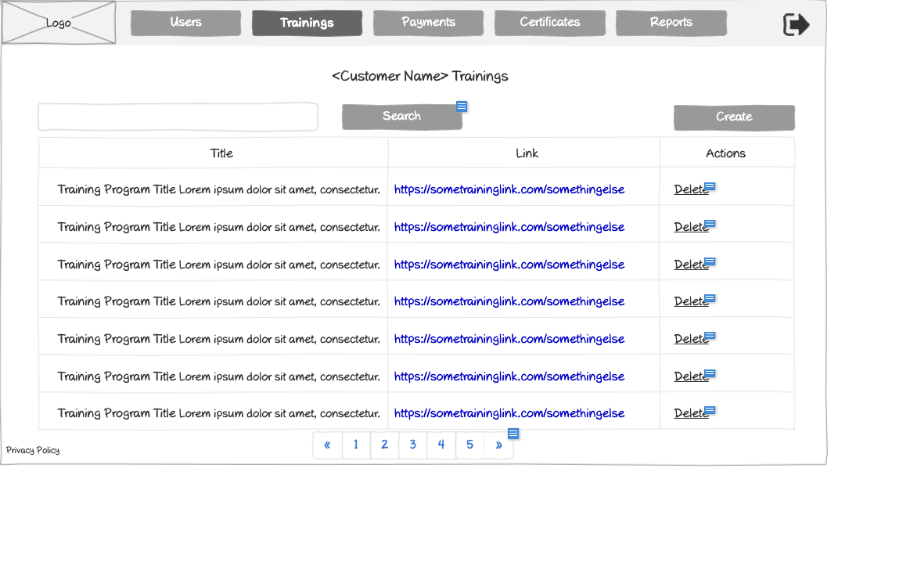

# Trainings List Wireframe



## ASCII Representation

```
+--------------------------------------------------------------------------------------------------------------+
|                                                                                                              |
| +--------+  +--------+  +--------+  +--------+  +--------+  +--------+                    +--------+         |
| |        |  |        |  |        |  |        |  |        |  |        |                    |        |         |
| |  Logo  |  | Users  |  |Trainings|  |Payments|  |Certificates|  | Reports |                    |   →    |         |
| |        |  |        |  |        |  |        |  |        |  |        |                    |        |         |
| +--------+  +--------+  +--------+  +--------+  +--------+  +--------+                    +--------+         |
|                                                                                                              |
|                                <Customer Name> Trainings                                                     |
|                                                                                                              |
| +------------------------------------------------------------------+  +--------+  +--------+                 |
| |                                                                  |  | Search |  | Create |                 |
| +------------------------------------------------------------------+  +--------+  +--------+                 |
|                                                                                                              |
| +----------------------------------+----------------------------------+---------------+                      |
| |              Title               |               Link               |    Actions    |                      |
| +----------------------------------+----------------------------------+---------------+                      |
| |                                  |                                  |               |                      |
| | Training Program Title Lorem ipsum dolor sit amet, consectetur. | https://sometraininglink.com/somethingelse | Delete |
| |                                  |                                  |               |                      |
| +----------------------------------+----------------------------------+---------------+                      |
| |                                  |                                  |               |                      |
| | Training Program Title Lorem ipsum dolor sit amet, consectetur. | https://sometraininglink.com/somethingelse | Delete |
| |                                  |                                  |               |                      |
| +----------------------------------+----------------------------------+---------------+                      |
| |                                  |                                  |               |                      |
| | Training Program Title Lorem ipsum dolor sit amet, consectetur. | https://sometraininglink.com/somethingelse | Delete |
| |                                  |                                  |               |                      |
| +----------------------------------+----------------------------------+---------------+                      |
| |                                  |                                  |               |                      |
| | Training Program Title Lorem ipsum dolor sit amet, consectetur. | https://sometraininglink.com/somethingelse | Delete |
| |                                  |                                  |               |                      |
| +----------------------------------+----------------------------------+---------------+                      |
| |                                  |                                  |               |                      |
| | Training Program Title Lorem ipsum dolor sit amet, consectetur. | https://sometraininglink.com/somethingelse | Delete |
| |                                  |                                  |               |                      |
| +----------------------------------+----------------------------------+---------------+                      |
| |                                  |                                  |               |                      |
| | Training Program Title Lorem ipsum dolor sit amet, consectetur. | https://sometraininglink.com/somethingelse | Delete |
| |                                  |                                  |               |                      |
| +----------------------------------+----------------------------------+---------------+                      |
| |                                  |                                  |               |                      |
| | Training Program Title Lorem ipsum dolor sit amet, consectetur. | https://sometraininglink.com/somethingelse | Delete |
| |                                  |                                  |               |                      |
| +----------------------------------+----------------------------------+---------------+                      |
|                                                                                                              |
| Privacy Policy           « | 1 | 2 | 3 | 4 | 5 | »                                                           |
|                                                                                                              |
+--------------------------------------------------------------------------------------------------------------+
```

## Overview

This wireframe displays the "Trainings List" interface for a specific customer, showing all training programs associated with that customer. The interface presents a tabular view of training programs with search, creation, and deletion capabilities.

## UI Components

### Navigation Header
- **Logo**: Organization or application logo in the top-left corner
- **Main Navigation**: Horizontal menu with options for Users, Trainings (currently selected), Payments, Certificates, and Reports
- **Navigation Arrow**: Button in the top-right corner for additional navigation options or to collapse/expand the menu

### Page Header
- **Title**: "<Customer Name> Trainings" heading at the top of the content area, displaying the specific customer's name

### Action Controls
- **Search Bar**: Full-width search field at the top of the content area
- **Search Button**: Button to execute the search query
- **Create Button**: Button to create a new training program for this customer

### Trainings Table
- **Table Headers**:
  - Title: Name of the training program
  - Link: URL to access the training content
  - Actions: Available operations for each training program

- **Table Rows**: Multiple entries showing training information with the following columns:
  - Training Program Title (with descriptive text)
  - Training Link (formatted as a URL)
  - Action button: "Delete" for removing the training program

### Pagination Controls
- **Page Navigation**: Controls at the bottom of the table with first («), previous, numbered pages (1-5), next, and last (») buttons
- **Current Page**: Page 1 is currently selected

### Additional Information
- **Privacy Policy**: Link at the bottom-left of the page

## Functionality

This interface allows administrators to:

1. **Browse Training Programs**: View all training programs associated with a specific customer
2. **Search for Trainings**: Find specific training programs using the search functionality
3. **Create New Trainings**: Add new training programs for the customer
4. **Delete Trainings**: Remove training programs that are no longer needed
5. **Access Training Content**: View the links to training content for reference
6. **Navigate**: Move between different pages of training programs if the customer has many programs

## Notes

- This view is focused on a single customer's training programs, as indicated by the "<Customer Name> Trainings" title
- The interface provides a comprehensive management system for customer-specific training programs
- The "Delete" action suggests that administrators have the authority to remove training programs
- The "Create" button indicates that new training programs can be added directly from this interface
- The links to training content are displayed as full URLs, suggesting they might be external resources or specific deep links within the system
- The system maintains a consistent layout with other list views in the application, providing a familiar user experience
