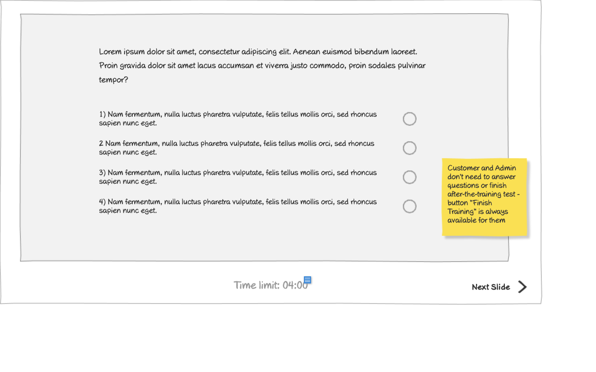

# View Presentation (Slide 2) Wireframe

## Overview

This wireframe displays the "View Presentation" interface showing the second slide of a training presentation. This slide appears to contain a question that the user must answer as part of the interactive training experience.

## UI Components

### Question Display
- **Question Text**: The question being asked of the user (not visible in detail in the wireframe)
- **Answer Options**: Multiple choice options presented to the user
- **Submit Button**: Button to submit the selected answer

### Presentation Controls
- **Progress Indicator**: Shows which slide/question the user is currently viewing
- **Navigation Controls**: Likely includes options to move between slides (though may be disabled until answering)

## Functionality

This interface allows users to:

1. **Read Questions**: View questions that test knowledge of the training material
2. **Select Answers**: Choose from multiple possible answers
3. **Submit Responses**: Confirm their answer selection
4. **Receive Feedback**: Likely get immediate feedback on whether their answer was correct
5. **Progress Through Training**: Move to the next slide after answering

## Notes

- This slide represents the interactive assessment component of the training presentation
- The multiple-choice format suggests a structured learning approach with clear right/wrong answers
- The interface likely prevents users from skipping questions without answering
- Based on other wireframes, incorrect answers may redirect users to specific slides for remedial content
- This question slide is part of the overall training flow, coming after content presentation slides
- The system likely tracks user responses for reporting and certification purposes
- The design maintains consistency with the overall presentation viewing interface while adapting to the question format
- This interactive element helps ensure user engagement and knowledge retention during the training
