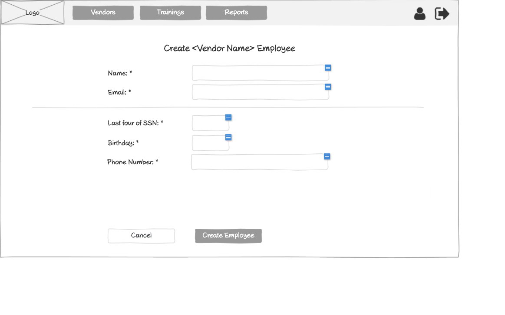

# Customer - Create Employee Wireframe

## Overview

This wireframe displays the "Create Employee" interface from the customer perspective. It allows customers to add new employee accounts to their organization within the training management system.

## UI Components

### Navigation Header
- **Logo**: Organization or application logo in the top-left corner
- **Main Navigation**: Horizontal menu with options for Employees and Training requests
- **User Profile**: Icon in the top-right corner for accessing user account options
- **Navigation Arrow**: Button in the top-right corner for additional navigation options

### Form Header
- **Title**: "Create Employee" heading centered at the top of the form

### Personal Information Section
- **Name Field**: Required text input (marked with asterisk *)
- **Email Field**: Required text input (marked with asterisk *)

### Employee Details Section
- **Horizontal Divider**: Separates basic information from employee-specific details
- **Last four of SSN Field**: Required text input for the last four digits of Social Security Number (marked with asterisk *)
- **Birthday Field**: Required date input (marked with asterisk *)
- **Phone Number Field**: Required text input (marked with asterisk *)

### Action Buttons
- **Cancel Button**: Allows users to cancel the employee creation process
- **Create Employee Button**: Submits the form to create the new employee account

## Functionality

This interface allows customers to:

1. **Create New Employees**: Add new employee accounts with all necessary personal information
2. **Validate Required Fields**: Required fields are clearly marked with asterisks (*)
3. **Cancel Creation Process**: Option to abandon the creation process without saving

## Notes

- The interface is simpler than the administrator version, focusing only on essential employee information
- Unlike the admin version, there is no vendor association section since employees created by customers are automatically associated with that customer
- The form follows a clean, minimalist design with clear section separation
- The required fields (marked with *) ensure that all necessary information is collected
- This view is accessed from the customer's employees management section
- The form structure is optimized for quick employee onboarding by customers
