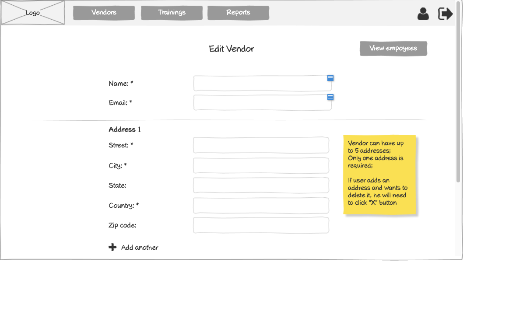

# Customer - Edit Vendor Wireframe



## Image Preview


## ASCII Representation

```
+------------------------------------------------------+
|  +------+   +---------+   +---------+   +---------+  |
|  | Logo |   | Vendors |   |Trainings|   | Reports |  |
|  +------+   +---------+   +---------+   +---------+  |
|                                                      |
|                    Edit Vendor                       |
|                                                      |
|  Name: *         +----------------------------+      |
|                  |                            |      |
|                  +----------------------------+      |
|                                                      |
|  Email: *        +----------------------------+      |
|                  |                            |      |
|                  +----------------------------+      |
|  ------------------------------------------------    |
|                                                      |
|  Address 1                                           |
|                                                      |
|  Street: *       +----------------------------+      |
|                  |                            |      |
|                  +----------------------------+      |
|                                                      |
|  City: *         +----------------------------+      |
|                  |                            |      |
|                  +----------------------------+      |
|                                                      |
|  State:          +----------------------------+      |
|                  |                            |      |
|                  +----------------------------+      |
|                                                      |
|  Country: *      +----------------------------+      |
|                  |                            |      |
|                  +----------------------------+      |
|                                                      |
|  Zip code:       +----------------------------+      |
|                  |                            |      |
|                  +----------------------------+      |
|                                                      |
|  + Add another                                       |
|                                                      |
+------------------------------------------------------+
```

## Overview

This wireframe displays the "Edit Vendor" interface from the customer perspective. It allows customers to modify vendor information, including contact details and address information.

## UI Components

### Navigation Header
- **Logo**: Organization or application logo in the top-left corner
- **Main Navigation**: Horizontal menu with options for Vendors, Trainings, and Reports
- **User Profile**: Icon in the top-right corner for accessing user account options
- **Navigation Arrow**: Button in the top-right corner for additional navigation options

### Page Header
- **Title**: "Edit Vendor" heading at the top of the form
- **View employees Button**: Button in the top-right to view employees associated with this vendor

### Vendor Information Form
- **Name Field**: Required text input (marked with asterisk *) for the vendor's name
- **Email Field**: Required text input (marked with asterisk *) for the vendor's email address

### Address Section
- **Address Label**: "Address 1" indicating this is the primary address
- **Street Field**: Required text input (marked with asterisk *) for street address
- **City Field**: Required text input (marked with asterisk *) for city
- **State Field**: Optional text input for state
- **Country Field**: Required text input (marked with asterisk *) for country
- **Zip code Field**: Optional text input for postal/zip code
- **Add another Button**: Button with plus icon to add additional address entries

### Informational Note
- **Yellow Sticky Note**: Contains important information about address management:
  1. "Vendor can have up to 5 addresses;"
  2. "Only one address is required;"
  3. "If user adds an address and wants to delete it, he will need to click 'X' button"

## Functionality

This interface allows customers to:

1. **Edit Vendor Information**: Update the vendor's name and email
2. **Manage Vendor Addresses**: Add, edit, or remove address information
3. **Add Multiple Addresses**: Create up to 5 different address entries for the vendor
4. **Navigate to Employees**: Access the vendor's employees list via the "View employees" button
5. **Validate Required Fields**: Ensure all required fields (marked with *) are completed

## Notes

- The interface provides a straightforward way for customers to manage vendor information
- Required fields are clearly marked with asterisks (*)
- The address management functionality is flexible, allowing for multiple addresses while requiring only one
- The sticky note provides important guidance on address management capabilities and limitations
- The "Add another" button with plus icon makes it clear how to add additional addresses
- This screen is likely accessed from the vendors list or vendor details page
- The interface follows a clean, minimalist design consistent with other parts of the application
- The "View employees" button provides quick access to the vendor's employee list, facilitating efficient navigation between related data
