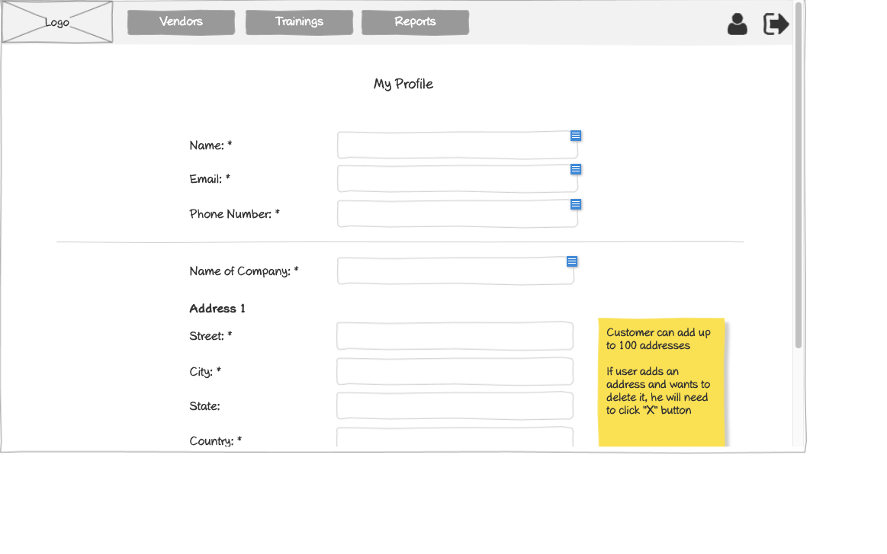

# Customer - Profile Wireframe



## Image Preview


## ASCII Representation

```
+------------------------------------------------------+
|  +------+   +---------+   +---------+   +---------+  |
|  | Logo |   | Vendors |   |Trainings|   | Reports |  |
|  +------+   +---------+   +---------+   +---------+  |
|                                                      |
|                    My Profile                        |
|                                                      |
|  Name: *         +----------------------------+      |
|                  |                            |      |
|                  +----------------------------+      |
|                                                      |
|  Email: *        +----------------------------+      |
|                  |                            |      |
|                  +----------------------------+      |
|                                                      |
|  Phone Number: * +----------------------------+      |
|                  |                            |      |
|                  +----------------------------+      |
|  ------------------------------------------------    |
|                                                      |
|  Name of Company: * +-------------------------+      |
|                    |                         |      |
|                    +-------------------------+      |
|                                                      |
|  Address 1                                           |
|                                                      |
|  Street: *       +----------------------------+      |
|                  |                            |      |
|                  +----------------------------+      |
|                                                      |
|  City: *         +----------------------------+      |
|                  |                            |      |
|                  +----------------------------+      |
|                                                      |
|  State:          +----------------------------+      |
|                  |                            |      |
|                  +----------------------------+      |
|                                                      |
|  Country: *      +----------------------------+      |
|                  |                            |      |
|                  +----------------------------+      |
|                                                      |
+------------------------------------------------------+
```

## Overview

This wireframe displays the "My Profile" interface from the customer perspective. It allows customers to view and edit their personal information, company details, and address information within the training management system.

## UI Components

### Navigation Header
- **Logo**: Organization or application logo in the top-left corner
- **Main Navigation**: Horizontal menu with options for Vendors, Trainings, and Reports
- **User Profile**: Icon in the top-right corner for accessing user account options
- **Navigation Arrow**: Button in the top-right corner for additional navigation options

### Form Header
- **Title**: "My Profile" heading centered at the top of the form

### Personal Information Section
- **Name Field**: Required text input (marked with asterisk *) showing the customer's current name
- **Email Field**: Required text input (marked with asterisk *) showing the customer's current email
- **Phone Number Field**: Required text input (marked with asterisk *) showing the customer's current phone number

### Company Information Section
- **Name of Company Field**: Required text input (marked with asterisk *) showing the customer's company name

### Address Section
- **Address Label**: "Address 1" indicating this is the primary address
- **Street Field**: Required text input (marked with asterisk *) for street address
- **City Field**: Required text input (marked with asterisk *) for city
- **State Field**: Optional text input for state
- **Country Field**: Required text input (marked with asterisk *) for country

### Informational Note
- **Yellow Sticky Note**: Contains important information about address management:
  1. "Customer can add up to 100 addresses"
  2. "If user adds an address and wants to delete it, he will need to click 'X' button"

## Functionality

This interface allows customers to:

1. **View Personal Information**: See their current profile details
2. **Edit Personal Information**: Update their name, email, and phone number if needed
3. **Edit Company Information**: Update their company name
4. **Manage Addresses**: Add, edit, or remove address information
5. **Add Multiple Addresses**: Create up to 100 different address entries
6. **Validate Required Fields**: Ensure all required fields (marked with *) are completed

## Notes

- The interface provides a comprehensive way for customers to manage their profile information
- The form appears to be in view/edit mode, allowing customers to see their current information and make changes
- Required fields are clearly marked with asterisks (*)
- The address management functionality is flexible, allowing for multiple addresses
- The sticky note provides important guidance on address management capabilities and limitations
- Unlike the vendor and employee profiles, customers can have up to 100 addresses, suggesting they may manage multiple locations
- This screen is likely accessed from the user profile icon in the navigation header
- The interface follows a clean, minimalist design consistent with other parts of the application
- The profile information is crucial for communication, billing, and identifying the customer within the system
