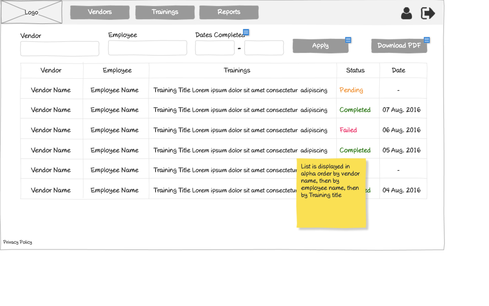

# Customer - Reports Wireframe



## Image Preview


## ASCII Representation

```
+------------------------------------------------------+
|  +------+   +---------+   +---------+   +---------+  |
|  | Logo |   | Vendors |   |Trainings|   | Reports |  |
|  +------+   +---------+   +---------+   +---------+  |
|                                                      |
|  +--------+  +---------+  +---------------+  +----+  |
|  | Vendor |  | Employee |  | Dates Completed|  |App|  |
|  +--------+  +---------+  +-------+-------+  +----+  |
|                                                      |
|  +--------+--+--------+--+--------+--+-----+--+----+ |
|  | Vendor |  |Employee|  |Trainings|  |Status|  |Date||
|  +--------+--+--------+--+--------+--+-----+--+----+ |
|  | Vendor  |  |Employee|  |Training |  |Pending|  |-| |
|  | Name    |  |Name    |  |Title... |  |       |  | | |
|  +--------+--+--------+--+--------+--+-----+--+----+ |
|  | Vendor  |  |Employee|  |Training |  |Completed| |07||
|  | Name    |  |Name    |  |Title... |  |       |  |Aug||
|  +--------+--+--------+--+--------+--+-----+--+----+ |
|  | Vendor  |  |Employee|  |Training |  |Failed |  |06||
|  | Name    |  |Name    |  |Title... |  |       |  |Aug||
|  +--------+--+--------+--+--------+--+-----+--+----+ |
|  | Vendor  |  |Employee|  |Training |  |Completed| |05||
|  | Name    |  |Name    |  |Title... |  |       |  |Aug||
|  +--------+--+--------+--+--------+--+-----+--+----+ |
|                                                      |
|  « | 1 | 2 | 3 | 4 | 5 | »                           |
|                                                      |
| Privacy Policy                                       |
+------------------------------------------------------+
```

## Overview

This wireframe displays the "Reports" interface from the customer perspective. It shows a comprehensive view of training activities across vendors and employees, allowing customers to track and monitor training progress and completion status.

## UI Components

### Navigation Header
- **Logo**: Organization or application logo in the top-left corner
- **Main Navigation**: Horizontal menu with options for Vendors, Trainings, and Reports (currently selected)
- **User Profile**: Icon in the top-right corner for accessing user account options
- **Navigation Arrow**: Button in the top-right corner for additional navigation options

### Filter Controls
- **Vendor Filter**: Dropdown or text input for filtering by vendor
- **Employee Filter**: Dropdown or text input for filtering by employee
- **Dates Completed Filter**: Date range selector with start and end date fields
- **Apply Button**: Button to apply the selected filters to the report data
- **Download PDF Button**: Button to export the current report view as a PDF file

### Reports Table
- **Table Headers**:
  - Vendor: Name of the vendor organization
  - Employee: Name of the employee
  - Trainings: Title of the training program
  - Status: Current status of the training
  - Date: Completion or attempt date

- **Table Rows**: Multiple entries showing training information with the following columns:
  - Vendor Name
  - Employee Name
  - Training Title (with descriptive text)
  - Status (color-coded: "Pending" in orange, "Completed" in green, "Failed" in red)
  - Date (formatted as DD Mon, YYYY or "-" if pending)

### Pagination Controls
- **Page Navigation**: Controls at the bottom of the table with first («), previous, numbered pages (1-5), next, and last (») buttons
- **Current Page**: Page 1 is currently selected

### Informational Note
- **Yellow Sticky Note**: Contains important information about the sorting order: "List is displayed in alpha order by vendor name, then by employee name, then by Training title"

### Additional Information
- **Privacy Policy**: Link at the bottom-left of the page

## Functionality

This interface allows customers to:

1. **View Training Reports**: See a comprehensive list of all training activities across vendors and employees
2. **Filter Reports**: Narrow down results by vendor, employee, or date range
3. **Export Data**: Download the report data as a PDF for offline use or sharing
4. **Track Training Status**: Easily identify the status of each training with color-coded indicators
5. **Navigate**: Move between different pages of report data if many entries are available

## Notes

- The interface provides a powerful reporting tool for customers to monitor training progress
- The status column uses color-coding for quick visual identification:
  - Orange for "Pending" trainings
  - Green for "Completed" trainings
  - Red for "Failed" trainings
- The date column shows the completion or attempt date for trainings with a status, and "-" for pending trainings
- The sticky note indicates that the report data is sorted hierarchically:
  1. First by vendor name (alphabetically)
  2. Then by employee name (alphabetically)
  3. Finally by training title (alphabetically)
- This sorting order makes it easy to find specific entries and understand the organizational structure
- The filter controls allow for customized views of the data based on specific criteria
- The PDF download option facilitates sharing reports with stakeholders or keeping records
- This screen serves as a central hub for monitoring and evaluating training effectiveness across the organization
