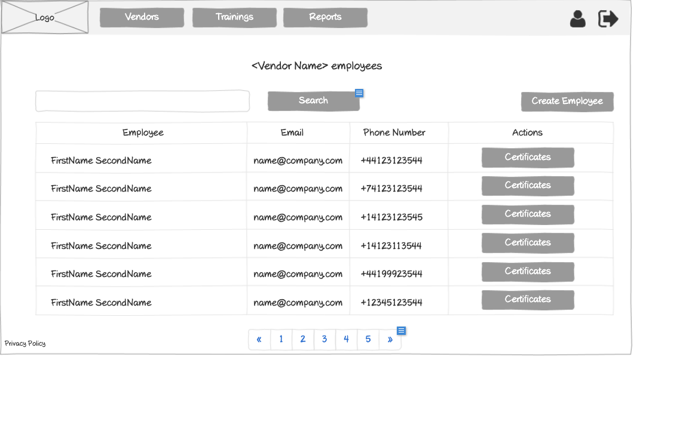

# Customer - Vendor Employees Wireframe



## Image Preview


## ASCII Representation

```
+------------------------------------------------------+
|  +------+   +---------+   +---------+   +---------+  |
|  | Logo |   | Vendors |   |Trainings|   | Reports |  |
|  +------+   +---------+   +---------+   +---------+  |
|                                                      |
|            <Vendor Name> employees                   |
|                                                      |
|  +------------------------------------------+  +-+   |
|  |                Search                    |  |S|   |
|  +------------------------------------------+  +-+   |
|                                                      |
|  +----------+----------------+----------------+      |
|  | Employee | Email          | Phone Number   |      |
|  +----------+----------------+----------------+      |
|  | FirstName| name@company   | +44123123544   |      |
|  | LastName | .com           |                |      |
|  +----------+----------------+----------------+      |
|  | FirstName| name@company   | +74123123544   |      |
|  | LastName | .com           |                |      |
|  +----------+----------------+----------------+      |
|  | FirstName| name@company   | +14123123545   |      |
|  | LastName | .com           |                |      |
|  +----------+----------------+----------------+      |
|  | FirstName| name@company   | +14123113544   |      |
|  | LastName | .com           |                |      |
|  +----------+----------------+----------------+      |
|                                                      |
|  « | 1 | 2 | 3 | 4 | 5 | »                           |
|                                                      |
| Privacy Policy                                       |
+------------------------------------------------------+
```

## Overview

This wireframe displays the "Vendor Employees" interface from the customer perspective. It shows a list of all employees associated with a specific vendor, allowing customers to view and manage vendor employee information and access their certificates.

## UI Components

### Navigation Header
- **Logo**: Organization or application logo in the top-left corner
- **Main Navigation**: Horizontal menu with options for Vendors, Trainings, and Reports
- **User Profile**: Icon in the top-right corner for accessing user account options
- **Navigation Arrow**: Button in the top-right corner for additional navigation options

### Page Header
- **Title**: "<Vendor Name> employees" heading at the top of the content area, displaying the specific vendor's name

### Search and Filter
- **Search Bar**: Full-width search field at the top of the content area
- **Search Button**: Button to execute the search query
- **Create Employee Button**: Button in the top-right to add a new employee to this vendor

### Employees Table
- **Table Headers**:
  - Employee: Name of the employee
  - Email: Email address of the employee
  - Phone Number: Contact phone number
  - Actions: Available operations for each employee

- **Table Rows**: Multiple entries showing employee information with the following columns:
  - Employee Name (formatted as FirstName SecondName)
  - Email Address (formatted as name@company.com)
  - Phone Number (with international format, e.g., +44123123544)
  - Action button: "Certificates" button to view employee certificates

### Pagination Controls
- **Page Navigation**: Controls at the bottom of the table with first («), previous, numbered pages (1-5), next, and last (») buttons
- **Current Page**: Page 1 is currently selected

### Additional Information
- **Privacy Policy**: Link at the bottom-left of the page

## Functionality

This interface allows customers to:

1. **Browse Vendor Employees**: View all employees associated with a specific vendor in a paginated table format
2. **Search for Employees**: Find specific employees using the search functionality
3. **Create New Employees**: Add new employee accounts for this vendor via the "Create Employee" button
4. **Access Employee Certificates**: View certificates for employees who have completed trainings
5. **Navigate**: Move between different pages of employees if the vendor has many employees

## Notes

- The interface provides a focused view of employees for a specific vendor, as indicated by the "<Vendor Name> employees" title
- All employees shown in this view belong to the same vendor
- The "Certificates" button in the Actions column allows quick access to each employee's training certificates
- Phone numbers are shown with international dialing codes, suggesting a global user base
- The "Create Employee" button indicates that customers can add new employees directly from this interface
- This screen is likely accessed from the vendors list or vendor details page
- The system maintains a consistent layout with other list views in the application
- This screen serves as a central hub for managing vendor employees and their training progress
- The search functionality allows customers to quickly find specific employees within a potentially large list
