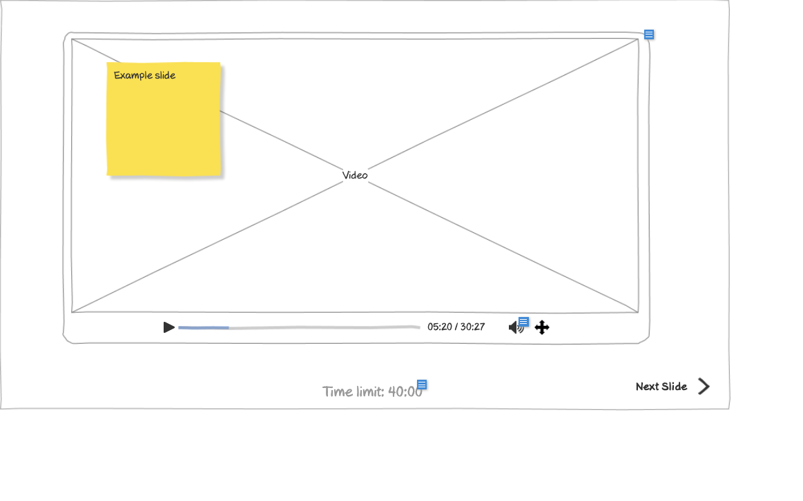

# Customer - View Presentation (Slide 1) Wireframe



## Image Preview


## ASCII Representation

```
+------------------------------------------------------+
|                                                      |
|  +----------------------------------------------------+
|  |                                                    |
|  |  +-----------+                                     |
|  |  |Example    |                                     |
|  |  |slide      |                                     |
|  |  +-----------+                                     |
|  |                                                    |
|  |                                                    |
|  |                                                    |
|  |                                                    |
|  |                    Video                           |
|  |                                                    |
|  |                                                    |
|  |                                                    |
|  |                                                    |
|  |                                                    |
|  |                                                    |
|  |                                                    |
|  |  ▶ ───────────────────────── 05:20 / 30:27  🔊 ⊕  |
|  |                                                    |
|  +----------------------------------------------------+
|                                                      |
|         Time limit: 40:00                 Next Slide →|
|                                                      |
+------------------------------------------------------+
```

## Overview

This wireframe displays the "View Presentation (Slide 1)" interface from the customer perspective. It shows a video presentation slide with playback controls and navigation options, allowing customers to view training content.

## UI Components

### Video Player
- **Video Display Area**: Large central area displaying the video content
- **Example Slide Note**: Yellow sticky note in the top-left indicating "Example slide"
- **Video Label**: Text in the center indicating "Video" (placeholder for actual video content)

### Playback Controls
- **Play/Pause Button**: Button to control video playback
- **Progress Bar**: Slider showing the current position in the video
- **Time Display**: Text showing current time and total duration (05:20 / 30:27)
- **Volume Control**: Button to adjust audio volume
- **Fullscreen Button**: Button to expand the video to fullscreen mode

### Navigation Controls
- **Time Limit Display**: Text showing the time limit for the presentation (40:00)
- **Next Slide Button**: Button in the bottom-right to advance to the next slide

## Functionality

This interface allows customers to:

1. **View Video Content**: Watch training videos as part of the presentation
2. **Control Playback**: Play, pause, and navigate through the video timeline
3. **Adjust Volume**: Control the audio level of the video
4. **Track Progress**: See the current position and total duration of the video
5. **Navigate Slides**: Move to the next slide in the presentation
6. **Monitor Time Limit**: Keep track of the overall time limit for the presentation

## Notes

- The interface provides a focused environment for viewing training video content
- The video player includes standard playback controls familiar to most users
- The "Example slide" sticky note indicates that this is a sample slide in the wireframe
- The time limit display (40:00) suggests that there is a maximum duration for completing the presentation
- The "Next Slide" button indicates that this is part of a multi-slide presentation
- This screen is likely part of a training module that may include various types of content (video, text, quizzes)
- The video appears to be approximately 30 minutes long (30:27), with the current position at 5 minutes and 20 seconds (05:20)
- The simple layout ensures that the video content is the focal point of the interface
- This view is likely accessed from a training program or course listing
