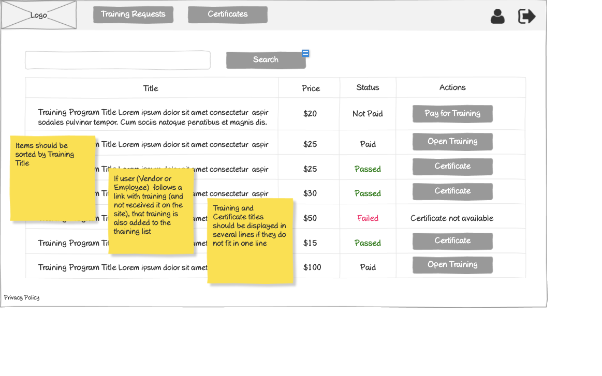

# Employee - Training Requests Wireframe



## Image Preview


## ASCII Representation

```
+------------------------------------------------------+
|  +------+   +-----------+   +----------------+   +-+ |
|  | Logo |   | Employees |   | Training req.  |   |U| |
|  +------+   +-----------+   +----------------+   +-+ |
|                                                      |
|  +------------------------------------------+  +-+   |
|  |                Search                    |  |S|   |
|  +------------------------------------------+  +-+   |
|                                                      |
|  +----------+----------------+----------------+      |
|  | Title    | Price          | Status         |      |
|  +----------+----------------+----------------+      |
|  | Training | $20            | Not Paid       |      |
|  | Program  |                |                |      |
|  | Title... |                |                |      |
|  +----------+----------------+----------------+      |
|  | Training | $25            | Paid for 2     |      |
|  | Program  |                | Trainings      |      |
|  | Title... |                |                |      |
|  +----------+----------------+----------------+      |
|  | Training | $25            | Paid for 1     |      |
|  | Program  |                | Training       |      |
|  | Title... |                |                |      |
|  +----------+----------------+----------------+      |
|  | Training | $30            | Paid for 20    |      |
|  | Program  |                | Trainings      |      |
|  | Title... |                |                |      |
|  +----------+----------------+----------------+      |
|                                                      |
|  « | 1 | 2 | 3 | 4 | 5 | »                           |
|                                                      |
| Privacy Policy                                       |
+------------------------------------------------------+
```

## Overview

This wireframe displays the "Training Requests" interface from the employee perspective. It shows a list of available training programs with their pricing, status, and request options, allowing employees to browse and request access to training content.

## UI Components

### Navigation Header
- **Logo**: Organization or application logo in the top-left corner
- **Main Navigation**: Horizontal menu with options for Employees and Training requests (currently selected)
- **User Profile**: Icon in the top-right corner for accessing user account options
- **Navigation Arrow**: Button in the top-right corner for additional navigation options

### Search and Filter
- **Search Bar**: Full-width search field at the top of the content area
- **Search Button**: Button to execute the search query

### Training Programs Table
- **Table Headers**:
  - Title: Name of the training program
  - Price: Cost of the training
  - Status: Current payment/access status
  - Actions: Available operations for each training

- **Table Rows**: Multiple entries showing training information with the following columns:
  - Training Program Title (with descriptive text)
  - Price (formatted with currency symbol)
  - Status (e.g., "Not Paid", "Paid for 2 Trainings", "Paid for 1 Training", etc.)
  - Action button: "Send request" for requesting access to the training

### Pagination Controls
- **Page Navigation**: Controls at the bottom of the table with first («), previous, numbered pages (1-5), next, and last (») buttons
- **Current Page**: Page 1 is currently selected

### Informational Notes
- **Yellow Sticky Note 1**: "Items should be sorted by Training Title"
- **Yellow Sticky Note 2**: "If user (Vendor or Employee) follows a link with training (and not received it on the site), that training is also added to the training list"
- **Yellow Sticky Note 3**: "Training and Certificate titles should be displayed in several lines if they do not fit in one line"

### Additional Information
- **Privacy Policy**: Link at the bottom-left of the page

## Functionality

This interface allows employees to:

1. **Browse Available Trainings**: View all training programs available to them
2. **Search for Trainings**: Find specific training programs using the search functionality
3. **View Training Status**: See which trainings have been paid for and how many licenses are available
4. **Request Access**: Send requests for access to specific training programs
5. **Navigate**: Move between different pages of training programs if many are available

## Notes

- The interface provides a comprehensive view of all training programs available to the employee
- Training programs have different statuses, including:
  - "Not Paid" - Training that has not been purchased yet
  - "Paid for X Trainings" - Training with multiple licenses available
- The "Send request" button suggests that employees need to request access even for paid trainings
- The sticky notes provide important information about:
  - Sorting order (by Training Title)
  - How trainings are added to the list (including via external links)
  - Display formatting for long titles
- Pricing varies across training programs ($15 to $100), suggesting different levels or types of training
- This screen serves as the main hub for employees to discover and access training content
