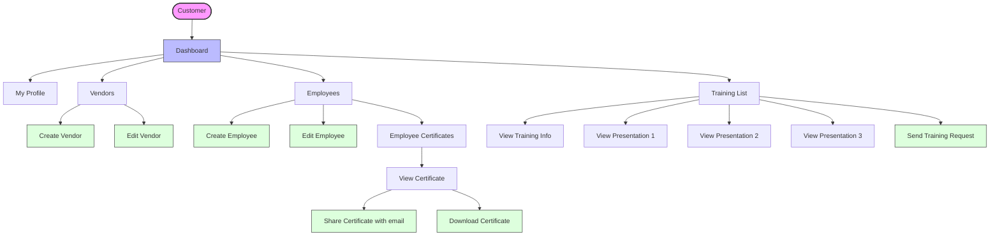
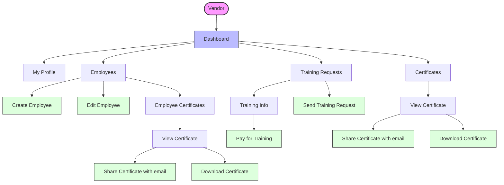
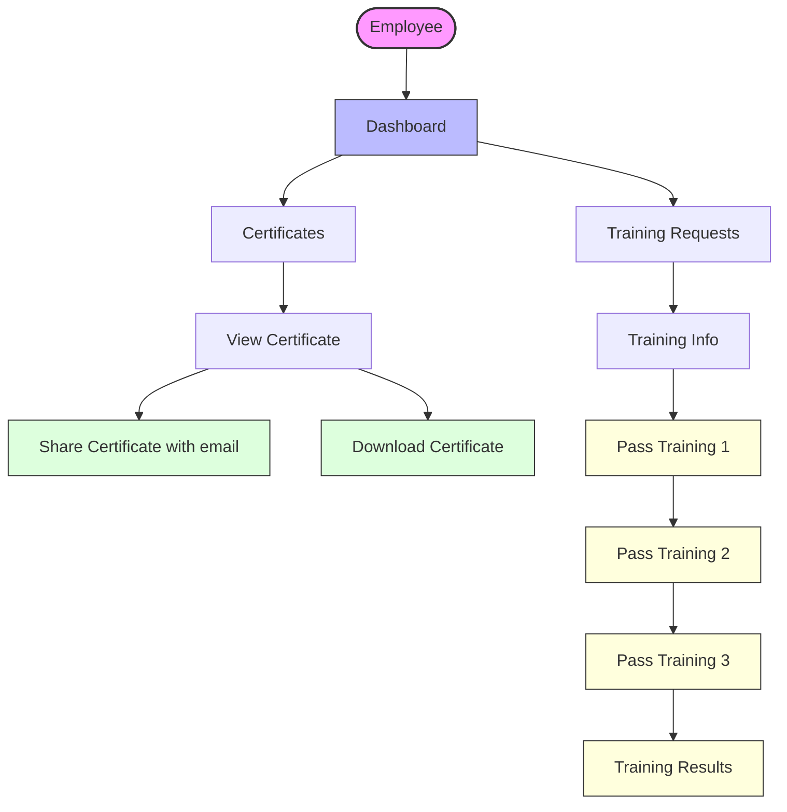
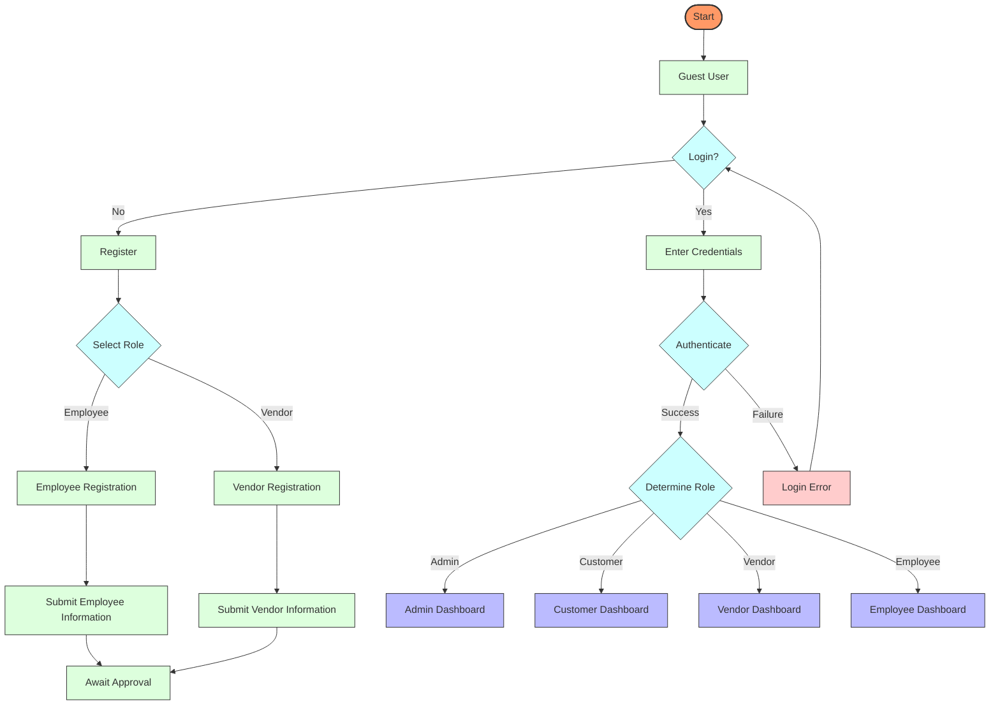
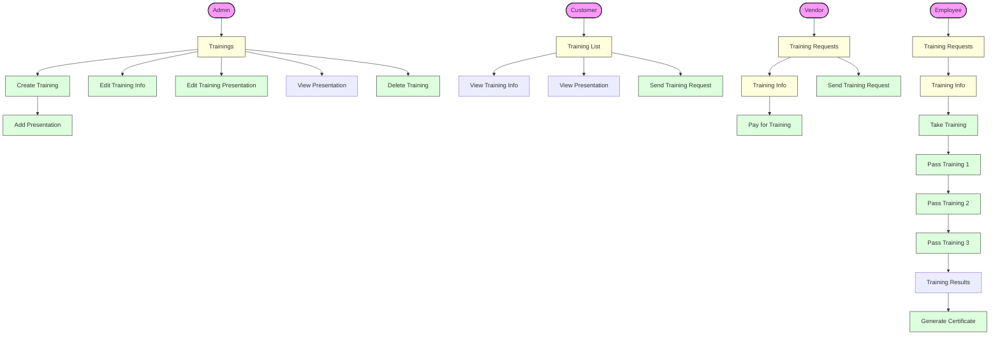
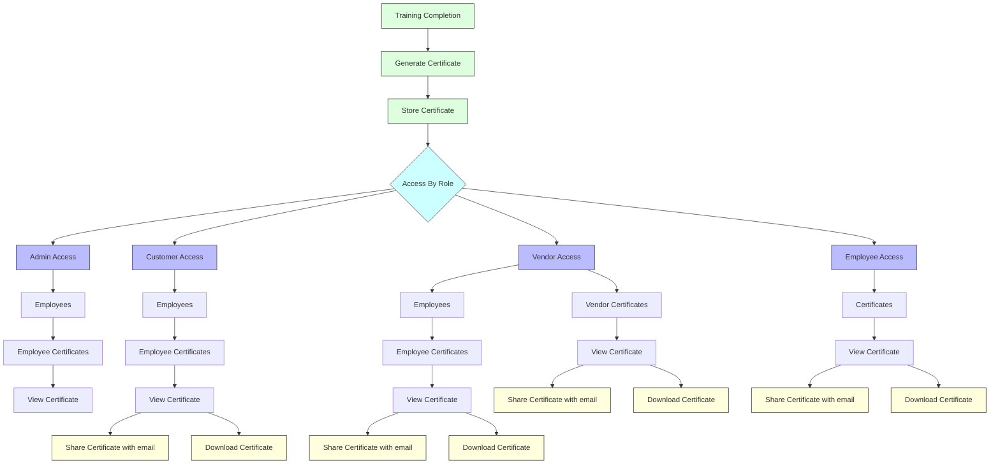
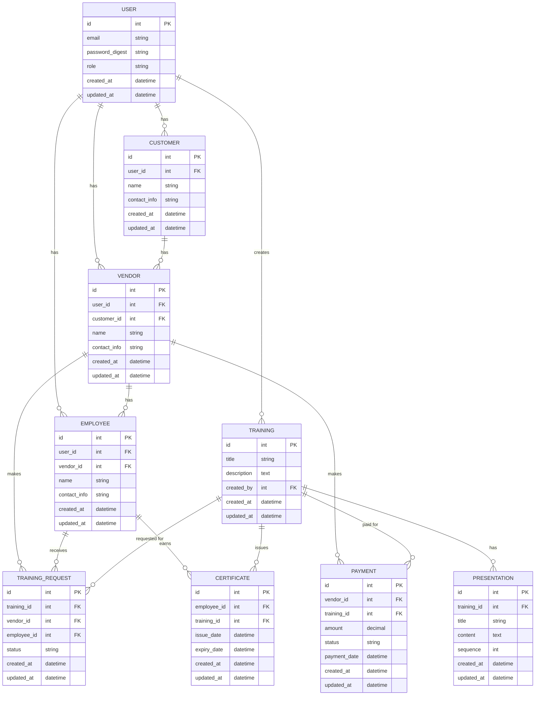

# Udora System Mermaid Diagrams

This document contains various mermaid diagrams that visualize the structure and flow of the Udora system.

## 1. Site Map Overview

```mermaid
graph TD
    %% Main user roles
    Guest([Guest])
    Admin([Admin])
    Customer([Customer])
    Vendor([Vendor])
    Employee([Employee])
    
    %% Guest flow
    Guest --> Login
    Login --> Registration
    Registration --> EmployeeReg[Employee Registration]
    Registration --> VendorReg[Vendor Registration]
    
    %% Admin flow
    Admin --> AdminDashboard[Dashboard]
    AdminDashboard --> AdminCustomers[Customers]
    AdminDashboard --> AdminVendors[Vendors]
    AdminDashboard --> AdminEmployees[Employees]
    AdminDashboard --> AdminTrainings[Trainings]
    AdminDashboard --> AdminPayments[Payments History]
    AdminDashboard --> AdminReports[Reports]
    
    %% Customer flow
    Customer --> CustomerDashboard[Dashboard]
    CustomerDashboard --> CustomerProfile[My Profile]
    CustomerDashboard --> CustomerVendors[Vendors]
    CustomerDashboard --> CustomerEmployees[Employees]
    CustomerDashboard --> CustomerTrainings[Training List]
    
    %% Vendor flow
    Vendor --> VendorDashboard[Dashboard]
    VendorDashboard --> VendorProfile[My Profile]
    VendorDashboard --> VendorEmployees[Employees]
    VendorDashboard --> VendorTrainingRequests[Training Requests]
    VendorDashboard --> VendorTrainingInfo[Training Info]
    VendorDashboard --> VendorCertificates[Certificates]
    
    %% Employee flow
    Employee --> EmployeeDashboard[Dashboard]
    EmployeeDashboard --> EmployeeCertificates[Certificates]
    EmployeeDashboard --> EmployeeTrainingRequests[Training Requests]
    EmployeeDashboard --> EmployeeTrainingInfo[Training Info]
    
    %% Style definitions
    classDef userRole fill:#f9f,stroke:#333,stroke-width:2px;
    classDef dashboard fill:#bbf,stroke:#333,stroke-width:1px;
    
    %% Apply styles
    class Guest,Admin,Customer,Vendor,Employee userRole;
    class AdminDashboard,CustomerDashboard,VendorDashboard,EmployeeDashboard dashboard;
```



## 2. Admin User Journey

```mermaid
graph TD
    Admin([Admin]) --> AdminDashboard[Dashboard]
    
    %% Customers management
    AdminDashboard --> Customers[Customers]
    Customers --> CreateCustomer[Create Customer]
    Customers --> EditCustomer[Edit Customer]
    Customers --> DeleteCustomer[Delete Customer]
    
    %% Vendors management
    AdminDashboard --> Vendors[Vendors]
    Vendors --> CreateVendor[Create Vendor]
    Vendors --> EditVendor[Edit Vendor]
    Vendors --> DeleteVendor[Delete Vendor]
    
    %% Employees management
    AdminDashboard --> Employees[Employees]
    Employees --> CreateEmployee[Create Employee]
    Employees --> EditEmployee[Edit Employee]
    Employees --> DeleteEmployee[Delete Employee]
    Employees --> EmployeeCertificates[Employee Certificates]
    EmployeeCertificates --> ViewCertificate[View Certificate]
    
    %% Trainings management
    AdminDashboard --> Trainings[Trainings]
    Trainings --> EditTrainingInfo[Edit Training Info]
    Trainings --> EditTrainingPresentation[Edit Training Presentation]
    Trainings --> CreateTraining[Create Training]
    Trainings --> DeleteTraining[Delete Training]
    Trainings --> ViewPresentation1[View Presentation 1]
    Trainings --> ViewPresentation2[View Presentation 2]
    Trainings --> ViewPresentation3[View Presentation 3]
    CreateTraining --> AddPresentation[Add Presentation]
    
    %% Payments and Reports
    AdminDashboard --> PaymentsHistory[Payments History]
    AdminDashboard --> Reports[Reports]
    Reports --> DownloadPDF[Download PDF]
    
    %% Home navigation
    AdminDashboard --> HomePage[Home Page]
    
    %% Style definitions
    classDef userRole fill:#f9f,stroke:#333,stroke-width:2px;
    classDef dashboard fill:#bbf,stroke:#333,stroke-width:1px;
    classDef action fill:#dfd,stroke:#333,stroke-width:1px;
    
    %% Apply styles
    class Admin userRole;
    class AdminDashboard dashboard;
    class CreateCustomer,EditCustomer,DeleteCustomer,CreateVendor,EditVendor,DeleteVendor,CreateEmployee,EditEmployee,DeleteEmployee,EditTrainingInfo,EditTrainingPresentation,CreateTraining,DeleteTraining,AddPresentation,DownloadPDF action;
```



## 3. Customer User Journey



## 4. Vendor User Journey



## 5. Employee User Journey



## 6. Authentication Workflow



## 7. Training Management Workflow



## 8. Certificate Management Workflow



## 9. Entity Relationship Diagram



## 10. Page Structure Diagram

```mermaid
graph TD
    %% Common Page Structure
    Page[Page] --> Header[Header]
    Page --> MainContent[Main Content]
    Page --> Footer[Footer]
    
    %% Header Components
    Header --> Logo[Logo]
    Header --> Navigation[Navigation Menu]
    Header --> UserInfo[User Info/Avatar]
    Header --> Notifications[Notifications]
    
    %% Main Content Components
    MainContent --> Sidebar[Sidebar]
    MainContent --> ContentArea[Content Area]
    
    %% Sidebar Components
    Sidebar --> UserRole[User Role]
    Sidebar --> MainNavigation[Main Navigation]
    Sidebar --> QuickLinks[Quick Links]
    
    %% Content Area Components
    ContentArea --> PageTitle[Page Title]
    ContentArea --> ActionButtons[Action Buttons]
    ContentArea --> DataTable[Data Table/List]
    ContentArea --> Forms[Forms]
    ContentArea --> DetailView[Detail View]
    ContentArea --> Pagination[Pagination]
    
    %% Footer Components
    Footer --> Copyright[Copyright]
    Footer --> SupportLinks[Support Links]
    Footer --> PrivacyLinks[Privacy Links]
    
    %% Style definitions
    classDef pageSection fill:#f9f,stroke:#333,stroke-width:2px;
    classDef component fill:#dfd,stroke:#333,stroke-width:1px;
    classDef subcomponent fill:#cff,stroke:#333,stroke-width:1px;
    
    %% Apply styles
    class Page,Header,MainContent,Footer pageSection;
    class Logo,Navigation,UserInfo,Notifications,Sidebar,ContentArea component;
    class UserRole,MainNavigation,QuickLinks,PageTitle,ActionButtons,DataTable,Forms,DetailView,Pagination,Copyright,SupportLinks,PrivacyLinks subcomponent;
```



## 11. Data Flow Diagram

```mermaid
flowchart TD
    %% External Entities
    Admin([Admin])
    Customer([Customer])
    Vendor([Vendor])
    Employee([Employee])
    
    %% Processes
    P1[Authentication Process]
    P2[User Management]
    P3[Training Management]
    P4[Certificate Management]
    P5[Payment Processing]
    P6[Reporting System]
    
    %% Data Stores
    DS1[(User Data)]
    DS2[(Training Data)]
    DS3[(Certificate Data)]
    DS4[(Payment Data)]
    
    %% Data Flows - Authentication
    Admin -->|Login Credentials| P1
    Customer -->|Login Credentials| P1
    Vendor -->|Login Credentials| P1
    Employee -->|Login Credentials| P1
    P1 -->|Verify| DS1
    P1 -->|Session Token| Admin
    P1 -->|Session Token| Customer
    P1 -->|Session Token| Vendor
    P1 -->|Session Token| Employee
    
    %% Data Flows - User Management
    Admin -->|Create/Edit/Delete Users| P2
    Customer -->|Create/Edit Vendors| P2
    Vendor -->|Create/Edit Employees| P2
    P2 -->|Store User Data| DS1
    P2 -->|User Data| Admin
    P2 -->|Vendor Data| Customer
    P2 -->|Employee Data| Vendor
    
    %% Data Flows - Training Management
    Admin -->|Create/Edit Trainings| P3
    Customer -->|Request Training| P3
    Vendor -->|Assign Training| P3
    Employee -->|Complete Training| P3
    P3 -->|Store Training Data| DS2
    P3 -->|Training Data| Admin
    P3 -->|Training Status| Customer
    P3 -->|Training Assignments| Vendor
    P3 -->|Training Content| Employee
    
    %% Data Flows - Certificate Management
    P3 -->|Training Completion| P4
    P4 -->|Generate Certificate| DS3
    P4 -->|Certificate Data| Admin
    P4 -->|Employee Certificates| Customer
    P4 -->|Employee Certificates| Vendor
    P4 -->|Personal Certificate| Employee
    
    %% Data Flows - Payment Processing
    Vendor -->|Make Payment| P5
    P5 -->|Store Payment Data| DS4
    P5 -->|Payment Confirmation| Vendor
    P5 -->|Payment Records| Admin
    
    %% Data Flows - Reporting
    DS1 -->|User Statistics| P6
    DS2 -->|Training Statistics| P6
    DS3 -->|Certificate Statistics| P6
    DS4 -->|Payment Statistics| P6
    P6 -->|Reports| Admin
    P6 -->|Limited Reports| Customer
    
    %% Style definitions
    classDef entity fill:#f9f,stroke:#333,stroke-width:2px;
    classDef process fill:#bbf,stroke:#333,stroke-width:1px;
    classDef datastore fill:#dfd,stroke:#333,stroke-width:1px;
    
    %% Apply styles
    class Admin,Customer,Vendor,Employee entity;
    class P1,P2,P3,P4,P5,P6 process;
    class DS1,DS2,DS3,DS4 datastore;
