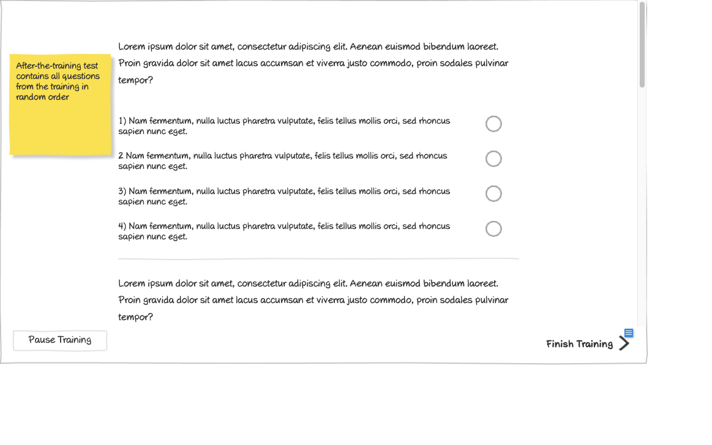

# Pass Training (Quiz Slide 3) Wireframe



## Image Preview


## ASCII Representation

```
+------------------------------------------------------+
|                                                      |
|  Lorem ipsum dolor sit amet, consectetur adipiscing  |
|  elit. Aenean euismod bibendum laoreet. Proin gravida|
|  dolor sit amet lacus accumsan et viverra justo      |
|  commodo, proin sodales pulvinar tempor?             |
|                                                      |
|                                                      |
|  1) Nam fermentum, nulla luctus pharetra vulputate,  |
|  felis tellus mollis orci, sed rhoncus sapien nunc   |  ○
|  eget.                                               |
|                                                      |
|  2 Nam fermentum, nulla luctus pharetra vulputate,   |
|  felis tellus mollis orci, sed rhoncus sapien nunc   |  ○
|  eget.                                               |
|                                                      |
|  3) Nam fermentum, nulla luctus pharetra vulputate,  |
|  felis tellus mollis orci, sed rhoncus sapien nunc   |  ○
|  eget.                                               |
|                                                      |
|  4) Nam fermentum, nulla luctus pharetra vulputate,  |
|  felis tellus mollis orci, sed rhoncus sapien nunc   |  ○
|  eget.                                               |
|                                                      |
|  Lorem ipsum dolor sit amet, consectetur adipiscing  |
|  elit. Aenean euismod bibendum laoreet. Proin gravida|
|  dolor sit amet lacus accumsan et viverra justo      |
|  commodo, proin sodales pulvinar tempor?             |
|                                                      |
|         No time limit                  Finish Training →|
|                                                      |
+------------------------------------------------------+
```

## Overview

This wireframe displays the "Pass Training (Quiz Slide 3)" interface, showing a multiple-choice quiz question as part of a training assessment. It allows users to select an answer and complete the training.

## UI Components

### Question Section
- **Question Text**: Paragraph at the top displaying the question text (Lorem ipsum placeholder text)
- **Additional Text**: Paragraph at the bottom with additional information or context

### Answer Options
- **Multiple Choice Options**: Four answer options labeled 1-4, each with descriptive text
- **Radio Buttons**: Circular selection buttons to the right of each answer option

### Navigation Controls
- **Time Limit Display**: Text indicating "No time limit" for this question
- **Finish Training Button**: Button in the bottom-right to complete the training

### Informational Note
- **Yellow Sticky Note**: Contains important information: "Customer and Admin don't need to answer questions or finish after-the-training test - button 'Finish Training' is always available for them"

## Functionality

This interface allows users to:

1. **Read Question**: View the question text at the top of the screen
2. **Select Answer**: Choose one of the four multiple-choice options
3. **Read Additional Information**: Review supplementary text at the bottom
4. **Complete Training**: Finish the training by clicking the "Finish Training" button
5. **Skip Questions**: For Customer and Admin users, bypass the quiz entirely

## Notes

- The interface provides a clean, focused environment for quiz-taking
- The question and answer options use placeholder text (Lorem ipsum)
- Unlike previous slides, this question has no time limit, allowing users to take as long as needed
- The radio button format ensures users can select only one answer
- The sticky note indicates special privileges for Customer and Admin users, who can skip the quiz
- This screen appears to be the final slide in the training quiz, as indicated by the "Finish Training" button
- The numbering of options is inconsistent (1), 2, 3), 4)) in the wireframe, which should be standardized in the final implementation
- The additional text at the bottom may provide context, hints, or supplementary information related to the question
- This view is likely accessed after completing previous quiz questions and before receiving a certificate
- The "Finish Training" button suggests that this is the final step before completing the training program
