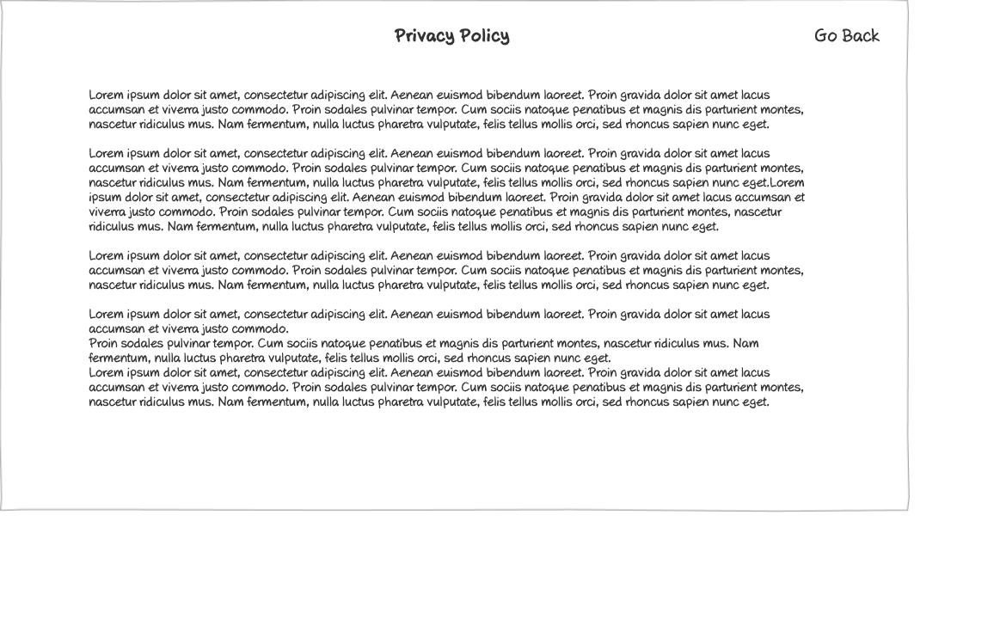

# Privacy Policy Wireframe



## Image Preview


## ASCII Representation

```
+------------------------------------------------------+
|  +------+   +---------+   +---------+   +---------+  |
|  | Logo |   | Vendors |   |Trainings|   | Reports |  |
|  +------+   +---------+   +---------+   +---------+  |
|                                                      |
|                    Privacy Policy                    |
|                                                      |
|  Lorem ipsum dolor sit amet, consectetur adipiscing  |
|  elit. Aenean euismod bibendum laoreet. Proin gravida|
|  dolor sit amet lacus accumsan et viverra justo      |
|  commodo, proin sodales pulvinar tempor.             |
|                                                      |
|  1. Information We Collect                           |
|                                                      |
|  Lorem ipsum dolor sit amet, consectetur adipiscing  |
|  elit. Aenean euismod bibendum laoreet. Proin gravida|
|  dolor sit amet lacus accumsan et viverra justo      |
|  commodo, proin sodales pulvinar tempor.             |
|                                                      |
|  2. How We Use Your Information                      |
|                                                      |
|  Lorem ipsum dolor sit amet, consectetur adipiscing  |
|  elit. Aenean euismod bibendum laoreet. Proin gravida|
|  dolor sit amet lacus accumsan et viverra justo      |
|  commodo, proin sodales pulvinar tempor.             |
|                                                      |
|  3. Information Sharing                              |
|                                                      |
|  Lorem ipsum dolor sit amet, consectetur adipiscing  |
|  elit. Aenean euismod bibendum laoreet. Proin gravida|
|  dolor sit amet lacus accumsan et viverra justo      |
|  commodo, proin sodales pulvinar tempor.             |
|                                                      |
|  4. Security                                         |
|                                                      |
|  Lorem ipsum dolor sit amet, consectetur adipiscing  |
|  elit. Aenean euismod bibendum laoreet. Proin gravida|
|  dolor sit amet lacus accumsan et viverra justo      |
|  commodo, proin sodales pulvinar tempor.             |
|                                                      |
|  5. Your Rights                                      |
|                                                      |
|  Lorem ipsum dolor sit amet, consectetur adipiscing  |
|  elit. Aenean euismod bibendum laoreet. Proin gravida|
|  dolor sit amet lacus accumsan et viverra justo      |
|  commodo, proin sodales pulvinar tempor.             |
|                                                      |
|  6. Changes to This Policy                           |
|                                                      |
|  Lorem ipsum dolor sit amet, consectetur adipiscing  |
|  elit. Aenean euismod bibendum laoreet. Proin gravida|
|  dolor sit amet lacus accumsan et viverra justo      |
|  commodo, proin sodales pulvinar tempor.             |
|                                                      |
|  7. Contact Us                                       |
|                                                      |
|  Lorem ipsum dolor sit amet, consectetur adipiscing  |
|  elit. Aenean euismod bibendum laoreet. Proin gravida|
|  dolor sit amet lacus accumsan et viverra justo      |
|  commodo, proin sodales pulvinar tempor.             |
|                                                      |
| Last Updated: January 1, 2025                        |
|                                                      |
+------------------------------------------------------+
```

## Overview

This wireframe displays the "Privacy Policy" page, showing the legal document that outlines how the application collects, uses, and manages user data. It provides users with information about their privacy rights and the organization's data practices.

## UI Components

### Navigation Header
- **Logo**: Organization or application logo in the top-left corner
- **Main Navigation**: Horizontal menu with options for Vendors, Trainings, and Reports
- **User Profile**: Icon in the top-right corner (not shown in ASCII but likely present in the actual wireframe)
- **Navigation Arrow**: Button in the top-right corner (not shown in ASCII but likely present in the actual wireframe)

### Page Header
- **Title**: "Privacy Policy" heading centered at the top of the content area

### Content Sections
- **Introduction**: Opening paragraph explaining the purpose of the privacy policy
- **Numbered Sections**: Seven distinct sections covering different aspects of the privacy policy:
  1. Information We Collect
  2. How We Use Your Information
  3. Information Sharing
  4. Security
  5. Your Rights
  6. Changes to This Policy
  7. Contact Us
- **Section Content**: Each section contains explanatory text (Lorem ipsum placeholder in the wireframe)

### Footer
- **Last Updated Date**: Text showing when the policy was last revised (January 1, 2025)

## Functionality

This interface allows users to:

1. **Read Privacy Policy**: View the complete privacy policy document
2. **Navigate Sections**: Easily identify and read specific sections of interest
3. **Understand Data Practices**: Learn how their personal information is handled
4. **Check Currency**: See when the policy was last updated

## Notes

- The interface provides a clean, organized presentation of the privacy policy
- The content is structured in numbered sections for easy reference and readability
- The Lorem ipsum placeholder text will be replaced with actual privacy policy content
- The last updated date helps users determine if they need to review changes since their last visit
- This screen is likely accessed via the "Privacy Policy" link in the footer of other pages
- The navigation header maintains consistency with other pages in the application
- The simple layout ensures that the legal content is presented clearly and professionally
- This view serves an important legal and compliance function, informing users about data practices
- The privacy policy is a critical document for regulatory compliance (e.g., GDPR, CCPA)
- The document appears to follow standard privacy policy structure with sections on collection, usage, sharing, security, and user rights
