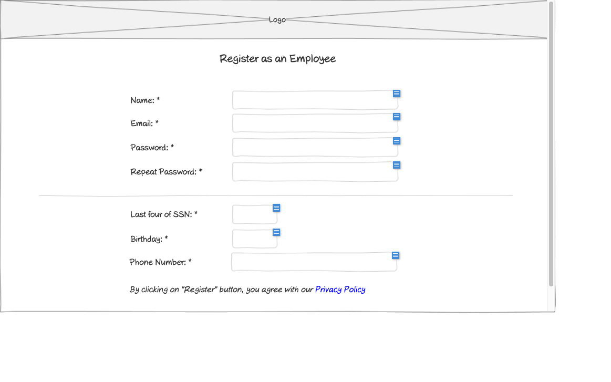

# Register as Employee Wireframe

## Overview

This wireframe displays the "Register as an Employee" interface, which allows new employees to create an account in the training management system. The form collects essential personal information needed to establish an employee account.

## UI Components

### Header
- **Logo**: Organization or application logo centered at the top of the page

### Form Header
- **Title**: "Register as an Employee" heading centered below the logo

### Personal Information Section
- **Name Field**: Required text input (marked with asterisk *)
- **Email Field**: Required text input (marked with asterisk *)
- **Password Field**: Required password input (marked with asterisk *)
- **Repeat Password Field**: Required password confirmation input (marked with asterisk *)

### Employee Details Section
- **Horizontal Divider**: Separates basic account information from employee-specific details
- **Last four of SSN Field**: Required text input for the last four digits of Social Security Number (marked with asterisk *)
- **Birthday Field**: Required date input (marked with asterisk *)
- **Phone Number Field**: Required text input (marked with asterisk *)

### Terms Agreement
- **Privacy Policy Link**: Hyperlinked text to the Privacy Policy
- **Agreement Text**: "By clicking on 'Register' button, you agree with our Privacy Policy"

## Functionality

This interface allows new employees to:

1. **Create an Account**: Register as an employee in the system
2. **Set Login Credentials**: Establish email and password for future logins
3. **Provide Personal Information**: Submit required personal details for identification
4. **Agree to Terms**: Acknowledge and accept the Privacy Policy

## Notes

- The interface provides a clean, straightforward registration form for employees
- Required fields are clearly marked with asterisks (*)
- The password field includes a confirmation field to prevent typing errors
- The form collects essential identification information (last four of SSN, birthday)
- The registration process includes explicit agreement to the Privacy Policy
- This screen is likely accessed from the registration options page where users select their role
- The form follows a logical flow, grouping related information together
- The design maintains a simple, focused approach to minimize registration friction
