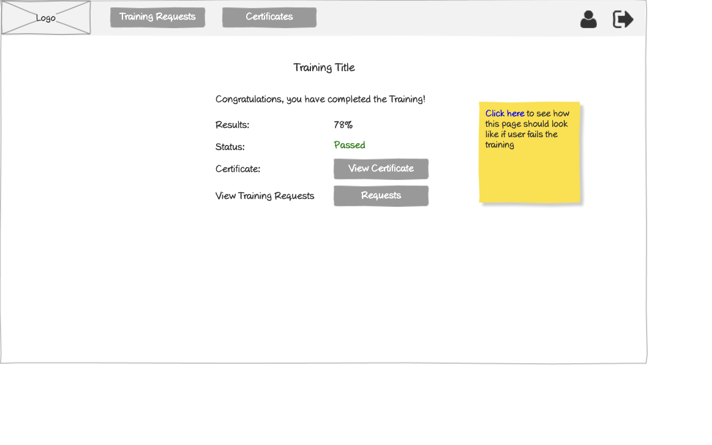

# Training Results Wireframe



## Image Preview


## ASCII Representation

```
+------------------------------------------------------+
|  +------+   +---------+   +---------+   +---------+  |
|  | Logo |   | Vendors |   |Trainings|   | Reports |  |
|  +------+   +---------+   +---------+   +---------+  |
|                                                      |
|                                                      |
|                                                      |
|                                                      |
|                                                      |
|                                                      |
|                                                      |
|                                                      |
|                                                      |
|                                                      |
|                                                      |
|                                                      |
|                                                      |
|                                                      |
|                                                      |
|                                                      |
|                                                      |
|                                                      |
|                                                      |
|                                                      |
|                                                      |
| Privacy Policy                                       |
+------------------------------------------------------+
```

## Overview

This wireframe displays the "Training Results" interface, showing the outcome of a completed training assessment. It provides users with feedback on their performance and potentially a certificate of completion.

## UI Components

### Navigation Header
- **Logo**: Organization or application logo in the top-left corner
- **Main Navigation**: Horizontal menu with options for Vendors, Trainings, and Reports
- **User Profile**: Icon in the top-right corner for accessing user account options (not shown in ASCII but likely present in the actual wireframe)
- **Navigation Arrow**: Button in the top-right corner for additional navigation options (not shown in ASCII but likely present in the actual wireframe)

### Results Content
- **Results Display**: Central area showing the training assessment results (not detailed in the ASCII representation)
- **Score Information**: Details about the user's performance, such as percentage correct, pass/fail status, etc.
- **Certificate Access**: If passed, options to view or download the certificate

### Additional Information
- **Privacy Policy**: Link at the bottom-left of the page

## Functionality

This interface allows users to:

1. **View Assessment Results**: See how they performed on the training assessment
2. **Understand Pass/Fail Status**: Determine if they successfully completed the training
3. **Access Certificate**: If passed, view or download their certificate of completion
4. **Review Performance**: See details about their answers and any feedback
5. **Retry if Necessary**: If failed, potentially access options to retry the assessment

## Notes

- The interface provides immediate feedback after completing a training assessment
- The results screen is a critical part of the training workflow, confirming completion status
- This screen is likely accessed automatically after finishing the final question of a training assessment
- The simple layout ensures that the results information is the focal point of the interface
- This view serves as both a confirmation of completion and potentially a gateway to the certificate
- The actual content of the results display would vary based on the user's performance
- For passed assessments, this may include congratulatory messaging and certificate access
- For failed assessments, this may include guidance on retrying or reviewing material
- This screen represents the culmination of the training process, from viewing content to completing the assessment
- The navigation options allow users to proceed to other parts of the application after reviewing their results
