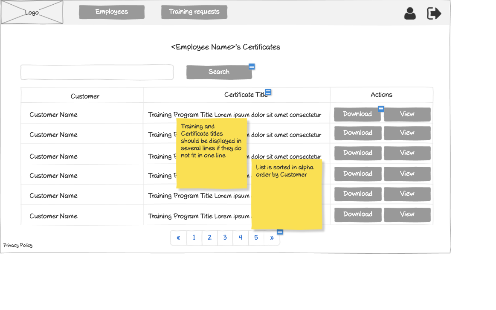

# Vendor - Employee Certificates List Wireframe



## Image Preview


## ASCII Representation

```
+------------------------------------------------------+
|  +------+   +----------------+   +------------+   +-+ |
|  | Logo |   |Training Requests|   |Certificates|   |U| |
|  +------+   +----------------+   +------------+   +-+ |
|                                                      |
|  +------------------------------------------+  +-+   |
|  |                Search                    |  |S|   |
|  +------------------------------------------+  +-+   |
|                                                      |
|  +----------+----------------+----------------+      |
|  | Customer | Training Title | Actions        |      |
|  +----------+----------------+----------------+      |
|  | Customer | Training       | +--------+ +-+ |      |
|  | Name     | Program Title  | |Download| |V| |      |
|  |          | Lorem ipsum... | +--------+ +-+ |      |
|  +----------+----------------+----------------+      |
|  | Customer | Training       | +--------+ +-+ |      |
|  | Name     | Program Title  | |Download| |V| |      |
|  |          | Lorem ipsum... | +--------+ +-+ |      |
|  +----------+----------------+----------------+      |
|  | Customer | Training       | +--------+ +-+ |      |
|  | Name     | Program Title  | |Download| |V| |      |
|  |          | Lorem ipsum... | +--------+ +-+ |      |
|  +----------+----------------+----------------+      |
|  | Customer | Training       | +--------+ +-+ |      |
|  | Name     | Program Title  | |Download| |V| |      |
|  |          | Lorem ipsum... | +--------+ +-+ |      |
|  +----------+----------------+----------------+      |
|                                                      |
|  « | 1 | 2 | 3 | 4 | 5 | »                           |
|                                                      |
| Privacy Policy                                       |
+------------------------------------------------------+
```

## Overview

This wireframe displays the "Employee Certificates List" interface from the vendor perspective. It shows a list of all certificates earned by the vendor's employees across different customers, allowing for management and access to these certificates.

## UI Components

### Navigation Header
- **Logo**: Organization or application logo in the top-left corner
- **Main Navigation**: Horizontal menu with options for Training Requests and Certificates (currently selected)
- **User Profile**: Icon in the top-right corner for accessing user account options
- **Navigation Arrow**: Button in the top-right corner for additional navigation options

### Search and Filter
- **Search Bar**: Full-width search field at the top of the content area
- **Search Button**: Button to execute the search query

### Certificates Table
- **Table Headers**:
  - Customer: Name of the customer organization
  - Training Title: Title of the completed training program
  - Actions: Available operations for each certificate

- **Table Rows**: Multiple entries showing certificate information with the following columns:
  - Customer Name
  - Training Program Title (with descriptive text)
  - Action buttons: "Download" and "View" for each certificate

### Pagination Controls
- **Page Navigation**: Controls at the bottom of the table with first («), previous, numbered pages (1-5), next, and last (») buttons
- **Current Page**: Page 1 is currently selected

### Additional Information
- **Privacy Policy**: Link at the bottom-left of the page

## Functionality

This interface allows vendors to:

1. **Browse Employee Certificates**: View all training certificates earned by their employees across different customers
2. **Search for Certificates**: Find specific certificates using the search functionality
3. **Download Certificates**: Download certificate files for distribution or record-keeping
4. **View Certificates**: Open certificates for detailed viewing
5. **Navigate**: Move between different pages of certificates if many are available

## Notes

- The interface provides a comprehensive view of all certificates earned by the vendor's employees
- Unlike the customer view, this view shows certificates across all customers, giving vendors a complete overview
- The table is organized by customer, allowing vendors to see which customers their employees have completed trainings for
- The "Download" and "View" buttons provide flexible options for accessing certificate content
- This screen is likely accessed from the main navigation menu
- The system maintains a consistent design pattern with other certificate views in the application
- This view serves as a central hub for tracking employee training accomplishments across all customer organizations
- The search functionality allows vendors to quickly find specific certificates within a potentially large list
- The pagination controls suggest that vendors may have many certificates to manage, especially if they have numerous employees working with multiple customers
