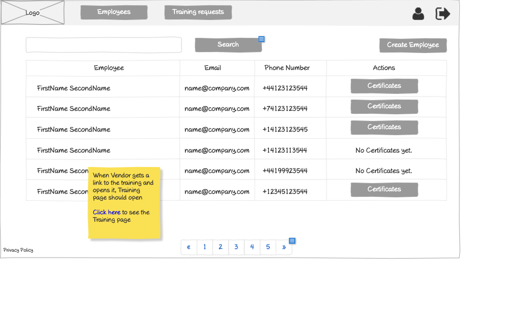

# Vendor - Employees List Wireframe



## Image Preview


## ASCII Representation

```
+------------------------------------------------------+
|  +------+   +----------------+   +------------+   +-+ |
|  | Logo |   |Training Requests|   |Certificates|   |U| |
|  +------+   +----------------+   +------------+   +-+ |
|                                                      |
|  +------------------------------------------+  +-+   |
|  |                Search                    |  |S|   |
|  +------------------------------------------+  +-+   |
|                                                      |
|  +----------+----------------+----------------+      |
|  | Employee | Email          | Phone Number   |      |
|  +----------+----------------+----------------+      |
|  | FirstName| name@company   | +44123123544   |      |
|  | LastName | .com           |                |      |
|  +----------+----------------+----------------+      |
|  | FirstName| name@company   | +74123123544   |      |
|  | LastName | .com           |                |      |
|  +----------+----------------+----------------+      |
|  | FirstName| name@company   | +14123123545   |      |
|  | LastName | .com           |                |      |
|  +----------+----------------+----------------+      |
|  | FirstName| name@company   | +14123113544   |      |
|  | LastName | .com           |                |      |
|  +----------+----------------+----------------+      |
|                                                      |
|  « | 1 | 2 | 3 | 4 | 5 | »                           |
|                                                      |
| Privacy Policy                                       |
+------------------------------------------------------+
```

## Overview

This wireframe displays the "Employees List" interface from the vendor perspective. It shows a list of all employees associated with the vendor, allowing for management and access to employee information.

## UI Components

### Navigation Header
- **Logo**: Organization or application logo in the top-left corner
- **Main Navigation**: Horizontal menu with options for Training Requests and Certificates
- **User Profile**: Icon in the top-right corner for accessing user account options
- **Navigation Arrow**: Button in the top-right corner for additional navigation options

### Search and Filter
- **Search Bar**: Full-width search field at the top of the content area
- **Search Button**: Button to execute the search query

### Employees Table
- **Table Headers**:
  - Employee: Name of the employee
  - Email: Email address of the employee
  - Phone Number: Contact phone number

- **Table Rows**: Multiple entries showing employee information with the following columns:
  - Employee Name (formatted as FirstName LastName)
  - Email Address (formatted as name@company.com)
  - Phone Number (with international format, e.g., +44123123544)

### Pagination Controls
- **Page Navigation**: Controls at the bottom of the table with first («), previous, numbered pages (1-5), next, and last (») buttons
- **Current Page**: Page 1 is currently selected

### Additional Information
- **Privacy Policy**: Link at the bottom-left of the page

## Functionality

This interface allows vendors to:

1. **Browse Employees**: View all employees in their organization in a paginated table format
2. **Search for Employees**: Find specific employees using the search functionality
3. **Navigate**: Move between different pages of employees if the organization has many employees

## Notes

- The interface provides a comprehensive view of all employees within the vendor's organization
- Unlike the customer's employee view, this view does not include an "Actions" column with certificate access, suggesting that certificate management may be handled elsewhere in the vendor interface
- Phone numbers are shown with international dialing codes, suggesting a global user base
- This screen is likely accessed from the main navigation menu
- The system maintains a consistent layout with other list views in the application
- This screen serves as a central hub for managing employees
- The search functionality allows vendors to quickly find specific employees within a potentially large list
- The pagination controls suggest that vendors may have many employees to manage
- This view is similar to the customer's vendor employees view but focused on the vendor's own employees rather than those of a specific customer
- The simple layout ensures that all important employee information is clearly presented
