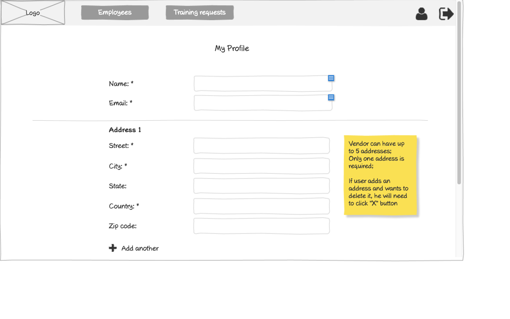

# Vendor - Profile Wireframe



## Image Preview


## ASCII Representation

```plaintext
+------------------------------------------------------+
|  +------+   +----------------+   +------------+   +-+ |
|  | Logo |   |Training Requests|   |Certificates|   |U| |
|  +------+   +----------------+   +------------+   +-+ |
|                                                      |
|                    My Profile                        |
|                                                      |
|  Name: *         +----------------------------+      |
|                  |                            |      |
|                  +----------------------------+      |
|                                                      |
|  Email: *        +----------------------------+      |
|                  |                            |      |
|                  +----------------------------+      |
|                                                      |
|  Phone Number: * +----------------------------+      |
|                  |                            |      |
|                  +----------------------------+      |
|  ------------------------------------------------    |
|                                                      |
|  Address 1                                           |
|                                                      |
|  Street: *       +----------------------------+      |
|                  |                            |      |
|                  +----------------------------+      |
|                                                      |
|  City: *         +----------------------------+      |
|                  |                            |      |
|                  +----------------------------+      |
|                                                      |
|  State:          +----------------------------+      |
|                  |                            |      |
|                  +----------------------------+      |
|                                                      |
|  Country: *      +----------------------------+      |
|                  |                            |      |
|                  +----------------------------+      |
|                                                      |
|  Zip code:       +----------------------------+      |
|                  |                            |      |
|                  +----------------------------+      |
|                                                      |
|  + Add another                                       |
|                                                      |
+------------------------------------------------------+
```

## Overview

This wireframe displays the "My Profile" interface from the vendor perspective. It allows vendors to view and edit their personal information and manage their address details within the training management system.

## UI Components

### Navigation Header

- **Logo**: Organization or application logo in the top-left corner
- **Main Navigation**: Horizontal menu with options for Training Requests and Certificates
- **User Profile**: Icon in the top-right corner for accessing user account options
- **Navigation Arrow**: Button in the top-right corner for additional navigation options

### Form Header

- **Title**: "My Profile" heading centered at the top of the form

### Personal Information Section

- **Name Field**: Required text input (marked with asterisk *) showing the vendor's current name
- **Email Field**: Required text input (marked with asterisk *) showing the vendor's current email
- **Phone Number Field**: Required text input (marked with asterisk *) showing the vendor's current phone number

### Address Section

- **Address Label**: "Address 1" indicating this is the primary address
- **Street Field**: Required text input (marked with asterisk *) for street address
- **City Field**: Required text input (marked with asterisk *) for city
- **State Field**: Optional text input for state
- **Country Field**: Required text input (marked with asterisk *) for country
- **Zip code Field**: Optional text input for postal/zip code
- **Add another Button**: Button with plus icon to add additional address entries

### Informational Note

- **Yellow Sticky Note**: Contains important information about address management (not visible in ASCII representation but likely present in the actual wireframe)

## Functionality

This interface allows vendors to:

1. **View Personal Information**: See their current profile details
2. **Edit Personal Information**: Update their name, email, and phone number if needed
3. **Manage Addresses**: Add, edit, or remove address information
4. **Add Multiple Addresses**: Create multiple different address entries
5. **Validate Required Fields**: Ensure all required fields (marked with *) are completed

## Notes

- The interface provides a comprehensive way for vendors to manage their profile information
- The form appears to be in view/edit mode, allowing vendors to see their current information and make changes
- Required fields are clearly marked with asterisks (*)
- The address management functionality is flexible, allowing for multiple addresses
- The "Add another" button with plus icon makes it clear how to add additional addresses
- This screen is likely accessed from the user profile icon in the navigation header
- The interface follows a clean, minimalist design consistent with other parts of the application
- The profile information is crucial for communication and identifying the vendor within the system
- This view is similar to the employee profile view but tailored for vendor-specific information
- The simple layout ensures that all important information is clearly presented and easily editable
